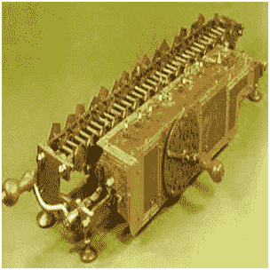
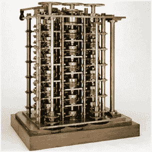
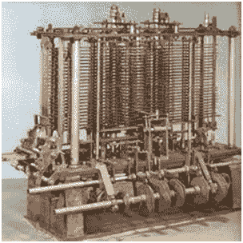
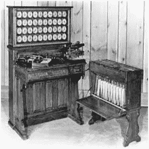
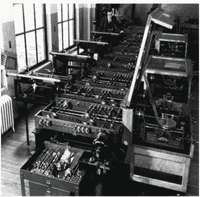
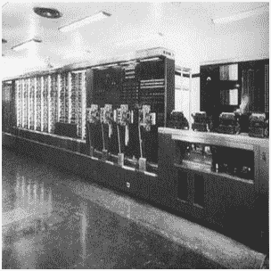

# 计算机历史

> 原文：<https://www.javatpoint.com/history-of-computer>

第一个计数装置是由原始人使用的。他们用棍子、石头和骨头作为计数工具。随着时间的推移，人类思维和技术的进步，更多的计算设备被开发出来。下面描述从第一个到最近的一些流行的计算设备；

## 算盘

计算机的历史始于算盘的诞生，算盘被认为是第一台计算机。据说中国人大约在 4000 年前发明了算盘。

这是一个木头架子，上面有金属杆和珠子。珠算师按照一定的规则移动珠子进行算术运算。中国、俄罗斯和日本等一些国家仍在使用算盘。该工具的图像如下所示；

## 纳皮尔的骨头

这是一种人工操作的计算装置，由默沙东的约翰·耐普尔(1550-1617)发明。在这个计算工具中，他使用了 9 个不同的标有数字的象牙条或骨头来进行乘法和除法。因此，这个工具被称为“纳皮尔的骨头”。它也是第一台使用小数点的机器。

## 帕斯卡尔汀

Pascaline 也被称为算术机器或加法机器。它是在 1642 年至 1644 年间由法国数学家兼哲学家比亚兹·帕斯卡发明的。人们认为它是第一台机械和自动计算器。

帕斯卡发明这台机器是为了帮助他的父亲，一个税务会计师。它只能执行加法和减法。这是一个带有一系列齿轮和轮子的木箱。当一个轮子旋转一周，它就带动相邻的轮子旋转。轮子顶部有一系列的窗口来读取总数。该工具的图像如下所示；

## 阶梯式计算者或莱布尼茨轮

它是由德国数学家兼哲学家戈特弗里德·威廉·莱布尼茨于 1673 年开发的。他改进了帕斯卡的发明来开发这台机器。这是一个数字机械计算器，被称为阶梯计算器，因为它不是由齿轮而是由凹槽鼓制成。见下图；

## 差异引擎

19 世纪 20 年代初，它由被称为“现代计算机之父”的查尔斯·巴贝奇设计。这是一台可以进行简单计算的机械计算机。这是一台蒸汽驱动的计算机器，旨在解决数字表，如对数表。

## 分析引擎

这台计算机也是查尔斯·巴贝奇在 1830 年开发的。这是一台使用穿孔卡片作为输入的机械计算机。它能够解决任何数学问题，并将信息存储为永久记忆。

## 制表机

它是由美国统计学家赫尔曼·何乐礼于 1890 年发明的。这是一台基于穿孔卡片的机械制表机。它可以将统计数据制成表格，记录或分类数据或信息。这台机器在 1890 年美国人口普查中使用过。霍尔瑞斯也开始了霍尔瑞斯？后来在 1924 年成为国际商用机器公司。

## 差分分析仪

这是 1930 年美国引进的第一台电子计算机。这是万尼瓦尔·布什发明的模拟装置。这台机器有真空管来转换电信号进行计算。它可以在几分钟内完成 25 次计算。

## 马克一号

计算机历史上的下一次重大变革始于 1937 年，当时霍华德·艾肯计划开发一种能够进行涉及大量数字的计算的机器。1944 年，马克一号计算机由 IBM 和哈佛大学合作建造。这是第一台可编程数字计算机。

## 几代计算机

一代计算机是指随着时间的推移，计算机技术的具体改进。1946 年，被称为电路的电子通路被开发出来进行计数。它取代了以前计算机中用于计数的齿轮和其他机械零件。

在每一代新电路中，电路变得比上一代电路更小、更先进。小型化有助于提高计算机的速度、内存和功率。下面描述了五代计算机；

## 第一代计算机

第一代(1946-1959)计算机速度慢、体积大、价格昂贵。在这些计算机中，真空管被用作中央处理器和存储器的基本部件。这些计算机主要依靠批处理操作系统和穿孔卡片。磁带和纸带在这一代被用作输出和输入设备；

一些流行的第一代计算机是；

*   **ENIAC** (电子数字积分器和计算机)
*   **EDVAC** (电子离散变量自动计算机)
*   **UNIVACI** (通用自动计算机)
*   **IBM-701**
*   **IBM-650**

## 第二代计算机

第二代(1959-1965 年)是晶体管计算机的时代。这些计算机使用的晶体管便宜、紧凑、耗电少；它使晶体管计算机比第一代计算机更快。

在这一代，磁芯被用作主要存储器，磁盘和磁带被用作辅助存储器。汇编语言和编程语言，如 COBOL 和 FORTRAN，批处理和多道程序操作系统在这些计算机中使用。

一些流行的第二代计算机是；

*   **IBM 1620**
*   **IBM 7094**
*   **CDC 1604**
*   **CDC 3600**
*   univac 1108

## 第三代计算机

第三代计算机使用集成电路代替晶体管。单个集成电路可以封装大量的晶体管，这增加了计算机的功率并降低了成本。计算机也变得更可靠、更高效、体积更小。这一代计算机使用远程处理、分时、多程序设计作为操作系统。此外，高级编程语言如 FORTRON-II TO IV、COBOL、PASCAL PL/1、ALGOL-68 也在这一代得到了应用。

一些流行的第三代计算机是；

*   **IBM-360 系列**
*   **霍尼韦尔-6000 系列**
*   **PDP(个人数据处理器)**
*   **IBM-370/168**
*   **上止点-316**

## 第四代计算机

第四代(1971-1980)计算机使用超大规模集成电路；包含数百万个晶体管和其他电路元件的芯片。这些芯片使这一代计算机更加紧凑、强大、快速和经济。这一代计算机使用实时、分时和分布式操作系统。像 C、C++、DBASE 这样的编程语言也在这一代被使用。

一些流行的第四代计算机是；

*   **DEC 10**
*   **STAR 1000**
*   **PDP 11**
*   **CRAY-1(超级计算机)**
*   **CRAY-X-MP(超级计算机)**

## 第五代计算机

在第五代(1980 年至今)计算机中，超大规模集成电路技术被超大规模集成电路所取代。它使得生产具有一千万个电子元件的微处理器芯片成为可能。这一代计算机使用并行处理硬件和人工智能软件。这一代使用的编程语言是 C、C++、Java、.Net 等。

一些流行的第五代计算机是；

*   **桌面**
*   **笔记本电脑**
*   **笔记本**
*   **超极本**
*   **铬书**