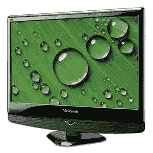
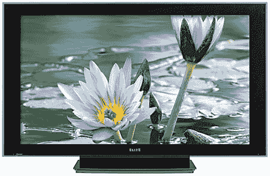
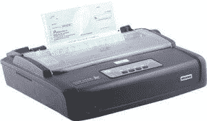
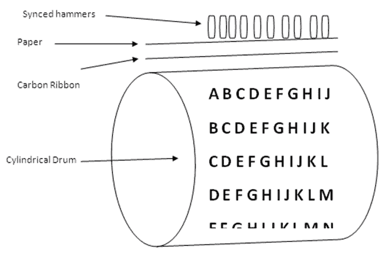
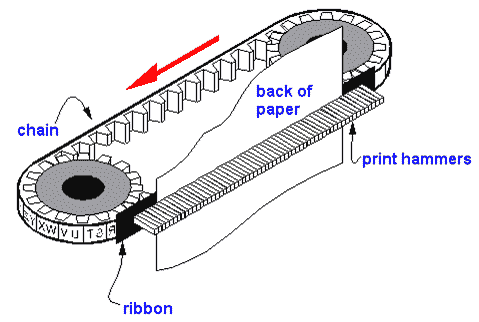
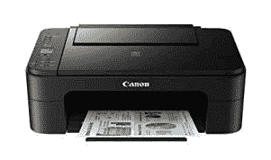
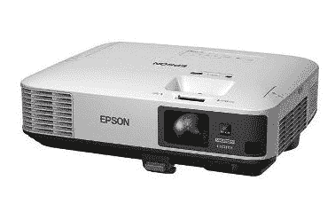

# 输出设备

> 原文：<https://www.javatpoint.com/output-devices>

输出设备显示通过输入设备输入计算机的原始数据的处理结果。有许多输出设备以不同的方式显示输出，如文本、图像、硬拷贝以及音频或视频。

一些流行的输出设备有:

1.  班长
    *   阴极射线管监视器
    *   液晶显示器
    *   发光二极管监视器
    *   等离子显示器
2.  打印机
    *   冲击打印机
        1.  字符打印机
            1.  点阵打印机
            2.  菊花轮打印机
        2.  行式打印机
            1.  滚筒式打印机
            2.  链式打印机
    *   非冲击式打印机
        1.  激光打印机
        2.  喷墨打印机
3.  放映机

* * *

## 1)监视器

显示器是计算机的显示单元或屏幕。它是将处理后的数据或信息显示为文本、图像、音频或视频的主要输出设备。

监视器的类型如下所示。

### 一)阴极射线管监视器

阴极射线管显示器以阴极射线管为基础。它们就像真空管，以视频信号的形式产生图像。阴极射线管通过电子枪产生一束电子束，击中屏幕的内部磷光表面，在屏幕上产生图像。显示器包含数百万个红色、绿色和蓝色的磷点。当被电子束击中时，这些点开始发光，这种现象被称为阴极发光。

阴极射线管监视器的主要部件包括电子枪组件、偏转板组件、荧光屏、玻璃外壳和底座。产生图像的屏幕前部(外表面)称为面板。它由光纤组成。

有三种电子束撞击屏幕:红色、绿色和蓝色。所以，你在屏幕上看到的颜色是红色、蓝色和绿色灯光的混合。磁场引导电子束。虽然液晶显示器已经取代了阴极射线管显示器，但阴极射线管显示器仍然被图形专业人员使用，因为它们的颜色质量。

### 二)液晶显示器

与阴极射线管显示器相比，液晶显示器是一种紧凑且重量轻的平板屏幕。它基于液晶显示技术，用于笔记本电脑、平板电脑、智能手机等的屏幕。液晶显示屏包括两层偏振玻璃，其间有液晶溶液。当光通过第一层时，电流使液晶排列。对准的液晶允许不同水平的光通过第二层，在屏幕上产生图像。

液晶屏有一个像素矩阵，用于在屏幕上显示图像。旧的液晶显示器有无源矩阵屏幕，其中的单个像素通过发送电荷来控制。当图像在屏幕上快速移动时，每秒钟可能会发出一些电荷，使屏幕看起来模糊不清。

现代液晶显示器使用有源矩阵技术，包含带电容的薄膜晶体管。这项技术允许像素保留电荷。所以，他们没有？当图像在屏幕上快速移动时，不要使屏幕模糊，并且比无源矩阵显示器更有效。

### 三)发光二极管监视器

发光二极管显示器是液晶显示器的改进版本。它也有一个平板显示器，并使用液晶显示技术，如液晶显示器。它们之间的区别在于显示器背光的光源。发光二极管显示器有许多发光二极管面板，每个面板有几个发光二极管为显示器提供背光，而液晶显示器使用冷阴极荧光灯为显示器提供背光。手机、LED 电视、笔记本电脑、电脑屏幕等现代电子设备。，使用发光二极管显示器，因为它不仅产生更多的亮度和更大的光强度，而且消耗更少的功率。

### 四)等离子显示器

等离子显示器也是基于等离子显示技术的平板显示器。它在两块玻璃面板之间有微小的细胞。这些电池含有稀有气体和少量汞的混合物。当施加电压时，细胞中的气体变成等离子体，并发出紫外光，在屏幕上产生图像，即屏幕被一点点等离子体(带电气体)照亮。等离子显示器比液晶显示器更亮，视角也比液晶显示器宽。

等离子显示器提供高达 1920 X 1080 的高分辨率、出色的对比度、宽视角、高刷新率等。因此，它们在观看动作电影、体育比赛等时提供了独特的观看体验。

* * *

## 2)打印机

打印机产生已处理数据的硬拷贝。它使用户能够在纸上打印图像、文本或任何其他信息。

根据打印机制，打印机分为两种类型:冲击式打印机和非冲击式打印机。

*   **冲击打印机:有两种类型:**
    1.  字符打印机
        1.  点阵打印机
        2.  菊花轮打印机
    2.  行式打印机
        1.  滚筒式打印机
        2.  链式打印机
*   **无冲击打印机:有两种类型:**
    1.  激光打印机
    2.  喷墨打印机

## 击打式打印机

冲击式打印机使用锤子或打印头将字符或图像打印到纸上。锤子或打印头将色带敲击或压向纸张，以打印字符和图像。

**冲击式打印机进一步分为两种。**

1.  字符打印机
2.  行式打印机

### 1)字符打印机

字符打印机一次打印一个字符，或者通过打印头或锤子的单次敲击来打印。它不会一次打印一行。点阵打印机和菊花轮打印机都是字符打印机。如今，这些打印机由于速度慢，而且只能打印文本，所以没有太多的用途。字符打印机有两种类型，如下所示:

**i)点阵打印机**

点阵打印机是一种冲击式打印机。它印刷的文字和图像是点的图案。这些图案是用打印头将浸透墨水的色带击打在纸上而形成的。打印头包含在纸上产生点图案以形成单个字符的针。24 针点阵打印机的打印头比 9 针点阵打印机包含更多的针，因此它产生更多的点，从而更好地打印字符。为了产生彩色输出，可以用彩色条纹改变黑色色带。点阵打印机的速度大约是每秒 200-500 个字符。

**ii)菊轮打印机**

黛西转轮打印机是由大卫·S·李在暗黑数据系统公司发明的。它由一个轮子或圆盘组成，有辐条或延伸部分，看起来像雏菊，所以它被命名为雏菊轮打印机。在延伸部分的末端，安装了模制金属字符。要打印一个字符，打印机转动滚轮，当所需的字符在打印位置时，锤子敲击磁盘，延伸部分敲击纸张上的墨带以产生印记。它不能用来打印图形，而且经常噪音大，速度慢，即速度很低，大约每秒 25-50 个字符。由于这些缺点，这些打印机已经过时了。

### b)行式打印机:

行式打印机，也称为条形打印机，一次打印一行。这是一台高速冲击打印机，因为它每分钟可以打印 500 到 3000 行。滚筒式打印机和链式打印机是行式打印机的例子。

**i)鼓式打印机:**

滚筒式打印机是一种由旋转滚筒制成的行式打印机，用于打印字符。鼓的表面有圆形的字符带。每一组角色都有一把独立的锤子。当您打印时，滚筒旋转，当所需的字符在锤子下时，锤子将色带敲击纸张以打印字符。滚筒以非常高的速度旋转，并且通过激活适当的锤子来打印字符。虽然不是一次打印所有字符，但打印速度非常快。此外，它只能打印预定义的样式，因为它有一组特定的字符。众所周知，由于使用锤击技术，这些打印机噪音很大。

**ii)链式打印机:**

链式打印机是一种使用旋转链打印字符的行式打印机。这些字符浮雕在链条的表面。链条围绕一组锤子水平旋转，对于每个打印位置提供一个锤子，即锤子的总数等于打印位置的总数。

链条以非常高的速度旋转，当所需的字符到达打印位置时，相应的锤子将页面敲击色带和链条上的字符。他们每分钟能打 500 到 3000 行。由于锤击动作，它们也很吵。

## 无冲击打印机:

非击打式打印机不会通过在靠着纸张放置的色带上敲击打印头或锤子来打印字符或图像。它们打印字符和图像，纸张和打印机器之间没有直接的物理接触。这些打印机可以一次打印一整页，因此也被称为页面打印机。无冲击打印机的常见类型有激光打印机和喷墨打印机:

### 一)激光打印机:

激光打印机是一种使用激光束打印字符的非冲击式打印机。激光束照射到作为感光器的鼓上，并通过改变鼓上的电荷在鼓上绘制图像。然后，感光鼓滚动进墨粉，感光鼓上的带电图像拾取墨粉。然后利用热和压力将墨粉打印在纸上。一旦文件被打印出来，感光鼓就会失去电荷，剩余的墨粉就会被收集起来。激光打印机使用粉末状墨粉代替液体墨水进行打印，并产生分辨率为每英寸 600 点(dpi)或更高的高质量打印对象。

### 二)喷墨打印机:

喷墨打印机是一种非冲击式打印机，通过喷射细小的离子化墨滴来打印图像和字符。打印头有细小的喷嘴来喷射墨水。打印头来回移动，将离子化的墨滴喷射到纸张上，纸张通过打印机输送。这些墨滴通过电场，将墨水引导到纸上，打印出正确的图像和字符。

喷墨打印机具有容纳墨水的墨盒。现代喷墨打印机是彩色打印机，有四个包含不同颜色的墨盒:青色、洋红色、黄色和黑色。它能够打印不同颜色的高质量图像。它可以产生分辨率至少为每英寸 300 点(dpi)的打印对象。

* * *

## 3)投影仪

投影仪是一种输出设备，使用户能够将输出投影到大的表面，如大屏幕或墙壁。它可以连接到计算机和类似设备，将它们的输出投射到屏幕上。它利用光线和镜头产生放大的文本、图像和视频。因此，它是一种理想的输出设备，可以进行演示或教授大量人员。

现代项目(数字投影仪)带有多个输入源，例如用于较新设备的 HDMI 端口和支持较旧设备的 VGA 端口。有些投影仪也支持无线网络和蓝牙。它们可以固定在天花板上，放在架子上，等等，经常用于课堂教学、演讲、家庭影院等。

数字投影仪有两种类型:

**液晶显示器(LCD)数字投影仪:**这种类型的数字投影仪非常受欢迎，因为它们重量轻，输出清晰。液晶投影仪使用透射技术来产生输出。它允许光源(标准灯)穿过三个彩色液晶灯面板。一些颜色穿过面板，一些被面板阻挡，因此图像出现在屏幕上。

**数字光处理(DLP)数字投影仪:**它有一组微小的镜子，为图像的每个像素提供一个单独的镜子，从而提供高质量的图像。这些投影仪主要用于剧院，因为它们满足了高质量视频输出的要求。

* * *