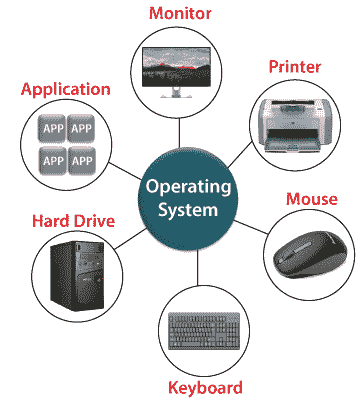
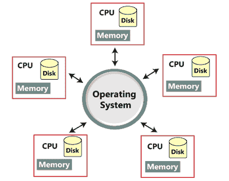
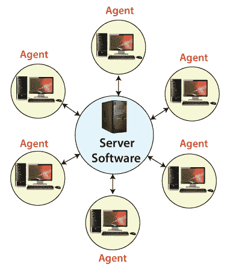
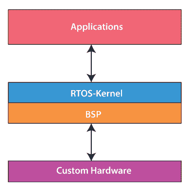

# 操作系统

> 原文：<https://www.javatpoint.com/operating-system>

顾名思义，操作系统是一种软件，没有它你就不能操作或运行计算机。它充当计算机硬件和安装在计算机上的应用程序之间的中介或翻译系统。换句话说，如果没有媒介在计算机硬件和计算机程序之间建立连接，就不能直接使用计算机程序。

除此之外，它还是计算机用户和[计算机硬件](https://www.javatpoint.com/hardware)之间的中介，因为它提供了一个标准的用户界面，当您打开计算机后，您可以在计算机屏幕上看到该界面。例如，Windows 和 Mac OS 也是操作系统，它们提供了带有图标和图片的图形界面，使用户能够同时访问多个文件和应用程序。

因此，尽管操作系统本身是一个程序或软件，但它允许用户在系统上运行其他程序或应用程序。我们可以说是在幕后运行你的电脑。

### 操作系统的主要功能:

*   **内存管理**:同时管理 RAM、ROM、硬盘、笔电等主、副内存。它检查并决定不同进程的内存空间分配和释放。当用户与系统交互时，中央处理器应该进行读或写操作，在这种情况下，操作系统决定为将程序指令和数据加载到内存中而分配的内存量。在这个程序被终止后，内存区域再次被释放，并准备由操作系统分配给其他程序。
*   **处理器管理**:方便处理器管理，决定进程访问处理器的顺序，也决定分配给每个进程的处理时间。除此之外，它还监视进程的状态，在进程执行时释放处理器，然后将其分配给新的进程。
*   **设备/硬件管理**:操作系统还包含管理设备的驱动。驱动程序是一种允许操作系统与设备通信的翻译软件，不同的设备有不同的驱动程序，因为每个设备使用不同的语言。
*   **运行软件应用**:提供运行或使用为执行特定任务而开发的软件应用的环境，如 Ms Word、Ms Excel、Photoshop 等。
*   **数据管理**:通过提供和显示数据管理目录，帮助数据管理。您可以查看和操作文件、文件夹，例如，您可以移动、复制、命名或重命名、删除文件或文件夹。
*   **评估系统的健康状况**:它给了我们一个关于系统硬件性能的想法。例如，您可以看到 CPU 有多忙，从硬盘检索数据的速度有多快等。
*   **提供用户界面**:充当用户和硬件之间的接口。它可以是一个图形用户界面，您可以在其中看到并单击屏幕上的元素来执行各种任务。它使你即使不知道计算机的语言也能与计算机交流。
*   **I/O 管理**:管理输入输出设备，使 I/O 过程流畅有效。例如，它接收用户通过输入设备提供的输入，并将其存储在主存储器中。然后，它指示中央处理器处理该输入，并相应地通过输出设备(如监视器)提供输出。
*   **安全**:它有一个安全模块，保护存储在计算机内存中的数据或信息，防止恶意软件和未经授权的访问。因此，它不仅管理您的数据，而且有助于保护数据。
*   **时间管理**:帮助 CPU 进行时间管理。内核操作系统不断检查请求中央处理器时间的进程的频率。当两个或多个同等重要的进程争夺 CPU 时间时，CPU 时间将被分割成段，并以循环方式分配给这些进程，以防止单个进程垄断 CPU。
*   **死锁预防**:有时一个本应该由两个或多个进程共享的资源被一个进程占用，导致资源无法继续。这种情况被称为死锁。操作系统不会因为在不同的进程间仔细分配资源而出现这种情况。
*   **中断处理** : OS 也响应中断，中断是程序或设备为了寻求 CPU 的注意而产生的信号。操作系统检查中断的优先级，如果它比当前运行的进程更重要，它会停止当前进程的执行，并保留 CPU 的这种状态，然后执行请求的进程。此后，中央处理器返回到停止的相同状态。

### 操作系统的类型:

### 1)批处理操作系统:

在这个系统中，用户和计算机之间不发生交互。用户需要以批次的形式在穿孔卡上准备作业，并将其提交给计算机操作员。计算机操作员对作业或程序进行分类，并将相似的程序或作业保存在同一批中，并作为一个组运行，以加快处理速度。它被设计成一次执行一个作业。工作是在先到先得的基础上处理的，即按照提交的顺序进行，没有任何人为干预。

比如银行生成的信用卡账单就是批量处理的一个例子。不会为每次信用卡购买生成单独的账单，而是通过批处理生成包含一个月内所有购买的单个账单。账单明细作为一个批次收集和保存，然后在计费周期结束时进行处理以生成账单。同样，在工资系统中，公司员工的工资是在每个月底通过批处理系统计算和生成的。

**批处理操作系统优势:**

*   重复的工作可以很容易地完成，无需任何人工干预
*   在批处理系统中输入数据不需要硬件或系统支持
*   它可以脱机工作，因此它对处理器的压力较小，因为它知道下一个要处理的任务以及任务将持续多长时间。
*   它可以在多个用户之间共享。
*   您可以设置批处理作业的时间，以便当计算机不忙时，它可以开始处理批处理作业，例如在晚上或任何其他空闲时间。

**批处理操作系统的缺点:**

*   你需要训练计算机操作员使用批处理系统。
*   调试这个系统不容易。
*   如果一个作业中出现任何错误，其他作业可能需要等待一段不确定的时间。

### 2)分时操作系统:

顾名思义，它使位于不同终端的多个用户能够使用一个计算机系统，并同时共享处理器的时间。换句话说，每个任务都有时间被执行，因此所有任务都被顺利执行。

每个用户在使用单个系统时都能获得处理器的时间。分配给任务的持续时间称为量程或时间片；当这个持续时间结束时，操作系统开始下一个任务。

**分时操作系统优势:**

*   它减少了 CPU 空闲时间，从而提高了工作效率。
*   每个进程都有机会使用中央处理器。
*   它允许不同的应用程序同时运行。

**分时操作系统的缺点:**

*   它需要一个特殊的操作系统，因为它消耗更多的资源。
*   在任务之间切换可能会挂起系统，因为它同时服务于许多用户和运行许多应用程序，因此它需要高规格的硬件。
*   它不太可靠。

### 3)分布式操作系统:

它使用或运行在多个独立的处理器上，为多个用户和多个实时应用提供服务。处理器之间的通信是通过许多通信线路建立的，例如电话线和高速总线。处理器在尺寸和功能方面可能彼此不同。

强大的[微处理器](https://www.javatpoint.com/microprocessor-tutorial)的可用性和先进的通信技术使得设计、开发和使用分布式操作系统成为可能。除此之外，它是网络操作系统的扩展，支持网络上机器的高级通信和集成。

**分布式操作系统优势:**

*   由于资源共享，它的性能比单个系统更高。
*   如果一个系统停止工作、出现故障或出现故障，其他节点不会受到影响。
*   可以轻松添加额外的资源。
*   可以建立对打印机等资源的共享访问。
*   更大程度上减少了处理中的延迟。
*   由于电子邮件的使用，数据共享或交换速度很快。

**分布式操作系统的缺点:**

*   由于资源共享，可能会出现安全问题
*   系统中很少会丢失消息
*   在处理大量数据的情况下需要更高的带宽
*   可能会出现过载问题
*   性能可能较低
*   用于建立分布式系统的语言还没有很好地定义
*   它们非常昂贵，所以不容易买到。

### 4)网络操作系统:

顾名思义，这个 [OS](https://www.javatpoint.com/os-tutorial) 将计算机和设备连接到局域网并管理网络资源。网络操作系统中的软件使网络设备能够共享资源并相互通信。它运行在服务器上，允许通过局域网共享打印机、文件、应用程序、文件和其他网络资源和功能。除此之外，网络中的所有用户都知道彼此的底层配置和各自的连接。例如:Ms Windows Server 2003 和 2008、 [Linux](https://www.javatpoint.com/linux-tutorial) 、UNIX、Novell NetWare、Mac OS X 等。

**网络操作系统优势:**

*   服务器是集中式的，可以从遥远的地方和不同的系统远程访问。
*   在这个系统中很容易集成先进和最新的技术和硬件。

**网络操作系统的缺点:**

*   系统中使用的服务器可能很贵。
*   该系统依赖于中心位置，需要定期监控和维护。

### 5)实时操作系统:

它是为实时应用程序开发的，在这些应用程序中，数据应该在固定的短时间内处理。它用在一个环境中，在这个环境中，多个进程应该在短时间内被接受和处理。RTOS 要求快速输入和立即响应，例如在炼油厂，如果温度过高并超过阈值，应该立即响应这种情况以避免爆炸。同样，该系统用于控制科学仪器、导弹发射系统、交通灯控制系统、空中交通控制系统等。

根据时间限制，该系统进一步分为两种类型:

**硬实时系统:**

这些用于时间至关重要或响应时间是主要因素的应用；即使是几分之一秒的延迟也会导致灾难。例如，一旦发生事故，安全气囊和自动降落伞会立即打开。除此之外，这些系统缺乏虚拟内存。

**软实时系统:**

这些用于定时或响应时间不太关键的应用。在这里，未能在截止日期前完成可能会导致性能下降，而不是灾难。例如，视频监控(cctv)、视频播放器、虚拟现实等。在这里，截止日期并不是每次对每项任务都很关键。

**实时操作系统优势:**

*   由于设备和系统的最大利用率，输出更快
*   任务转移非常快，例如 3 微秒，因此似乎同时执行几个任务
*   给予当前运行的应用程序比排队的应用程序更重要的地位
*   它可以用于嵌入式系统，如交通和其他。
*   它没有错误。
*   内存分配得当。

**实时操作系统的缺点:**

*   为了避免错误，可以同时运行较少数量的任务。
*   对于设计师来说，编写复杂而困难的算法或熟练的程序来获得所需的输出并不容易。
*   需要特定的驱动器和中断信号来快速响应中断。
*   由于涉及工作所需的资源，它可能非常昂贵。

### 几代操作系统:

### 第一代(1945 年至 1955 年):

那是第二次世界大战之前，数字计算机还没有发展起来的时候，在这个时间点上还有带机械继电器的计算引擎。后来机械继电器被真空管取代，因为它们非常慢。但是，即使使用真空管，性能问题也没有得到解决，此外，这些机器体积太大，因为它们是由成千上万根真空管组成的。

此外，每台机器都是由一组人设计、编程和维护的。编程语言和操作系统是未知的，绝对机器语言正被用于编程。

这些系统是为数值计算而设计的。程序员被要求注册一段时间，然后将他的插板插入计算机。20 世纪 50 年代，穿孔卡片被引入，这提高了计算机的性能。它允许程序员在穿孔卡片上编写程序，并将其读入系统；程序的其余部分是相同的。

### 第二代(1955 年至 1965 年):

这一代始于 20 世纪 50 年代中期晶体管的引入。晶体管的使用使计算机更加可靠，它们开始销售给顾客。这些机器被称为大型机。只有大组织和政府公司才能负担得起。在这台机器里，程序员被要求把程序写在纸上，然后在卡片上打卡。该卡将被带到输入室，交给操作员以获得输出。打印机提供被带到输出室的输出。这些步骤使它成为一项耗时的任务。因此，采用批处理系统来解决这个问题。

在批处理系统中，任务以批处理的形式被收集在输入室的托盘中，并被读取到磁带上，磁带被带到机房，在那里它被安装在磁带驱动器上。然后使用一个特殊的程序，操作员从磁带上读取第一个任务或作业并运行它，然后输出到第二个磁带上。操作系统自动从磁带中读取下一个作业，作业一个接一个地完成。批完成后，取下输入和输出磁带，开始下一批。打印输出取自输出磁带。它主要用于工程和科学计算。这一代计算机中使用的第一个操作系统被称为 FMS (Fortran 监视器系统)，IBMSYS 和 Fortran 被用作高级语言。

### 第三代(1965 年至 1979 年):

这一代始于 1964 年引进 IBM的 360 系列计算机。在这一代，晶体管被硅芯片取代，操作系统被开发用于多道程序设计，其中一些甚至同时支持批处理、分时、实时处理。

### 第四代操作系统(1979 年至今):

这一代操作系统始于个人电脑和工作站的出现。这一代引入了包含数千个晶体管的芯片，使得支持网络增长的个人计算机的发展成为可能，从而支持网络操作系统和分布式操作系统的发展。DOS、Linux 和窗口操作系统是这一代操作系统的几个例子。

* * *