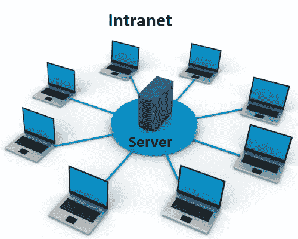
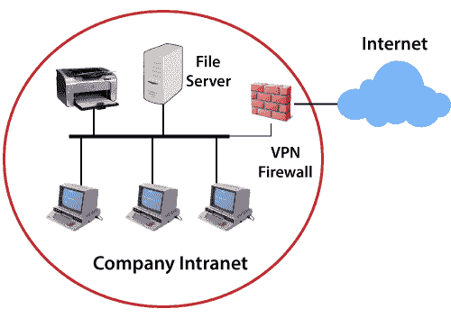

# 内部网络

> 原文：<https://www.javatpoint.com/intranet>

内部网是属于特定组织的专用网络。它是为一个组织及其员工(如员工、客户和其他授权人员)专用而设计的。它提供了一个安全的平台来传递信息和与授权用户共享数据。机密信息、数据库、链接、表格和应用程序可以通过内部网提供给员工。因此，它就像一个私人互联网或内部网站，在一个组织内运行，为其员工提供对其信息和记录的访问。内部网中的每台计算机都由一个唯一的 IP 地址标识。

它基于互联网协议(TCP/ [IP](https://www.javatpoint.com/ip-full-form) )，通过防火墙和其他安全系统防止未经授权的访问。防火墙监控传入和传出的数据包，以确保它们不包含未经授权的请求。所以，内部网的用户可以访问[互联网](https://www.javatpoint.com/internet)，但是如果没有授权，互联网用户不能访问内部网。此外，要访问内部网，授权用户需要连接到其[局域网](https://www.javatpoint.com/wireless-lan-introduction)(局域网)。

**内部网的一些好处是:**

*   便宜易实现易运行，比互联网和[外网](https://www.javatpoint.com/extranet)更安全。
*   它简化了沟通，使公司能够毫不延迟地在员工之间共享其数据、信息和其他资源。全体员工可以接收公司的公告、提问和访问内部文档。
*   它为存储和开发支持业务运营的应用程序提供了一个安全的空间。
*   它通过加快工作流程和减少错误来提高公司的效率。因此，它通过按时完成任务来帮助实现目标。
*   它为新想法上传到公司的互联网网页之前提供了一个测试平台。因此，它有助于维护公司的信誉
*   信息实时共享，或者更新立即反映给所有授权用户。
*   现代内部网还提供了一个移动应用程序，允许员工在旅途中保持联系。
*   它有助于项目管理和跟踪工作流程和团队的进展。
*   它可以与移动设备一起工作，这意味着它可以将内部网中存在的信息直接提供给员工的移动设备，如电话、平板电脑等。
*   它还可以用来激励员工，促进员工的认可，并奖励他们超出预期的表现。

## 内部网如何工作:

内部网基本上包括三个组件:网络服务器、内部网平台和应用程序。网络服务器是包含所有内部网软件和数据的硬件。它管理对服务器上托管的文件的所有请求，找到所请求的文件，然后将其传递给用户的计算机。

内部网平台是软件，允许通信工具、协作应用程序和数据库彼此无缝协作。它是根据企业的具体需求量身定制的。

这些应用程序是用户顺利工作所必需的。它们是计算工具，允许用户完成他们的工作，相互通信和协调，并检索和存储信息。

此外，想要访问内部网的用户需要有一个特殊的网络密码，并且应该连接到局域网。远程工作的用户可以通过虚拟专用网络( [VPN](https://www.javatpoint.com/vpn-full-form) )访问内部网，该虚拟专用网络允许他们登录内部网以访问信息。

## 内部网的缺点:

*   由于隐藏的成本和复杂性，建立内部网的成本可能很高。
*   如果防火墙不能正常工作或没有安装，它可能会被某人黑客攻击
*   需要高安全性密码，外部用户无法猜到
*   人们总是害怕失去对内部网的控制
*   有时可能会出现文档重复，这可能会在员工中造成混乱
*   你必须允许多个用户访问，所以你可能会发现很难控制这个网络。

### 内部网示例:

**教育内网:**一般在学校、学院等。例如，学校内部网旨在允许教学人员相互交流，并获得有关即将到来的更新的信息，如考试日期、学校功能、假期等。

**房地产内部网:**房地产公司的内部网允许其销售团队访问完成销售可能需要的所有重要手册、模板和表格。员工还能及时了解重要事件，如会议、培训、会议等。它还可以用来与团队分享激励信息。

**医疗保健内部网:**在医疗保健领域，在大医院中，内部网帮助医疗保健专业人员作为一个团队工作，为他们的患者提供适当的护理和治疗。医生可以共享报告，治疗程序、账单和索赔可以轻松解决，而无需从一个部门转移到另一个部门。

**IT 部门内部网:**在 [IT](https://www.javatpoint.com/it-full-form) 三部门总是有大量的信息需要一次性与所有员工共享。它可能与需要在给定时间范围内完成的项目有关，例如指导方针、条款和条件，以及在进行项目时应遵循的规则。

## 内部网和互联网的区别:

| 互联网 | 内部网络 |
| 它是一种介质，如光纤电缆，将数十亿台计算机相互连接起来，建立一个全球网络。 | 这是一个小型的专用网络，因为它属于特定的组织。 |
| 它拥有数十亿用户，因为它是一个全球公共网络。 | 它的用户有限。 |
| 它不如内部网安全。 | 这是一个比互联网更安全的网络。 |
| 它可以被任何使用互联网设备的人评估或使用，如笔记本电脑、移动电话等。 | 只有授权人员才能使用该网络。 |
| 它提供广泛的信息，如新闻、博客、网站等。 | 它提供与其组织的工作、政策、更新等相关的有限信息。 |
| 它不属于任何个人或组织。 | 它可以归个人或组织所有。 |

* * *