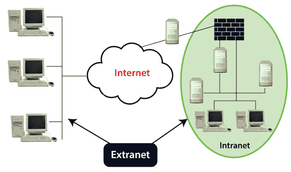
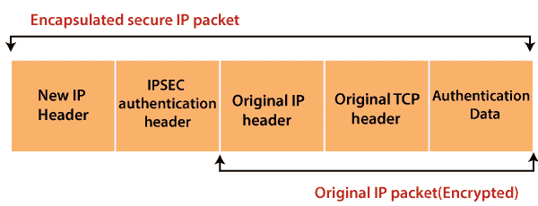

# 外联网

> 原文：<https://www.javatpoint.com/extranet>

外联网是组织内联网的一部分。它是一个基于互联网协议的通信网络。它为其贸易伙伴、客户和其他企业提供对公司内部网的受控访问。因此，它是一个私有网络，可以与公司外部的授权人员安全地共享公司的内部信息和运营，而无需访问公司的整个网络。用户需要有身份证、密码和其他身份验证机制才能访问该网络。

## 外联网的一些好处:

*   它是公司和贸易伙伴之间的单一接口。
*   它使公司的流程自动化，比如当库存下降时自动向供应商下订单。
*   它通过为客户提供一个解决其疑问和投诉的平台来改善客户服务。
*   它使公司能够与贸易伙伴共享信息，而无需参与纸质出版流程。
*   它简化了重复性的业务流程，例如定期向供应商订购。

## 外联网是如何建立的？

它是以虚拟专用网的形式建立的，因为它容易受到安全威胁，因为它使用[互联网](https://www.javatpoint.com/internet)将外部人员连接到组织的内部网。虚拟专用网可以确保您在公共网络中的安全网络，如互联网。传输控制协议(TCP)和互联网协议(IP)用于数据传输。

[虚拟专用网](https://www.javatpoint.com/vpn-full-form)确保基于互联网协议安全架构(IPSEC)协议的安全交易，因为它为 [TCP/IP](https://www.javatpoint.com/tcp-ip-full-form) 协议提供了额外的安全层，该协议用于外联网中的数据传输。在这一层中， [IP](https://www.javatpoint.com/ip-full-form) 包被封装成一个新的 IP 包，如下图所示:

此外，为了给内部网提供更多的安全性，组织还采取了以下两种措施:

*   **防火墙:**防止未授权用户访问外网。
*   **密码:**它还防止包括公司员工在内的未经授权的用户访问存储在其服务器上的数据。

## 外联网的局限性:

*   **托管:**如果在自己的服务器上托管外网页面，需要高带宽的互联网连接，这是可能非常昂贵的。
*   **安全性:**如果您将其托管在自己的服务器上，则需要额外的防火墙安全性。它增加了工作量，使安全机制变得非常复杂。
*   **依赖:**它依赖于互联网，因为外人不使用互联网就无法获取信息。
*   **少互动:**减少了客户、业务伙伴、厂商等面对面的互动。，导致关系建立不良。

## 内部网和外部网的区别:

| 内部网络 | 外联网 |
| 这是一个专用网络，不能从外部访问。 | 它可能不被称为专用网络，因为它可以从外部进行评估。它为授权的外部用户(如供应商、合作伙伴等)提供了有限的访问权限。 |
| 它连接公司的员工。 | 它将公司员工与合作伙伴联系在一起。 |
| 它是一个独立的网络，不是任何其他网络的一部分或延伸。 | 它是公司内部网的一个附加部分。 |
| 通信仅在拥有网络的组织内进行。 | 允许外部用户(如供应商、客户和合作伙伴)成为内部网的一部分，以获取有关组织的信息和更新。 |

* * *