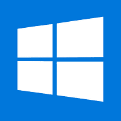
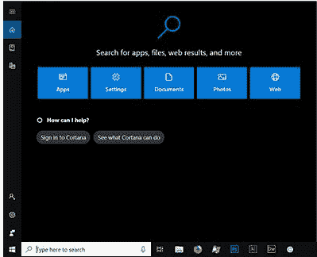
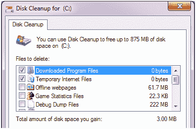

# 什么是 Windows？

> 原文：<https://www.javatpoint.com/windows>

Windows 是微软开发的**图形操作系统**。它允许用户查看和存储文件、运行软件、玩游戏、观看视频，并提供了一种连接到互联网的方式。它是为家庭计算和专业作品发布的。

微软推出了第一个版本 1.0

它于 1983 年 11 月 10 日**发布，用于家庭计算和视窗的专业功能。后来，它在许多版本的 Windows 以及当前版本的 Windows 10 上发布。**

 **1993 年，第一个面向业务的 Windows 版本发布，被称为 **Windows NT 3.1** 。然后又推出了下一个版本， **Windows 3.5** 、 **4/0** 、 **Windows 2000** 。当微软在 2001 年发布视窗操作系统时，该公司为个人和商业环境设计了各种版本。它是基于标准 x86 硬件设计的，比如**英特尔**和 **AMD 处理器**。因此，它可以在不同品牌的硬件上运行，如惠普、戴尔和索尼电脑，包括家用电脑。

### Windows 版本

从 Windows XP 开始，微软已经生产了几个版本的 Windows。这些版本具有相同的核心操作系统，但有些版本包含附加成本的高级功能。Windows 有两个最常见的版本:

*   windows 手机
*   视窗专业版

### windows 手机

Windows Home 是 Windows 的基础版。它提供了 Windows 的所有基本功能，如浏览网页、连接互联网、玩视频游戏、使用办公软件、观看视频。此外，它更便宜，并且预装了许多新电脑。

### 视窗专业版

Windows Professional 也被称为 Window Pro 或 win Pro。它是 Windows 的增强版，对超级用户和中小型企业都有好处。它包含 Windows Home 的所有功能以及以下功能:

*   **远程桌面:** Windows 专业版允许用户创建远程桌面连接。它为用户提供了远程连接另一台计算机的选项，包括共享对其鼠标、键盘和视图显示的控制。主要借助端口 3389 进行访问。此外，我们还可以使用团队查看器或 VNC 应用程序来创建远程桌面连接。
*   **可信引导:**它为引导加载程序提供加密等安全性，并保护计算机免受 **rootkits** (允许用户通过被称为 rootkits 的未授权方式进入另一台计算机的软件工具的集合)的攻击。
*   **Bitlocker:** 它允许用户使用 AES(高级加密标准)算法加密存储驱动器。此功能存在于 Windows 7 和 Windows Vista(仅限终极版和企业版)中，包括 Windows Server 2008。

商用笔记本电脑或计算机主要使用 Bitlocker 功能来保护其在计算机上的数据。就好像你的电脑被偷了一样，破解 Bitlocker 密码非常困难。只有输入正确的密码才能解锁。此外，如果您忘记了您的 Bitlocker 密码，它将无法检索。

*   **Windows 沙盒:**沙盒位于计算机、网络或在线服务上，使用户能够在不中断系统的情况下实验或测试计算机安全性。
*   **Hyper-V:** 代表虚拟机管理程序，由微软公司于 2008 年 6 月 26 日开发。它也被称为视窗服务器虚拟化。Hyper-V 用于 x86-64 服务器的虚拟化，运行虚拟机和第三方软件，如 VirtualBox。
*   **组策略管理:**管理员可以在组织中指定组策略来管理不同的 Windows 用户。
*   它为内存超过 128 GB 的系统提供支持。
*   此外，它还提供了更多的窗口更新安装选项，以及大约 34 天的灵活计划和延迟。

### 微软 Windows 为什么叫 Windows？

当微软视窗没有推出时，所有的微软用户都使用微软操作系统。微软对其大部分产品只说了一个字；它需要一个能够代表其新的 [GUI](https://www.javatpoint.com/gui-full-form) 操作系统的新 Word。微软决定称之为 Windows，因为它能够同时执行几项任务和运行应用程序。

称之为“视窗”的另一个原因是，你不能像“视窗”一样为一个普通的名字注册商标。它的正式名称是微软视窗，第一个 1.0 版本的视窗是在 1995 年推出的。

### 微软视窗的历史

从 1983 年开始，微软就在生产 Windows。微软创始人**‘比尔·盖茨’**于 1983 年 11 月 10 日宣布为微软 Windows 服务，并于 1985 年**发布了第一版 **Windows** 。下表包含从第 1 版到第 10 版的 Windows 历史记录。**

 **| 版本 | 历史 |
| **Windows 1.0** | **微软首次推出 Windows 1.0 版本。它于 1985 年 11 月 20 日发行，开始时售价为 100 美元。此外，这是微软首次尝试用 16 位语言制作图形用户界面。** |
| **Windows 2.0** | 第二个版本**Windows 2.0**是由微软于 1987 年 12 月 9 日**生产的**，同一天还推出了 **Window 386** 。最初，市场上两个窗户的价格都是一样的 **$100.00** 。
它带来了新的功能，比如它能够相互重叠，它还引入了最大化和最小化窗口的新方法，而不是分别使用“缩放”和“图标化”。
此外，它还包括控制面板功能，其中几个系统设置和配置选项在一个地方可用。甚至微软的 Word 和 Excel 也是第一次在 Windows 2 上使用。 |
| **视窗 286** | 1988 年 6 月**发布，刚开始的时候价格是 100 美元。** |
| **Windows 3.0** | 这是第一个需要硬盘的 Windows。它是由微软在 1990 年 5 月 22 日推出的。其完整版售价为**149.95 美元，**更新版为**79.95 美元**。另外，**多媒体支持的** Windows 3 是在【1991 年 10 月推出的。
Windows 3.0 版本获得了更多的成功，它成为了苹果 Macintosh 和 Commodore Amiga GUI 的一个挑战，因为它是由 PC 兼容制造商以及 Zenith Data Systems 在计算机上预装提供的。
它还能够在 Windows 中运行 MS-DOS 程序，该程序允许在传统程序中进行多任务处理，并支持 256 种颜色，这使得界面更加丰富多彩和高级。 |
| **Windows 3.1** | 它于 1992 年 4 月推出，当时它正在开发中，代号为斯巴达。这是个人电脑图形用户界面常用的操作系统。发行后的头两个月，销量就超过了 100 万册。它首次通过引入 TrueType 字体使视窗成为可用的发布平台。扫雷也首次在 Windows 3.1 上使用。
它只需要 1MB 的 RAM 就能运行，并且它允许用户第一次借助鼠标控制 MS-DOS 程序。此外，它也是第一个以光盘形式发行的操作系统。
其他几代 3.1 版本如下:

*   1992 年**推出了工作组窗口 3.1 .**
***   On July 27th, 1993 **, Microsoft launched Windows **NT 3.1** .***   On December 31st, 1993 **, the updated versions of Windows 3.1 **, Windows 3.11 and** were released.***   Workgroup Windows 3.11 was launched in February 1994.*   On September 21st, 1994 **, Windows **NT 5** was launched.*****   The next version of Windows **NT 3.51 and** was launched on May 30th, 1995 **.******

 |
| **Windows 95** | 顾名思义，Windows 95 是在 1995 年 8 月 24 日**推出的，在发布的 4 天内，销量就超过了 100 万份。它首次引入了开始按钮和开始菜单功能，包括重要功能，如 32 位环境、多任务处理和任务栏。此外，在一些程序和元素的帮助下，微软操作系统在视窗 95 中仍然发挥着至关重要的作用。
Internet Explorer 也是第一次在 Windows 95 上使用，但是默认情况下无法安装，它需要 Windows 95 plus 包才能安装。后来，Windows 95 进行了改进，默认包含了 IE 浏览器。** |
| **Windows 95 服务包** | 它于 1996 年 2 月 24 日推出。 |
| windows nt 4.0 | 【1996 年 7 月 29 日， Windows NT 4.0 上线。 |
| **Windows CE** | 

*   The first edition of Windows CE **0** was launched in November, 1996 **.**
*   Windows CE second edition **0** was launched in November, 1997 **.**
*   The next edition of Windows CE **1** was published in **July 1998** .
*   Windows CE third edition **3.0** was launched in 1999.

 |
| **Windows 98** | 它是在 Windows 95 上开发的，并于 1998 年 6 月推出。它发布了，包括 Internet Explorer 4、Windows 通讯簿、Outlook Express、Microsoft Chat 和 NetShow Player。
Windows 98 第二版于 1999 年 5 月 5 日推出，在这个版本中 NetShow Player 被 Windows Media Player 6.2 取代。它还附带了地址栏和窗口资源管理器中的后退/前进导航按钮，以及更多其他功能。
Windows 98 附带了针对计算机组件和附件的新功能 Windows Driver 模型，该模型为 Windows 的所有未来版本提供了支持。此外，它还改进了 USB 支持，包括 USB 鼠标和 USB 集线器。 |
| **视窗 2000** | 【2000 年 2 月 17 日上线。 |
| **Windows ME** | 发明于【2000 年 9 月，最后一个操作系统，基于 MS-DOS，在 Windows 9x 线。根据企业市场，它被认为是面向消费者的 Windows 2000。它还为消费者提供了一些有用的功能以及更自动化的系统恢复工具。
此外，一个互联网浏览器，视窗电影制作机和视窗媒体播放器 7 首次在视窗操作系统上使用。 |
| **视窗 2000** | 于 2000 年 2 月 17 日**引入。**基本上是基于微软面向业务的系统 Windows NT，后来为 Windows XP 提供了基础。此外，自动更新功能首次出现在 Windows 2000 上，并且是第一个支持休眠的操作系统。 |
| **Windows XP** | Windows XP 被认为是 Windows 最好的版本；于 2001 年 10 月 25 日推出。它遵循 Windows ME，并提供了消费者友好的元素。2003 年 3 月 28 日**发布了 64 位**版本的视窗操作系统。此外，其**专业版** x64 于【2005 年 4 月 24 日推出。
开始按钮和任务栏被替换为包括绿色的开始按钮、蓝色的任务栏和 vista 壁纸，以及几个阴影和更多的视觉效果。
它还带来了一些重要的功能，比如帮助读取 LCD 屏幕上内容的 ClearType、从光盘和其他媒体自动播放、不同的自动更新以及恢复工具。
此外，使用时间最长，即使停产，估计也在 430 m PC 使用。 |
| **Windows Vista** | 它是微软在 2007 年 1 月推出的。它带来了更好的外观和感觉用户界面，并包括透明元素，安全性和搜索。当它处于开发阶段时，它的代号是“长角牛”Windows Media Player 11 和 Internet Explorer 7 首次在 Windows Vista 上亮相，其中包括反间谍程序 Windows Defender。它还提供了一些有用的功能，如视窗影碟机，语音识别和照片库。此外，它是第一个以 DVD 形式发行的操作系统。 |
| **Windows Server 2008** | **2008 年 2 月 27 日**微软推出 Windows Server 2008。 |
| **Windows 7** | 它于 2009 年 10 月 22 日**推出，以克服 Windows Vista 面临的所有问题。它发布时具有用户友好的特性和较少的对话框过载。与之前发布的其他版本相比，它更稳定、更快、更易于使用。此外，手写识别功能首次在 Windows 7 上使用。
由于 IE 是微软视窗系统的默认浏览器，反垄断调查利用了微软在欧洲将其作为默认浏览器。因此，它必须为用户提供在第一次引导时选择和安装浏览器的选项。** |
| **Windows Server 2012** | **2012 年 9 月 4 日**微软发布 Windows Server 2012。 |
| **窗口 8** | 微软于 2012 年 10 月 26 日**推出。**它发布时具有新功能，例如快速操作系统、对 USB 3.0 设备的支持以及网络商店。Web 商店是一个可以下载不同类型 Windows 应用程序的地方；它的全屏模式首次在 Windows 8 上运行。 |
| **Windows 8.1** | 微软于 2013 年 10 月 17 日**推出。**它重新启动了开始按钮，能够从 Windows 8.1 的桌面视图显示开始屏幕。此外，它提供了一种选择直接引导到桌面的方法。 |
| **窗口 10** | 【2015 年 7 月 29 日微软推出 Windows 10。它发布时具有一些新功能，例如在键盘和鼠标模式以及平板电脑模式之间切换，这对于使用像 surface Pro 3 这样带有可拆卸键盘的计算机的用户来说是有益的。它是为跨多个设备的所有 Windows 平台以及 Windows 平板电脑和手机(包括常见应用程序)而设计的。 |

### 视窗的特点

微软视窗包含了很多帮助用户的功能。它的一些优秀特性如下:

1.  **控制面板:** Windows 提供了一个控制面板功能，其中包括许多工具来配置和管理其计算机上的资源。例如，用户可以更改音频、视频、打印机、鼠标、键盘、网络连接、日期和时间、节能选项、用户帐户、安装的应用程序等的设置。
    T3】
2.  **Cortana:** Windows 10 引入了一个名为 Cortana 的功能，可以接受语音命令。它可以执行各种任务，如回答您的问题、在计算机上搜索数据、在线购买、设置提醒和约会等。此外，它的行为类似于其他语音激活服务，如谷歌助手、阿列克谢或 Siri，包括在您的计算机上搜索信息的另一个好处。要在窗口 10 中打开 Cortana，按下**窗口键+ S** 。
    
3.  **文件资源管理器:**也叫 Windows 资源管理器，在电脑上显示你的文件和文件夹。它允许用户浏览硬盘、固态硬盘和其他插入的可移动磁盘(如笔式驱动器和光盘)上的数据，您可以根据删除、重命名、搜索和传输数据等要求管理内容。
    T3】
4.  **互联网浏览器:**作为互联网浏览器，搜索任何东西、查看页面、网购、玩游戏、看视频等都非常重要。Windows 自带预装的互联网浏览器。在 Windows 10 中，Edge 互联网浏览器是默认浏览器。此外，从 Windows 95 版到 8.1 版，Internet Explorer 是微软 Windows 中的默认浏览器。
    T3】
5.  **微软 Paint:** 从 1985 年 11 月开始，微软 Windows 自带预装的微软 Paint。这是一个创建、查看和编辑图像的简单软件。它提供了几个工具来绘制图像、裁剪、调整大小以及保存具有不同文件扩展名的图像。
    T3】
6.  **任务栏:** Windows 自带一个任务栏，可以显示当前打开的程序，它还允许用户访问任何特定的程序。此外，它还包括右侧的通知区域，显示日期和时间、电池、网络、音量和其他后台运行的应用程序。
    T3】
7.  **开始菜单:**微软 Windows 在任务栏左侧包含一个开始菜单。它显示安装在计算机上的程序和实用程序。只需点击开始菜单按钮或按键盘上的开始键即可打开。
    T3】
8.  **任务管理器:** Windows 包括任务管理器功能，提供计算机上正在运行的应用程序或程序的详细信息。您还可以检查每个应用程序使用了多少系统资源，例如内存、中央处理器、磁盘输入/输出。
    T3】
9.  **磁盘清理:**用于在删除临时或不必要文件的帮助下释放磁盘空间。它还有助于提高计算机的性能，并增加下载程序和文档的存储空间。要打开磁盘清理，请按照以下步骤操作:
    
    *   按**窗口+e**打开文件浏览器
    *   然后，右键单击任意磁盘驱动器，并从下拉列表中选择属性选项。
    *   现在，点击**磁盘清理**。

### Linux 和 Windows 操作系统的区别

下表描述了 [Linux](https://www.javatpoint.com/linux-tutorial) 和 Windows 操作系统的主要因素:

| 主题 | Windows 操作系统 | Linux 操作系统 |
| **命令行** | Windows 允许用户使用命令行，但不能作为 Linux 命令行。要打开命令行，请单击运行对话框，并在运行搜索栏中键入 CMD，然后按回车键。 | 尽管 Linux 命令行为管理和日常任务提供了更多功能，但它并没有为最终用户提供太多功能。 |
| **可靠性** | 在过去的几年里，Windows 已经提高了它的可靠性，但与 Linux 相比，它仍然不太可靠。 | Linux 比 Windows 操作系统更可靠、更安全。它主要关注系统安全性、流程管理和启动时间。 |
| **可用性** | Windows 更容易使用，因为它提供了一个简单的用户界面。但是它的安装过程可能需要更多的时间。 | 虽然 Linux 能够更容易地执行复杂的任务，但是它的安装过程很复杂。 |
| **安全** | 近年来，微软加强了视窗系统的安全功能。由于它拥有庞大的用户群，主要是新的计算机用户，它很容易成为恶意代码者的目标。此外，在所有的操作系统中，微软视窗可能是开发恶意软件和病毒的一部分。 | 与微软视窗系统相比，Linux 是一个更安全的操作系统。即使是攻击者也发现在 Linux 的帮助下破坏安全性有困难。 |
| **支持** | 它为用户提供了在线和集成的帮助系统，以及大量的信息书籍，可为各种技能水平的人提供帮助。 | 有大量的书籍可以提供关于 Linux 的帮助，包括在线支持。 |
| **更新** | 定期更新会在不方便的时候提醒用户更新，让用户感到沮丧。此外，更新需要更多时间。 | Linux 为用户提供了对更新的完全控制。他们可以相应地对其进行更新，而且更新所需的时间更少，也不需要重新启动系统。 |
| **许可** | 有许可证的微软视窗不允许修改软件(无权访问源代码)。它只能安装在具有 Windows 许可证密钥的系统上。 | 带有许可证的 Linux 操作系统为用户提供了在任意数量的系统上重用源代码的好处。它还允许用户修改软件并出售其修改版本。 |

* * *****