# 什么是打印机？

> 原文：<https://www.javatpoint.com/printers>

打印机是一种硬件输出设备，用于生成硬拷贝和打印任何文档。文档可以是任何类型，如文本文件、图像或两者的组合。它接受用户在计算机或其他设备上的输入命令来打印文档。例如，如果你必须在大学提交一份项目报告，你需要创建一份报告的软拷贝，并在打印机的帮助下打印出来。

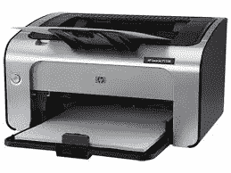

打印机是常见的计算机外围设备之一，可分为两类，即 **2D 和 3D 打印机**。2D 打印机用于在纸上打印文本和图形，3D 打印机用于创建三维物理对象。

## 打印机类型

虽然有不同类型的打印机，但现在常用的打印机有两种，喷墨打印机和激光打印机。下面列出了所有不同类型的打印机:

*   喷墨打印机
*   激光打印机
*   3D 打印机
*   发光二极管打印机
*   固体油墨打印机
*   点阵打印机
*   多功能或多功能一体打印机
*   热敏打印机
*   计划者

### 喷墨打印机

家用和商用计算机用户广泛使用它，通过在纸上使用磁性板喷射墨水来打印字符。它包含一个**进纸组件、墨盒、打印头、稳定杆和皮带。**

它将墨水存储在墨盒中，并使用单独的墨盒打印多种类型的彩色文档。这些颜色是青色、品红色、黄色和黑色的组合。这些类型的打印机有能力借助鲜艳的颜色创建高质量的图片。此外，与其他打印机相比，喷墨打印机更实惠，更易于使用。

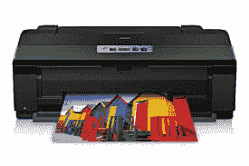

**喷墨打印机的优势:**

*   喷墨打印机能够产生高质量的输出。
*   这些打印机速度相当快，而且容易使用。
*   此外，这些类型的打印机不需要预热时间。

**喷墨打印机的缺点:**

*   打印可能需要更多时间。
*   它的运行成本很高。
*   它不允许荧光笔标记。
*   有时，它会产生空弹药筒的错误警告。

### 激光打印机

激光打印机是常见的个人电脑打印机之一。它于 1971 年推出，之后由加里·斯塔克韦瑟在施乐 PARC 公司开发。它使用激光或非冲击式复印机技术在纸上打印文本和图像。每当它被输入打印任何文件时，激光束就会借助电荷将文件吸引到硒鼓上。

*   当鼓被充电时，它在墨粉(干墨粉)中滚动。墨水跟随图像，图像已经在鼓上充电。墨水与纸张结合，包括热和压力，然后转移到一大块(一张)纸上。

当打印文档时，多余的墨粉被收集，并且电荷从鼓中移除。大多数激光打印机只能打印单色。单色激光打印机比彩色激光打印机便宜十倍左右。

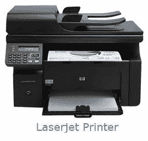

激光打印机和喷墨打印机有许多不同之处，例如:

*   激光打印机含有干墨，而喷墨打印机含有**湿墨。**
*   喷墨打印机比激光打印机大约贵十倍，因为它需要非常频繁地更换墨水。
*   如果纸张是湿的，喷墨打印机将打印模糊的文件，但激光打印机将打印清晰。喷墨打印机适合打印较少的文档，而激光打印机具有打印更多文档的能力。

**激光打印机的优势:**

*   这些类型的打印机具有更高的纸张容量。
*   它比喷墨打印机便宜。
*   它能够快速打印文件。
*   此外，它能够提高生产率。

**激光打印机的缺点:**

*   激光打印机可能需要预热时间。
*   激光打印机体积庞大，因为它们需要激光技术和成像鼓。
*   它要求高电压导致少量碳排放。

### 3D 打印机

打印技术历史上最好的改进之一是 3d 打印机，由**查克·赫尔**在 **1984** 开发。它使用**优质树脂**制作三维物体和物品。它使用塑料、聚合物、金属合金甚至食品配料等材料。

**3D 打印机的应用**

使用 3D 打印机的应用有很多，比如**考古、航天工程、信息系统、牙科、生物技术**。例如，它可能被用来从物理上重建古老的考古文物，这些文物已经随着时间而被摧毁。

**3D 打印机如何工作？**

通常，对象的设计始于计算机辅助设计(CAD)软件系统，在该系统中创建其原型。然后，计算机辅助设计系统将该原型以 STL(立体光刻)文件格式发送到打印机。打印机在读取横截面的原型后，开始逐层重新创建对象的过程。下图是名为 FlashForge 的 3d 打印机的蓝图。

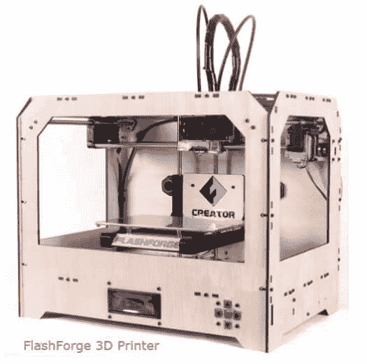

**3D 打印机优势:**

*   3D 打印机的主要优点是它允许用户以 3D 方式打印对象。
*   它具有完全定制的能力。
*   它很容易获得，成本效益高。
*   它打印的文件质量更好。
*   它为用户提供了无限的形状和几何图形。

**3D 打印机的缺点:**

*   它的初始成本和树脂成本都很高。
*   3D 打印仍在发展技术。
*   它消耗的能量比注塑高 50 到 100 倍。
*   它包括有限的材料
*   3D 打印机速度很慢，因为它们可以无限制地进行大规模定制。

### 发光二极管打印机

LED 打印机大多像激光打印机。它使用鼓、墨水和定影器系统来打印黑色或彩色文档。最初，卡西欧和 function 通过将光线聚焦在滚筒的整个长度上来开发发光二极管打印机。这些类型的打印机是无冲击的，但不是在打印头中使用激光，而是使用发光二极管。这些打印机是制造商 OKI 在 1989 年发明的。

激光打印机和 LED 打印机是有区别的；发光二极管打印机使用一条发光二极管在打印鼓上产生吸墨静电荷，而激光打印机使用激光器和镜子。尽管与喷墨打印机和激光打印机相比，发光二极管打印机并不更受欢迎，但它们逐渐受到欢迎，因为它们为用户提供了独特的好处。

**LED 打印机如何工作？**

发光二极管打印机有一个感光的鼓状激光打印机，它的表面在高压线的帮助下充满了静电。在激光打印机中，为了从电路板上绘制图像或文本，激光使用发送给它的数据，这些数据需要打印到镜子中，并在其轴上移动，以将光束传输到滚筒上。

而在发光二极管打印机中，负静电荷是由位于滚筒上方或下方的发光二极管产生的。来自发光二极管的光照射到带正电的鼓上，擦除鼓上的电荷并产生负电荷。这种电荷会吸引带正电的碳粉颗粒，这些颗粒会粘附在发光二极管产生的带负电的表面上。

当纸张进入打印机的机械装置时，它会在高压线的帮助下带正电，并将碳粉从其粘附的带负电的部分吸出。然后，纸张在两个加热辊之间移动，在从打印机出来之前，它会将碳粉带到页面上。

**LED 打印机的优势:**

*   LED 打印机的制造比激光打印机便宜。
*   这些类型的打印机大多包含免费保修延期。
*   这些打印机能够在厚的 3D 项目上打印。

### 固体油墨打印机

激光级固体墨水打印机旨在节省包装空间和金钱。它使用一种独特的墨水技术，在使用前会融化成液体。由于喷墨打印机将墨水直接喷在纸上，但固体墨水打印机不同，它们将墨水喷在鼓上。首先，将油墨转移到鼓上比转移到打印机上是获得良好颜色组合的更好方法，因为鼓可以比移动的纸张得到适当的控制。施乐在 2000 年收购了泰克公司的彩色打印机部门。固体墨水打印机是由泰克推出市场的，带有蜡笔状墨盒。

**固体墨打印机优势:**

*   固体墨水打印机的打印质量很好，因为它可以在信封、再生纸、透明胶片和卡片纸等各种介质上产生动态色彩和非凡的打印质量。
*   固体墨水打印机很容易操作，因为它们是由无毒植物油制成的，在我们手中不会融化。与激光或喷墨打印机不同，它们不会溢出或泄漏。
*   这些类型的打印机能够快速打印文件。一般每分钟最多可以打印 30 页。
*   固体打印机中的墨水装载很容易，因为它包括特定形状的墨棒，这些墨棒只能进入正确的插槽。这些类型的打印机包含打印机顶部的墨水槽，它们允许您随时更换墨水，包括在打印时。
*   固体墨水打印机就是这样设计的；它们仅包括三个主要组件，即打印鼓、打印头和控制器。与彩色激光打印机相比，它占用的空间更少。
*   此外，这些打印机及其部件比彩色碳粉盒和彩色激光打印机更便宜。

**固体油墨打印机的缺点:**

*   这些打印机可能需要预热和冷却停机时间。
*   这些对紫外线很敏感，随着时间的推移，颜色可能会在阳光下褪色。
*   这些打印机比激光打印机耗电更多
*   这些打印机主要用于大量打印。如果在打印过程中关闭，需要一段时间才能再次预热。

### 点阵打印机

点阵打印机也被称为针式打印机，由 IBM 在 1957 年发布。尽管在 1970 年，先涛公司创造了第一台点阵冲击打印机。它使用打印头击打墨带，打印头放置数千个小点形成图像和文本。如今，与激光和喷墨打印机相比，它的使用较少，因为它的打印速度慢，产生的图像质量较低。然而，点阵打印机仍然在一些部门使用，如包裹递送公司和汽车配件商店。

**点阵打印机优势:**

*   与大多数打印机相比，点阵打印机不太贵，而且很容易在市场上买到。
*   与非击打式打印机不同，它能够打印出特定打印件的复写纸。
*   它的印刷成本比其他打印机低。
*   此外，它的维护成本比其他打印机便宜。

**点阵打印机的缺点:**

*   与非冲击式打印机相比，点阵式打印机的速度较慢，而且输出的分辨率也不高。
*   当大头针碰到纸上的色带时，会产生很高的噪音。
*   这可能是一台耗时的打印机，因为它需要一张纸来手动卷绕和对齐。

### 多功能打印机

多功能打印机是可以执行**打印、扫描、传真、复印**等各种任务的硬件设备。它也被称为多功能一体打印机。它适用于想要降低成本、整合资产和改进工作流程的预算型企业。虽然有必要借助有线或无线连接将打印机连接到计算机，但有时也可以像独立复印机一样通过控制面板进行控制。此外，不需要一个以上的单元，因为它可以轻松地同时完成办公室或家中的多项任务。

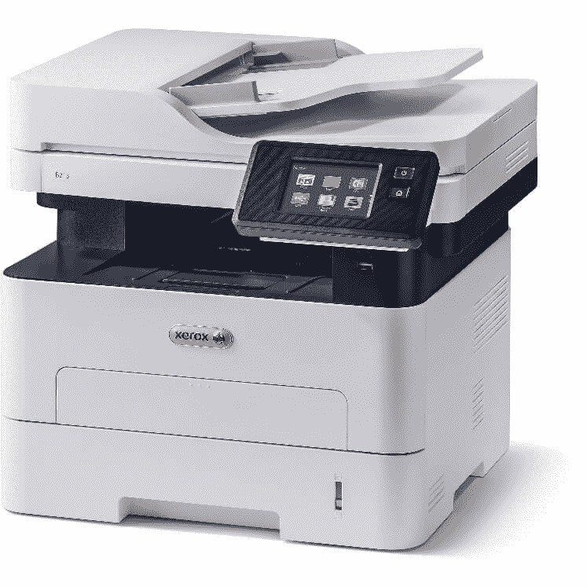

**多功能打印机的优势:**

*   多功能打印机可以节省初始成本，因为您可以只购买一台大型多功能打印机，而不是购买许多打印机和传真机。
*   这些类型的打印机有利于家庭和办公室，因为它们节省了大量的占地面积。可能很难为传真机、打印机和扫描仪找到空间，但多功能打印机占用的空间有限，可以执行多项任务，如打印、传真和扫描。
*   多功能打印机的最大优点之一是，与激光打印机或其他打印机相比，操作功能更快。此外，一些多功能打印机可以同时发送打印文档、传真、扫描图像和复印。
*   此外，这些打印机只需要一根电缆来为整个设置供电，这减少了运行设备所需的拥挤和电力。因此，与其他打印机相比，多功能打印机消耗更少的功率。

**多功能打印机的缺点:**

*   多功能打印机的运行成本很高。与其他打印机相比，它的维护成本也很高，因为它使用墨水的速度很快。所有功能，如传真、复印和打印机，都可以更快地使用墨水。
*   这些打印机根据先进先出规则执行任务。所以所有的任务都堆积在一个队列中，这会导致机器变慢。因此，有些人可能不得不等待使用机器。
*   当多功能打印机停止工作或出现故障时，所有扫描、打印、复印、传真工作将完全停止。如果组织对传真、复印和打印文档有更多要求，这可能是一个问题。

### 热敏打印机

热敏打印机是由杰克·基尔比发明的，也称为电热打印机、热转印打印机或热蜡转印打印机。它利用加热针在纸上产生图像。这些类型的打印机广泛用于银行、航空、食品杂货、娱乐、零售、医疗保健行业、传真机和计算器。这些打印机成本低，打印速度快，不像其他打印机那样使用墨水。他们主要依靠热敏纸来产生图像。

这项技术对组织来说很有用，因为它既可靠又经济。员工可以不间断地工作，因为他们不需要更换这台打印机的墨盒或色带。

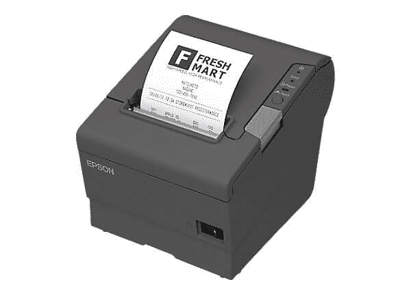

**热敏打印机优势:**

*   热敏打印机的主要优点之一是不需要任何色带或墨盒。因此，公司可以通过使用它来节省时间。
*   这些类型的打印机易于使用，因为它们的按钮较少，包括使用软件。
*   这些对办公室有益，因为它们提供了无噪音的环境。
*   这些打印机更便宜，有几种型号和尺寸。
*   这些打印机比其他打印机打印单色的速度更快，效率更高。

**热敏打印机的缺点:**

*   通常，热敏打印机不能像标准打印机那样很好地打印出颜色。
*   打印时，高热可能对打印头有害。因此，如果打印头出现故障，您必须支付维修费用或购买新的打印头。

### 计划者

绘图仪是一种硬件设备或打印机，最早是由雷明顿-兰德公司于 1953 年在 T2 发明的。它是为打印矢量图形而开发的，使用铅笔、钢笔、记号笔或其他书写工具来绘制连续的线条，而不是使用墨水或 tonner。它广泛用于打印原理图和其他类似应用的硬拷贝。

下表列出了几种类型的绘图仪:

1.  **鼓式绘图仪:**又称滚筒绘图仪。当钢笔左右移动时，它会在鼓上来回转动平装书。借助于这两个方向的组合，可以在任何方向上绘制线条。
2.  **平板式绘图仪:**在平板式绘图仪中，一张纸放置在一个大的水平面上。移动杆在表面上移动并绘制线条。
3.  **静电绘图仪:**它用带正电荷的墨水或 tonner 在带负电荷的纸上绘图。
4.  **喷墨绘图仪:**它是一种夹送辊绘图仪，通过在纸上喷洒小墨滴来产生图像。
5.  **切割绘图仪:**是新一代设备，允许用户切割不同形状。它主要用于广告、标志制作、广告牌和车辆图形。

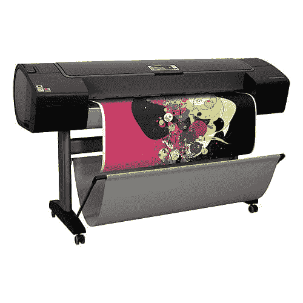

**绘图仪的优势:**

*   绘图仪能够以更好的质量在大约 2 英尺或更大的纸张上工作。
*   它可以打印在纸张、钢、塑料、铝、胶合板和任何平板材料上，包括纸张。
*   它能够将所有模板和模式保存在磁盘上。因此，它可以克服反复加载相同模式的问题。
*   此外，它可以一千次绘制相同的图案，而不会有任何退化。

**绘图仪的缺点:**

*   绘图仪的尺寸比传统打印机**要大得多。**
*   与传统打印机相比，绘图仪更贵。

### 打印机接口

打印机接口是指将打印机连接到计算机并与之通信的各种方式。现在常用的连接方式有 Wi-Fi(无线)和 USB 线(有线)。下面给出了用于连接计算机和打印机的电缆的完整列表:

*   通用串行总线
*   第 5 类
*   MPP-1150
*   法尔接口
*   小型计算机系统接口
*   串行端口
*   并行端口
*   无线网络

**USB:** 代表 1996 年 1 月首次推出的**通用串行总线**。它允许计算机与外围设备和其他设备通信。有各种各样的 USB 连接设备，如键盘、鼠标、pendrive 和闪存驱动器。它还可以用来给平板电脑、智能手机等设备供电，包括给电池充电。

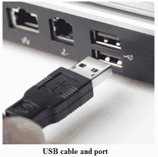

USB 电缆有 3 英尺到 16 英尺的不同长度。它的最大长度为 16 英尺 5 英寸(5 米)，用于高速设备，9 英尺 10 英寸(3 米)用于低速设备。

**第 5 类:**它是一种网络电缆，包括由 RJ-45 连接器端接的四对铜线。也称为局域网电缆或以太网电缆。它用于商业和家庭网络，提供高达每秒 100 兆字节的数据传输速度。它的最大长度是 100 米。如果在没有任何网络设备的情况下超过这个长度，会导致网络问题，包括数据传输速度崩溃和数据丢包。

**MPP-1150:** 用于雅达利电脑串行接口。它连接到打印机的 36 针连接器。

**Firewire:** 它是一种 400-800 Mbps 及以上的数字总线带宽，由苹果在 1995 年开发。它支持即插即用(PnP)设备，可以在同一总线上处理多达 63 个单元。它也被称为 IEEE-1394。对 USB 比较熟悉的用户可以考虑一下类似 USB 的 FireWire。和 USB 一样，FireWire 也有各种设备，比如摄像头和可移动驱动器。

**SCSI:** 它代表小型计算机系统接口，最早完成于 1982 年。它主要用于磁盘驱动器，支持八个设备，或者十六个带宽 SCSI 的设备。一旦安装到计算机上，它允许安装几个 SCSI 设备。

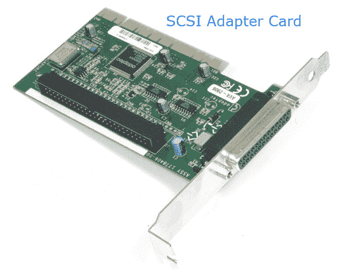

*   **SCSI-1:** 它是最初的 SCSI 标准，每秒钟最多可以传输 8 位。它在 1986 年被开发为 ANSI X3。
*   **SCSI-2:** 它提供了对额外设备的支持，并增加了宽而快的 SCSI 等新功能。它于 1990 年获得批准。
*   **SCSI-3:**1996 年批准为‘ANSI x 3.270-1996’。

**串口:**是计算机上一次可以传输一位的异步端口。它为用户提供了将串行设备与计算机连接的选项。例如，调制解调器可能连接到 COM1，鼠标可能连接到 COM2。它可以与鼠标、调制解调器、打印机和网络一起使用。此外，它是主板的一部分，位于计算机的背面。

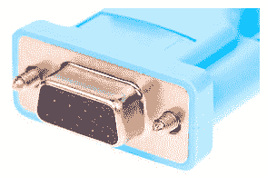

**并口:**广泛用于打印机与电脑的连接。它最初由 Centronics 公司设计，后来由爱普生开发。它是一个 25 针计算机接口，位于 BM 兼容计算机的背面。

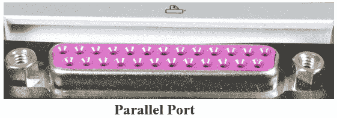

**Wi-Fi:** 它是一种无线组网技术，代表无线保真。它使用 IEEE 802.11 标准来提供无线互联网和网络连接。无线网络更受欢迎，因为它提供无线连接，而通过电缆提供连接非常困难，因为它需要在每台计算机上安装和部署。

### 各种打印机的历史

| 打印机 | 历史 |
| **机械打印机** | 在 **1822** 中，查尔斯·巴贝奇介绍了第一台与差引擎一起使用的机械打印机。 |
| **喷墨打印机** | 虽然喷墨打印机是在 20 世纪 50 年代发展起来的，但直到 20 世纪 70 年代才能够产生像样的数字图像。这些打印机由不同的公司开发，如爱普生、佳能和惠普。 |
| **激光打印机** | 这台激光打印机是由加里·斯塔克韦瑟在施乐工作期间开发的，他在 20 世纪 70 年代初改装了他们的一台 7000 型复印机。当惠普公司在 1984 年开发出惠普激光打印机时，激光打印机变得更加经济实惠且广泛可用。第二年，苹果公司发明了 Apple LaserWriter 打印机，为打印机市场提供了 PostScript 技术。 |
| **3D 打印机** | **1984 年**3d 打印机由查克·赫尔引进。 |
| **点阵打印机** | 在 **1957** 年，IBM 创造了第一台点阵打印机。尽管如此，Centronics 公司在 1970 年推出了第一台点阵冲击打印机。 |

### 如何购买打印机？

无论何时购买打印机，选择一台完美的打印机对您来说都可能是一项艰巨的任务。以下是打印机技术的重要信息，可以帮助您购买打印机。

### 技术

购买打印机时，首先要考虑的是技术，即打印机用于打印的技术。如今，激光和喷墨打印机是更流行的打印机技术。

激光打印机是企业或网络的更好解决方案，因为它们提供高质量的分辨率、效率和速度。

喷墨打印机价格合理，对家庭企业和家庭用户都有好处。

### 解决

这是购买打印机时需要牢记的要点之一。它是根据打印机打印的每英寸点数(DPI)来衡量的。

### 速度

在购买打印机之前，速度也是必须考虑的重要一点。打印机的速度意味着一台打印机一分钟可以打印多少页。它的分级可以在每分钟 4 到 10 页(PPM)之间，这是基于不同的因素，例如打印是彩色还是黑白、整页还是仅文本。您可能更喜欢购买激光打印机，因为与喷墨打印机相比，它的每分钟页面速度更快。

### 每页成本

每页的成本与打印机购买后的现行价格有关。当你考虑每页的成本时，你可能需要为激光打印机支付比喷墨打印机更少的费用。

### 墨水和墨粉

无论何时购买打印机，墨粉或墨水都是一个重要因素。阅读下面给出的打印机墨水特性。

*   **价格**是你购买打印机时最重要的因素之一。如果你需要经常使用打印机，你必须花更多的钱更换墨水。因此，检查一下当墨水需要更换时需要支付多少费用。
*   您需要从可以购买的地方查看油墨的可用性。因为有些打印机制造商专门向客户提供墨水。如果您从第三方购买这种墨水，打印机的保修将失效。
*   查看您的打印机使用了哪种类型的墨水。正在考虑激光打印机的用户，请确保打印机接受不同颜色的墨盒。一些打印机制造商可能会提供一个包含所有类型墨盒的墨盒，因此即使您需要一种颜色，您也必须购买该墨盒中所有可用的颜色。此外，检查墨盒是否只包含墨水或墨水和喷嘴，因为与仅包含墨水的墨盒相比，包含墨水和喷嘴的墨盒将更加昂贵。

* * *