# 什么是显示器？

> 原文：<https://www.javatpoint.com/monitor>

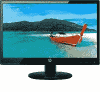

监视器是一种电子输出设备，也称为**视频显示终端**(视频显示器)或**视频显示单元**(视频显示器)。它用于显示连接的计算机通过计算机的视频卡生成的图像、文本、视频和图形信息。虽然它几乎像电视，但它的分辨率比电视高得多。第一台电脑显示器于 1973 年 3 月 1 日在 T4 推出，它是施乐阿尔托电脑系统的一部分。

旧的显示器是通过使用荧光屏和阴极射线管(CRT)制造的，这使得它们又重又大，从而使它们占据了桌子上更多的空间。如今，所有显示器都是使用平板显示技术制成的，通常用发光二极管背光照明。与老式的阴极射线管显示器相比，这些现代显示器占用的桌面空间更少。

## 监视器历史

*   在 **1964** 中，Uniscope 300 机器包括一个内置的 CRT 显示器，这不是一个真正的电脑显示器。
*   A.约翰逊在 1965 年发明了触摸屏技术。
*   1973 年 3 月 1 日，施乐 Alto 电脑问世，它有了第一台电脑显示器。这台显示器包括一个单色显示器，并采用了阴极射线管技术。
*   1975 年，乔治·塞缪尔·赫斯特推出了第一个电阻式触摸屏显示器，尽管它只是在 1982 年之前才使用。
*   1976 年，苹果 I 和 Sol-20 电脑系统推出。这些系统有一个内置的视频端口，允许它们在计算机显示器上运行视频屏幕。
*   1977 年，詹姆斯·p·米切尔发明了 LED 显示技术。但即使在 30 年后，这些显示器也不容易在市场上买到。
*   1977 年 6 月，Apple II 发布，允许在 CRT 显示器上进行彩色显示。
*   1987 年，IBM 发布了 IBM 8513，第一款 VGA 显示器。
*   1989 年，VESA 为计算机的显示定义了 SVGA 标准。
*   在 20 世纪 80 年代后期，彩色阴极射线管显示器能够支持 1024×768 分辨率的显示。
*   Eizo Nanao 制造了 Eizo L66，这是第一台用于台式电脑的液晶显示器，并于 20 世纪 90 年代中期发布。
*   1997 年，IBM、Viewsonic 和苹果开始开发彩色液晶显示器，其质量和分辨率优于阴极射线管显示器。
*   1998 年，台式电脑的彩色液晶显示器由苹果公司制造。
*   2003 年晚些时候，阴极射线管显示器的销量首次超过液晶显示器。直到 2007 年，阴极射线管显示器的销量一直超过液晶显示器，因此它们成为更受欢迎的电脑显示器。
*   2006 年，杰夫·韩在 TED 发布了第一款无界面、基于触摸的显示器。
*   2009 年，NEC 公司发布了 LED 显示器 MultiSync EA222WMe。这是 NEC 发布的第一款显示器。
*   AMD 和英特尔在 2010 年 12 月宣布终止对 VGA 的支持。
*   2017 年，随着客户开始降价，触摸屏液晶显示器变得更加实惠。

## 监视器的类型

监视器有几种类型；其中一些如下:

### 1.阴极射线管监视器

这是早期显示器中使用的技术。它使用电子束在屏幕上创建图像。它包括在屏幕内发射电子束的枪。电子束反复撞击屏幕表面。这些枪负责生成 RGB(红、绿、蓝)颜色，在这三种颜色组合的帮助下可以生成更多的其他颜色。今天的平板显示器取代了阴极射线管显示器。

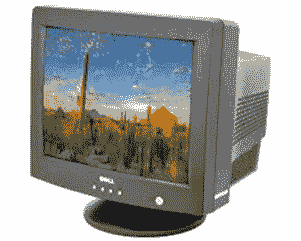

### 2.平板显示器

这些类型的显示器重量轻，占用空间少。与阴极射线管显示器相比，它们耗电更少。这些监视器更有效，因为它们不提供有害辐射。这些显示器比阴极射线管更贵。平板显示器用于 PDA、笔记本电脑和手机。这些显示器有各种尺寸，如 15 英寸、17 英寸、18 英寸和 19 英寸等。平板显示器是借助两块玻璃制成的。这些盘子里有一种物质，它可以通过多种方式被激活。

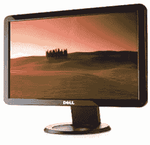

**平板显示器屏幕使用两种技术，如下所示:**

*   **液晶显示器:** LCD(液晶显示器)屏幕含有一种被称为液晶的物质。这种物质的颗粒排列方式使光线位于屏幕背面，从而产生图像或块。与阴极射线管显示器相比，液晶显示器提供了清晰的图像，并且辐射更少。此外，它比阴极射线管显示器消耗更少的功率和占用更少的空间。
*   **气体等离子体显示:**这款显示器采用气体等离子体技术，在 2 片玻璃之间使用一层气体。当施加电压时，气体释放出紫外光。通过这种紫外线，屏幕上的像素发光并形成图像。这些显示器有最大 150 英寸的不同尺寸。虽然与液晶显示器相比，它提供了有效的颜色，但它更贵。这就是为什么它使用较少的原因。

### 3.触摸屏显示器

这些监视器也被称为输入设备。它使用户能够通过使用手指或手写笔而不是鼠标或键盘与计算机进行交互。当用户用手指触摸屏幕时，会发生一个事件，并将其转发给控制器进行处理。这些类型的屏幕包括帮助用户与计算机交互的图片或文字。它通过触摸屏幕上显示的菜单或图标接受用户的输入。

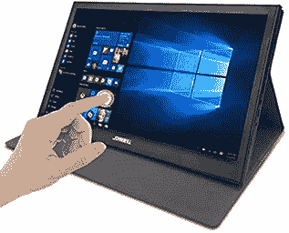

触摸屏显示器有不同的类型；下面给出了三种常见类型:

*   **电阻式触摸屏:**一般来说，这种屏幕包括一层薄的导电电阻金属层。当触摸被按下时，发送到控制器的电流发生变化。如今，这些屏幕被广泛使用。这些监视器更可靠，因为它们不会受到液体或灰尘的影响。
*   **表面波触摸屏:**这些监视器通过超声波处理输入。当用户触摸屏幕时，波被计算机处理和吸收。它不太可靠，因为它们会被水或灰尘损坏。
*   **电容式触摸屏:**该屏幕包括一个带有带电材料的盖子。这种材料使电流不断流过屏幕。它主要由手指使用，而不是手写笔。这些显示器具有更好的清晰度，不会被灰尘损坏。如今，电容式触摸屏大多用于智能手机。

### 4.led 监视器

这是一台平板电脑显示器，代表发光二极管显示器。重量轻，深度短。作为光源，它使用一个发光二极管面板。如今，大量的电子设备，无论是大型还是小型设备，如笔记本电脑屏幕、手机、电视、电脑显示器、平板电脑等，都使用发光二极管显示器。

相信詹姆斯·p·米切尔发明了第一个 [LED](https://www.javatpoint.com/led-full-form) 显示器。1978 年 3 月 18 日，第一个发光二极管显示器的原型在爱荷华州的 SEF(科学和工程博览会)上向市场发布。1978 年 5 月 8 日，它在加利福尼亚州阿纳海姆的 SEF 再次放映。这款原型机获得了 T2 国家航空航天局和通用汽车公司的奖项。

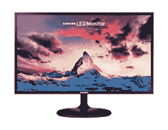

**LED 显示器的优势:**

*   它包括更宽的调光范围。
*   它是一个更可靠的显示器。
*   它通常不太贵。
*   它消耗更少的功率(20 瓦)，并且在更低的温度下运行。
*   它具有更动态的对比度。

**液晶显示器和发光二极管显示器的比较:**

| **分辨率 1920×1080** | 液晶监视器 | led 监视器 |
| **亮度** | 250 cd / m 2 | 250 cd / m 2 |
| **能源之星认证** | 不 | 是 |
| **重量** | 2.4 公斤 | 2.4 公斤 |
| **对比度** | 12,000,000: 1 | 100,000,000: 1 |

### 5.有机发光二极管监视器

这是一种新的平面发光显示技术，与[液晶](https://www.javatpoint.com/lcd-full-form)显示器相比，效率更高、更亮、更薄、刷新率更高、对比度更好。它由位于两个导体之间的一系列有机薄膜组成。这些显示器不需要背光，因为它们是发射型显示器。此外，它提供了前所未有的更好的图像质量，并用于平板电脑和高端智能手机。

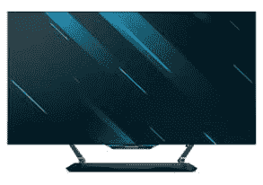

如今，它被广泛应用于笔记本电脑、电视、手机、数码相机、平板电脑、VR 耳机。手机厂商的需求，2018 年生产了超过 5 亿块 AMOLED 屏幕。三星显示器是 AMOLED 屏幕的主要生产商。例如，苹果在 2018 年的 iPhone XS 中使用了 SDC 制造的 AMOLED OLED 面板——5.8 英寸 1125x2436。此外，iPhone X 也在使用相同的 AMOLED 显示屏。

### 6.dlp 监视器

DLP 代表**数字光处理，**由德州仪器开发。这是一项技术，用于通过将图像从显示器投影到大屏幕上进行演示。在开发 DLP 之前，大多数计算机投影系统都是基于液晶技术的，会产生褪色和模糊的图像。DLP 技术利用了一种数字微镜器件，这是一种装在一种特殊微芯片上的微型镜子。此外，它提供了更高质量的图片，在光线充足的房间里也能正常看到。

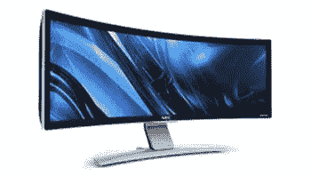

### 7.薄膜晶体管监视器

它是一种液晶平板显示器，代表薄膜晶体管。在[薄膜晶体管](https://www.javatpoint.com/tft-full-form)显示器中，所有像素都由一到四个晶体管控制。高质量的平板液晶显示器使用这些晶体管。尽管基于薄膜晶体管的显示器为所有平板技术提供了更好的分辨率，但这些技术非常昂贵。使用薄膜晶体管技术的液晶显示器被称为有源矩阵显示器。与旧的无源矩阵显示器相比，有源矩阵显示器提供了更高的质量。

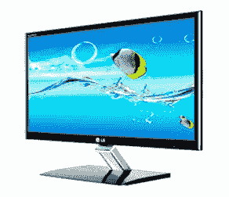

### 8.等离子屏幕监视器

等离子屏幕是一种薄的平板，可以像液晶电视和发光二极管电视一样挂在墙上。与液晶显示器相比，它的屏幕更亮，比阴极射线管显示器更薄。它可以用来显示数字计算机输入模式或模拟视频信号，有时，它作为“薄面板”显示器销售。等离子显示器具有宽视角、高对比度和高刷新率，用于减少视频模糊。此外，由于它支持高达 1920 x 1080 的高分辨率，因此可以提供更高质量的图片。

等离子屏幕也有一些缺点，比如**屏幕烧屏的几率大，耗电多，亮度随时间的流失，重量会更重。**

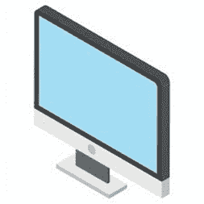

## 监视器连接器的类型

计算机显示器需要以下类型的连接器之一来连接计算机。

*   视频图形阵列
*   雷电
*   高清晰度多媒体接口
*   USB-C
*   交互式数字视频系统(Digital Video Interactive)
*   显示端口

**VGA:** 是流行的显示标准，代表**视频图形阵列**或**视频图形适配器**。由 [IBM](https://www.javatpoint.com/ibm-full-form) 开发后于 1987 年推出。它用于将计算机与投影仪、显示器或电视连接起来。它提供 640 x 480 分辨率的彩色显示，包括 16 种颜色的显示和一次 60 Hz 的刷新率。如果分辨率小于 320 x 200，它将显示 256 种颜色。由于使用模拟信号，它只能在屏幕上显示较低的质量和分辨率。 [VGA](https://www.javatpoint.com/vga-full-form) 连接器和电缆在当今的投影仪、显示器、计算机和电视中不太常见。这些连接器正在被 [HDMI](https://www.javatpoint.com/hdmi-full-form) 和 DVI 电缆和连接器所取代。

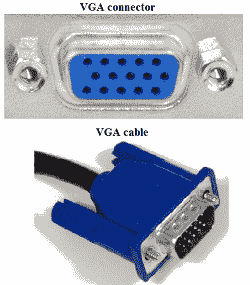

**Thunderbolt:** 是一款[硬件](https://www.javatpoint.com/hardware)接口，以 Light Peak 的名字上市，由英特尔与苹果合作开发。2011 年 2 月 24 日，它首次作为消费品的一部分出售。它用于将鼠标、键盘、打印机、扫描仪等外围设备连接到计算机。它能够传输 DC 电力，并能够通过更便宜的电缆进行远距离数据传输。迅雷的前两个版本能够以每秒 20 Gb 的速度传输数据。第三次迭代能够使用 USB Type-C 连接器，并且能够以高达每秒 40 Gb 的速率传输数据。

**用什么材料做一根迅雷电缆？**

有两种类型的迅雷电缆可供选择，一种使用光缆，另一种使用铜线。尽管 Thunderbolt 电缆被设计用作光纤电缆，但这些版本发布的数量较少。铜线允许电缆供电，而且价格较低，这就是它被广泛使用的原因。毕竟，英特尔打算利用铜线的力量，通过结合光纤和铜线来提供更快的光纤带宽速度。

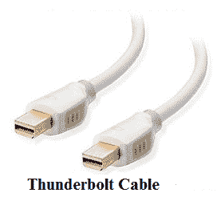

**HDMI:** 是由东芝、索尼、日立、飞利浦等多家公司开发的电缆和连接器。它代表高清多媒体接口。它能够在设备之间传输高带宽和高质量的音频和视频流。它与投影仪、高清电视、蓝光播放器或 DVD 播放器一起使用。

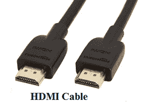

通过更换三根复合音频/视频电缆，单根 HDMI 电缆可以更轻松地将两台设备连接在一起传输音频和视频信号。此外，它能够传输多达 8 通道的数字音频信号，包括增强、标准和高清视频信号。HDMI 电缆有各种长度，最长可达 50 英尺。尽管如此，不建议购买长度超过 25 英尺的电缆，因为它可能会出现信号丢失或降级的问题。

**USB-C:** 为即插即用接口，代表**通用串行总线**。它允许计算机与外围设备和其他设备通信。它还能够向平板电脑和智能手机等特定设备供电，包括为它们的电池充电。1996 年 1 月，通用串行总线的第一个版本发布。然后，这项技术被康柏、英特尔、微软和其他公司效仿。

现在有几个 [USB](https://www.javatpoint.com/usb-full-form) 设备可以连接到电脑上，比如数码相机、[键盘](https://www.javatpoint.com/computer-shortcut-keys)、[麦克风](https://www.javatpoint.com/microphone)、鼠标、[打印机](https://www.javatpoint.com/printers)、扫描仪等等。此外，USB 连接器有不同的形状和大小。用于高速设备的 USB 电缆长度为 **16 英尺 5 英寸**(其最大长度)，用于低速设备的 **9 英尺 10 英寸**。

**DVI:** 是视频显示界面，代表**数字视觉界面**。它用于以 2560 x 1600 的高分辨率传输数字视觉界面和显示设备。计算机显示器和投影仪是使用 DVI 连接的常见设备。它也可以被一些电视使用；但是，HDMI 是最常见的，因为只有一些 DVI 电缆能够传输音频信号。

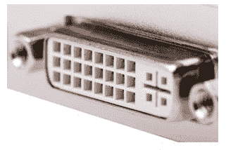

DVI 连接器根据信号支持三种名称之一:DVI-D(仅支持数字)、DVI-A(仅支持模拟)或 DVI-I(同时支持模拟和数字)。如果您的图形处理器和显示器能够同时支持 VGA 和 DVI，建议使用 DVI 电缆。DVI 电缆始终提供至少等于 VGA 的图像质量，如果可能的话，还会更好。

**显示端口:**是连接投影仪、显示器或电视电缆的数字音频和视频接口。它是由 VESA 创建的。显示端口有两种连接方式，一种是标准连接，另一种是迷你显示端口。它们的大小不同，但两种连接类型都能传输相同的信号。如今，VGI、HDMI 和 DVI 是最常见的显示端口类型。

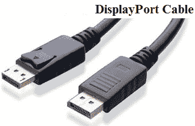

## 液晶显示器和发光二极管的区别

下表包含了液晶显示器和发光二极管之间的几个区别:

| 液晶显示 | 发光二极管 |
| 代表**液晶显示器**。 | **发光二极管**的简称。 |
| 液晶显示器不是发光二极管显示器的子集。 | 发光二极管显示器是液晶显示器的一个子集。 |
| 它主要使用荧光灯。 | 它主要使用发光二极管。 |
| 在液晶显示器中，荧光灯通常位于屏幕的背面。 | 通常，发光二极管位于屏幕的边缘或背面。 |
| 液晶显示器的能效低于发光二极管，尺寸也更厚。 | 与液晶显示器相比，发光二极管更节能，尺寸也更薄。 |
| 它的分辨率很低。 | 它的分辨率很高。 |
| 它的对比度很高。 | 它的对比度很低。 |
| 直流电会降低液晶显示器的寿命。 | 直流电对发光二极管没有任何影响。 |
| 液晶显示器显示面积大。 | 发光二极管显示面积小。 |
| 液晶屏切换时间慢。 | LED 的开关时间快。 |

* * *