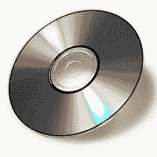

# 什么是光盘

> 原文：<https://www.javatpoint.com/cd>

光盘是詹姆斯·罗素推出的圆形光盘。它的直径为 4.75 英寸，是一种扁平、圆形的便携式存储介质，用于记录、存储和回放音频、视频和其他数据。1982 年 8 月 17 日**，在*德国*，第一张[光盘](https://www.javatpoint.com/cd-full-form)在飞利浦工厂诞生。索尼和飞利浦提出了光盘标准，在 **1993** 中，这项技术被引入美国。它可以存储高达 700 兆字节的数据或 80 分钟的音频。它以小凹槽的形式存储数据，并在光驱激光的帮助下读取，凹槽由驱动器转换为可用数据。**

 **最初的光盘只能存储音频，后来被录音带取代。音频光盘能够让用户跳到光盘上的不同位置。光盘可以无限制地使用而不损失质量，而录音带如果使用 10 次左右就会失去质量。因为在光盘中，读取数据的激光不会对光盘施加压力，而在磁带中，磁头会慢慢磨损磁带上的磁条。

### 电脑上的光盘有什么用？

光盘是用来存储数据的，以后可以执行。因此，您可以在光盘中加载软件程序，并将其移动到计算机上。甚至， [Windows](https://www.javatpoint.com/windows) 文件也存储在光盘里，可以安装到电脑上。此外，光盘上存储的文件可以传输到其他计算机，通过它您可以备份所有文件。

### 光盘历史

索尼和飞利浦两家公司宣布在 20 世纪 70 年代末分别开发光盘和原型。

### 它是如何开始的

在 **1957** 年，意大利人安东尼奥·鲁比亚尼(Antonio Rubbiani)以涉及原始视频光盘的实验开始了光盘的故事，这激励了所有一代科学家致力于数字技术。

后来近 12 年，飞利浦开始开发 ALP(音频长播放)光盘。它使用了一种名为激光的技术，这成为了对传统模拟乙烯唱片的挑战。音频长播放使用的时间更长，它比他们的乙烯塑料唱片占用的空间更少。

飞利浦团队在技术总监的指导下，在埃因霍温进行了多次数字光盘技术实验。后来这些实验都没用过。

然而，飞利浦认真工作，于 1978 年推出了光盘项目。这个项目的目的是用新的格式取代盒式磁带和模拟视频设备。当时这两种技术都比较流行，已经使用了很多年。

1977 年，决定了光盘项目的项目名称。飞利浦选择它是为了让人们意识到紧凑型盒式磁带的成功。然后，飞利浦开始为其数字音频研究部门完成的工作而努力，这导致了一个非常激动人心的关头。

飞利浦已经将商用激光唱机投放市场。因此，就光盘的物理设计而言，与竞争对手相比，它处于领先地位。然而，飞利浦无法从数字录音中获益，无法提前开发光盘。

此外，索尼也在努力开发一种光盘，所以与之抗衡的是一个截然相反的问题。此外，它有很多知识来开发和实现更好的数字音频电路，但它不知道制作物理光盘的过程。

1979 年，由于这些发展，索尼和飞利浦给了世界一个惊喜，宣布(在日本的一次会议上)，他们将共同开发光盘。因此，这两家公司开始在接下来的几年里与新政合作。

工程师(在飞利浦工作)，他们专注于光盘的物理设计，并思考激光如何读取光盘表面的信息。索尼的数字技术专家致力于数字转换电路的模拟设计，专注于纠错码的设计和数字信号的编码。

### 光盘红皮书标准是如何制定的

索尼和飞利浦在普遍接受光盘的某些规格时推出了红皮书。它的名字(红皮书)来源于第一份出版物封面的颜色。

红皮书有规范，包括采样、记录细节、光盘大小和许多其他标准。甚至一些标准仍然保持不变。

然后，光盘被制成便携式的，尺寸比黑胶唱片小。它的直径为 120 毫米，可以在立体声系统中播放。此外，与盒式磁带或黑胶唱片相比，它可以存储大量数据。

之后，飞利浦和索尼分别开始工作，并尝试生产自己的光驱设备。1982 年 10 月 1 日的一个月前，索尼发布了第一张商用光驱。这是裁谈会发展史上的一件大事。索尼首先在日本，然后在欧洲市场推出了 CDP-101 光盘播放器。直到 1983 年初，它才到达美国海岸。

1984 年，索尼发布了第一台便携式光盘播放器，再次击败了飞利浦公司。在市场上推出商业光盘的时候到了。瑞典流行乐队 ABBA 在市场上推出的第一张商业 CD。

### 不太为人知的黄皮书标准

第二本标准书再次更适合两家公司，尽管它们仍在分别工作。1983 年，黄皮书发布了基于可记录光盘的标准。

从电子学的角度来说，光盘可以通过某种方式改变，它将数据存储在光盘上，计算机可以读取这些数据。这是裁谈会历史上的一个显著发展，对裁谈会的发展产生了深远的影响。

光盘将能够存储大量的数据，不管它们的大小如何，它将是现有软盘的理想替代品。光盘将更积极地访问数据，因为它们包括高速。该标准于 1990 年准备好供个人和企业商业使用。

1995 年，索尼有一个计划正在酝酿中，它开始了一个步骤来标准化[数字多功能光盘(DVD)](https://www.javatpoint.com/dvd-full-form)，这是光盘历史上下一个引人注目的运动。DVD 的发展并不是为了取代录像带和模拟视频存储器，它们甚至可以用来代替电脑上的光盘和 cd-r 来存储数据。

然而，DVD+Rs 和 DVD-Rs 仍然可以在市场上买到，因为 DVD 直到今天还没有完全标准化。DVD+Rs 和 DVD-Rs 提供了一些不同的功能。

### 裁谈会的未来

将来，光盘可以用于许多用途。例如，它可以用来替代模拟乙烯唱片和磁带。此外，它还可以用来存储、备份和传输计算机数据，最近的娱乐销售数据证明了这一点。

### 不同类型的光盘

光盘有不同的类型，但它们都是用来存储数字信息的。

1.  **光盘**
    ROM 一词是指只读存储器，允许计算机读取已经存储在计算机上的数据，不能删除或更改。它更受欢迎的是为几个游戏机分发游戏和软件。此外，任何标准都可以用来播放光盘记录。
2.  **可录 CD(CD-R)**
    CD-R 代表可录，也称为 CD-WORM(一次写入，多次读取)或 CW-WO(一次写入)。飞利浦和索尼联合开发的。通常，这些类型的光盘有 74 分钟的音乐存储空间，但有些光盘可以存储多达 80 分钟的音乐。它的优点是信息只写一次，可以多次读取。它也有一个限制，即它不能与所有设备完全兼容；因此，它无法读取所有设备。
    当它插入播放器时，内置的激光光线读取数据，并由用户记录在上面。音乐光盘在可录制光盘中很受欢迎，因为大多数音乐专辑都是以这种格式发行的。
3.  **CD+R**
    CD+R 与 CD-R 无关，CD 中的 R 代表可录。一群公司开发了+R 格式。它的开发是为了增加光盘的存储量。与标准 CD-R 相比，CD+R 可容纳大约两倍的存储空间
4.  **可重写光盘(CD-RW)**
    CD-RW 可以多次写入数据、擦除和重复使用，也可以用作普通的 CD-R。通常，可重写光盘可以存储高达 700 MB 的数据，并且可以重复写入多达 1000 次。但是在其中重写存储的视频和音频会降低数据质量。在光盘上，光盘刻录机使用最高的激光功率将记录层熔化到光盘上。在 CD-RW 中，刻录机利用其中等水平的激光功率熔化数据层；新数据可以添加到磁盘。光盘播放器不会改变记录层，它使用最低的激光功率来读取光盘。
5.  **视频光盘(VCD)**
    简单来说，就是一张光盘，包括运动图像和图片。它的容量为 650 兆字节/700 兆字节，可以存储 74/80 分钟的数据。它主要用于看电影。后来它被 SVCD 和 DVD 取代，因为它的图像质量不是太好。
6.  **迷你光盘**
    迷你光盘宽约 3 英寸，可存储 210 兆字节的数据或最多 24 分钟的音乐。迷你光盘可以与大多数光盘播放器一起使用。
    广泛用于单曲录音，也用于广告和商业用途。

* * ***