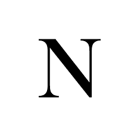

# 什么是性格？

> 原文：<https://www.javatpoint.com/character>

字符是单个可视对象，也称为字符，用于表示数字、符号或文本。例如，N 是字母，是单个字符，如下所示。在计算机中，一个字符等于一个字节，即 8 位。



一个角色也被用来描述一个电脑玩家；它在电脑游戏中扮演着一个虚拟玩家的重要角色。例如，你在玩游戏时被认为是一个角色或电脑。如果一个角色不受另一个人的控制，而你遇到了那个角色，它被称为非玩家角色(NPC)。在魔兽世界游戏中，下图是一个游戏角色的例子。


字符是信息技术中可打印的符号，具有象形或语音含义。通常，它是文本中单词的一部分，表达语法标点符号，或描绘数字。如今，字符通常是*信息技术*中有限数量的符号之一，包括十进制数字系统中的数字、特定语言字母表中的字母以及一些特殊符号，如 atsign (@)和&符号(&)。对于字符，已经开发了许多计算机编码标准。 [ASCII](https://www.javatpoint.com/ascii-full-form) 是个人电脑中最常用的， [IBM](https://www.javatpoint.com/ibm-full-form) 大型机系统使用 EBCDIC。此外，Unicode(新标准)受到后来的[视窗](https://www.javatpoint.com/windows)系统的支持。

有时，字形和字符是有区别的。在进行这种区分时，就声音和意义而言，一个字符可以与其他字符区分开来。字形是用于描述字符的图形图像。在不同的实现中，一个字符可以有多个可能的字形，并且一个字形可以表示多个可能的字符。

在*计算机科学*中，字符是信息的显示单位，相当于一个字母符号或字母。在[计算机科学](https://www.javatpoint.com/what-is-computer-science)中，一个字符不等于一位机器语言，而不是借助编译后的机器语言来描述单个字符。对于字符，已经开发了一个通用系统，称为 [ASCII](https://www.javatpoint.com/ascii) 。

在编程语言中，该字符也用作保留关键字*，在该语言中，它可以用代码语言表示为 chr 或 char。它在计算机编程中起着至关重要的作用，计算机编程是一种保存一个字符(字母、数字等)的数据类型。)的数据。字符是字符串或文本的单个单位，整个字符串和单个字符都是在代码函数的帮助下操作的。并且，显示在[面向对象的](https://www.javatpoint.com/java-oops-concepts)编程中通过如下拉列表和框。*

此外，如果字符串值没有 char 作为数据类型，某些语言可能会使用某些方法的缩写。例如， [JavaScript](https://www.javatpoint.com/javascript-tutorial) 有方法 charCodeAt()和 charAt()，返回与调用字符串相关的值。例如，charAt()方法返回一个包含字符的字符串。当您运行下面的代码时，它会提醒字符串“javatpoint”(从 0 开始，而不是从 1 开始)中位置 2 的字符值。

```

mystring = "javatpoint";
window.alert(mystring.charAt(2));

```

由于“j”的位置为 0，“a”位于位置 1，“v”位于位置 2，因此上述代码转发带有“v”的警报。

### 字符串

字符串是字符的集合，通常通过将字符括在单引号(')或双引号(" ")中来指定。例如，加州是一个名字，但是如果你用单引号或双引号来写，比如加州，那么“加州”就是字符串。它由位代码表示，并组织成一个变量。这个保存字符的字符串变量是用特定的长度定义的，或者它的长度可以由程序识别。在字符串中，名称代表其他对象，因为它不代表任何东西，并且不同于名称。

在多种计算机[程序](https://www.javatpoint.com/program)中，字符串由特定的语法来标记，这些程序通过几个编程命令来设置或标注，并且通常包括引号。然后，这些用来存放描述 ASCII 字符的各种类型的数据。通过存储对应于字符的特定值，在许多情况下，单个字节代表一个字符。不同的编码约定可以使用 UTF 协议或 Unicode 或八位字节协议来标识字节作为操作单位。

在计算机程序中，一个角色可以扮演多个角色。例如，在程序的加载函数中，程序员可以用命令创建一个未填充的字符串。用户事件可以将数据输入到未填充的字符串中。当用户键入一个单词或任何字符串，如“你好吗”，然后程序可以稍后读取该字符串并将其显示在屏幕上，打印出来，保存起来，等等。此外，字符串通常包含在数据存储和数据捕获功能中，这些功能采用名称或其他类型的信息。

### 可变字符字段(可变字符)

varchar(可变字符字段)是一种数据类型，用于保存编程或数据库语言中的值。它可以包含任何类型的数据，如字符、数字、标点符号或空格。根据数据库的不同，数据类型最多可以存储最大值。变量字符字段主要用于字符串操作，并充当临时变量。varchar 字段通常用等于零的当前长度初始化，并且它具有声明的最大长度。它的当前长度可以从零到最大声明字段长度。根据使用的编程语言，声明可变字符字段的方法是不同的。

可变字符字段包括避免填充的最大优点。在字符字段的情况下，无论字符串的实际大小如何，该字段都会占用精确的字符数，并且字段长度和固定长度之间的差异会用空格扩展。在可变字符字段中，只需要最小的存储空间，因为它使用字符串大小所需的空间，这与字符字段不同。它也有助于排序和搜索值，因为它包含了一个避免任何浪费的特性。

此外，在某些数据库和编程语言中，如果发现任何额外的空间，它会在将其存储到数据库之前自动删除。基于数据库或编程语言，可变字符字段可能有限制；它不能用作候选项或主键，也不能与 select 语句一起使用。大多数[关系数据库管理系统](https://www.javatpoint.com/what-is-rdbms)都支持可变字符字段。

* * *