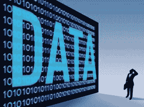

# 什么是数据？

> 原文：<https://www.javatpoint.com/data>



一般来说，数据是为了某种目的而收集和翻译的一条独特的信息。如果数据没有以特定的方式格式化，它对计算机或人类就没有价值。数据可以以不同的形式存在，例如存储在电子存储器中的比特和字节、纸片上的数字或文本，或者存储在一个人头脑中的事实。自从计算机发明以来，人们就用数据这个词来表示计算机信息，这些信息被传输或存储。有不同种类的数据；这些措施如下:

*   声音
*   录像
*   单一字符
*   数字(整数或浮点)
*   画
*   布尔型(真或假)
*   文本(字符串)

在计算机的存储器中，数据以包含值 1 或 0 的一系列二进制数字(位)的形式存储。信息可以是图片、文本文档、软件程序、音频或视频剪辑或其他类型的数据。计算机数据可以存储在计算机存储器的文件和文件夹中，并由计算机的 [CPU](https://www.javatpoint.com/cpu-full-form) 处理，该 CPU 利用逻辑运算从输入数据生成输出(新数据)。

因为数据以二进制形式(零或一)存储在计算机上，可以进行数字处理、创建、保存和存储。这允许在各种媒体设备或网络连接的帮助下将数据从一台计算机发送到另一台计算机。此外，如果您多次使用数据，它不会随着时间的推移而恶化或失去质量。

### 计算机数据示例

```

0143 0157 0155 0160 0165 0164 0145 0162 0040 0150 0157 0160 
Joe,Smith, 1234 Circle,SLC,UT,8404,8015553211
01100011011011110110110101110000011101010111010001100101011100100010000001101000000101

```

### 数据类型

下面给出了两种类型的数据:

**1。定性数据:**定性数据是表示某种特征或属性的信息。它描绘了无法用数字来计数、测量或轻松表达的描述。它可以从音频、文本和图片中收集。它通过数据可视化工具共享，如概念图、云、信息图表、时间表和数据库。例如，收集任何班级学生的诚实、智力、创造力、智慧和清洁等属性的数据将被视为定性数据的样本。

通常，它有两种类型:人种学数据和解释性数据。了解一个群体如何为一个事件分配背景的数据集合，被称为人种学数据。收集这些数据是为了了解个人对事件的体验和感受，它被称为解释性数据。

**收集定性数据的方法**

通过提出开放式问题，或通过直接或间接观察，广泛收集定性数据。以下是收集定性数据的常用方法:

*   面谈
*   小组讨论
*   个案研究
*   文化或人种学研究
*   从现有记录中提取
*   参与者观察
*   开放式调查问题
*   现场工作

**定性数据分析**

定性数据可以通过演绎或归纳的方法进行分析。在演绎技术中，分析师从一个问题开始，并根据问题主观地评估数据。在归纳技术中，他或她简单地评估数据来寻找模式，就像这种方法一样；分析师没有议程。通常，归纳过程也被称为基础理论。一般来说，归纳技术比演绎技术花费更多的时间。

**定性分析工具**

定性数据分析依赖于模拟和数字工具来组织、系统化和分析非数字数据。

*   **SWOT 分析:**这是一个框架，意味着优势、劣势、机会和威胁分析。它用于识别和分析对场所、人员、项目或产品的活动有影响的内部和外部因素。该工具有助于提供一个快照，以了解能够影响成功的定性动态。
*   **波特五力:**是用来完善 SWOT 分析的框架。它由哈佛大学教授迈克·E·波特开发，通过识别和分析能够影响成功的内部和外部因素来改进 SWOT 分析。

此外，QDAS(定性数据分析软件)有助于在短时间内收集和分析定性数据。它包括情感分析和文本解释的编码、转录分析和递归抽象等功能。

**定性数据的利弊**

方法内容和观察性有助于定性数据研究者根据实际经验收集正确的数据，也有助于避免霍桑效应。在报道中包含定性数据有助于增加故事的色彩，有助于通过真实人物的真实例子将一般化的解决方案带入不那么抽象的观点。

收集和分析定性数据可能非常耗时。因此，定性数据的研究者在他们的分析中使用抽样。当使用小样本数据时，很难扩展结果来发现。

分析师可以使用数值计算和数学公式来分析可量化的数据，并可以直接将其放入数据库。在对定性数据进行模式或意义的统计检查之前，必须通过描述性参数进行分类，如身体或特征特征。

虽然分析人员可以通过任何软件工具(如电子表格)轻松分析定量数据，但定性数据的分析取决于研究人员的技能和经验，这有助于从小样本中创建参数，并且可以检查更大的数据集。

**2。定量数据:**这些类型的数据可以测量，但不能简单观察。数据可以用数字表示，并用于统计分析和数学计算。例如，这些数学推导可以用于现实生活中的决策。还有，一个班级参加不同游戏的学生人数；数学计算估计有多少学生参加哪项运动。

这些数据是用来回答诸如“多少”等问题的任何可量化信息。”“多久一次？”“多少？".这些数据可以方便地用数学方法评估，也可以验证。通常，在调查、问卷或民意测验的帮助下，收集定量数据以进行统计分析，并将其发送给特定人群。此外，定量数据有助于测量几个可控的参数，因为它包括数学推导。

**定量数据类型**

有各种类型的定量数据；这些措施如下:

*   **实物测量:**常用于计算任何实物的测量，例如，分配给任何组织中新加入员工的每个隔间都是由人力资源主管仔细测量的。
*   **计数器:**用于与实体相等计数。例如，计算一个特定的应用程序有多少人从应用商店下载了它。
*   **感觉计算:**这是一种自然感知测量参数的机制，有助于创建恒定的信息源。例如，电磁信息通过数码相机转换成一串数字数据。
*   **定性实体的量化:**有助于将数字识别为定性信息。例如，您要求与在线调查的受访者分享 0-10 分的推荐可能性。
*   **数据投影:**借助数学分析工具和算法，可用于未来的数据投影。例如，一名营销人员在推出一款经过全面分析的新产品后，会预测产量的增长。

**收集定量数据的方法**

下面给出了两种主要的定量数据收集方法:

1.  **调查**
    调查传统上是借助纸质方法进行的，并逐渐演变为在线媒介。收集封闭式问题构成这些调查的主要部分，更适合收集定量数据。该调查包含特定问题的答案选项。此外，调查是统一的，以收集观众的反馈。根据完成调查所需的时间，调查被分为不同的类别:**下面给出了一些管理调查以收集定量数据的原则:**
    *   **纵向研究:**在这种情况下，市场研究人员从一个特定时间段到另一个时间段进行调查，因为这是一种观察性研究。当主要目标是收集和分析数据模式时，通常会实施此调查。
    *   **横断面研究:**在这种情况下，市场研究员在特定时间段进行调查。通过实施调查问卷，有助于了解特定时间段样本中的特定主题。
    *   **不同问题类型的使用:**封闭式问题必须在调查中使用，以收集定量数据。这些问题可以是多种类型问题的组合，也可以是多项选择题，如评分量表问题、语义差异量表问题等。它有助于收集可以理解和分析的数据。
    *   **测量的基本水平:**收集定量数据，四个测量尺度，序数、名义、间隔和比率尺度，是在调查中创建多项选择题的基础。这四个基本要素是最重要的，因为没有基本要素，选择题就无法产生。
    *   **调查分布和调查数据收集:**收集定量数据，也是调查过程的另一个重要原则。收集数据的调查分发方式多种多样，常见的方法有 Email、短信调查、二维码、网站嵌入调查、QuestionPro app 等。
2.  **一对一访谈**
    这也是收集定量数据的传统方法。虽然是面对面进行，但已经转移到电话和在线平台。营销人员可以在访谈的帮助下从参与者那里收集大量数据。定量面试极其重要，在收集信息方面发挥着重要作用。有三个重要部分有助于通过访谈收集定量数据。这些主要部分如下:
    *   **面对面面试:**除了已经问过的调查问题，面试官还可以准备一份重要的面试问题清单。因此，面试官能够提供关于讨论主题的完整细节。此外，面试官将通过设法在个人层面上与受访者建立联系来帮助收集关于该主题的更多细节，通过这种方式，回答也会得到改善。
    *   **计算机辅助个人面试:**在这种方法中，面试官能够将收集到的数据直接输入到计算机或任何其他类似设备中。它也被称为一对一面试技术，这种技术有助于减少处理时间，并为面试官提供好处，因为他们不需要携带问卷的硬拷贝，只需要在笔记本电脑上输入答案。
    *   **在线/电话面试:**虽然，电话面试不是现代技术。这些类型的采访也转向了在线媒体，如 Zoom 或 Skype，它提供了通过网络进行在线采访的选项。在线面试是有益的，有助于克服面试者和被面试者之间的距离问题，节省他们的时间。
    *   然而，在电话面试的情况下，面试只是一个电话。

**定量数据的分析方法**

虽然数据收集是研究过程中至关重要的一部分，但也需要进行分析，使其易于理解。因此，有几种方法可以分析在调查中收集的定量数据。这些方法如下:

*   **交叉制表:**是最优选、应用最广泛的定量数据分析方法。为了评估研究中不同数据集之间的有效结果，它使用了基本的表格形式。它包含一些相互关联的数据。
*   **趋势分析:**如果已经收集了很长一段时间，它提供了检查定量数据的选项。它还有助于收集关于数据随时间变化的反馈。
*   **MaxDiff 分析**:有助于对客户的购买偏好进行高斯化，确定在这个过程中，哪些参数的排名比其他参数高。这种方法也称为“最好-最差”方法，因为它很耗时。此外，这种方法可以互换使用，并且更容易实现。
*   **联合分析:**最类似于 MaxDiff 分析方法，帮助分析参数，做出更好的决策。这种方法能够收集和分析高级指标，这些指标提供最重要的参数，包括对采购决策的深入了解。
*   **差距分析:**是另一种采用并列矩阵描述数据的量化数据分析方法，提供了一种衡量实际业绩与预期业绩差异的方法。通过这种方法进行的数据分析有助于描述完成这一差距所需的东西，也有助于衡量绩效差距。
*   **SWOT 分析:**这是一个框架，意味着优势、劣势、机会和威胁分析。它有能力识别一个组织或产品或服务的 SWOT。此外，它有助于创建有效的商业战略，并提供竞争的完整画面。
*   **TURF 分析:**它评估产品或服务或两者混合的总市场覆盖范围，代表总的非重复覆盖范围和频率分析。这种方法有助于理解任何组织中的途径和频率。
*   **文本分析:**在这种方法中，智能工具处理容易理解的数据。他们对这些数据进行更多的量化或形成定性和开放性的数据。这种方法在收集的数据是非结构化的并且需要转换成可理解的结构化方式的情况下很有帮助。

**定量数据示例**

下面给出了一些定量数据的例子，有助于理解哪些类型的数据被称为定量数据。

*   我一个季度更新了六次手机。
*   我叔叔去年瘦了 20 公斤。
*   最新的移动应用有 83 人下载。
*   我儿子去年长高了 2 英寸。
*   600 名员工参加了会议。
*   44%的人喜欢网上购物，而不是去商场。

**量化数据优势**

**进行深入研究:**研究极有可能会比较细致，因为可以对定量数据进行统计分析。

**最小偏差:**研究中有很多例子如果涉及到个人偏差，就会产生不正确的结果。定量数据的数字性质减少了有助于引导正确数据的个人偏见。

**定量数据的缺点**

定量数据的一些缺点如下:

**取决于问题类型:**收集定量数据，结果取决于问题类型。在收集定量数据时，研究者的研究目标和对问题的认识是最重要的。

**受限信息:**在收集数据的基础上，由于定量数据不具有描述性，研究人员可能更难做出决策。

### 定量和定性数据之间的差异

| 数据 | 质量数据 |
| 处理数量、数字或数值的数据称为定量数据。 | 处理质量的数据称为定性数据。 |
| 这些数据是可测量的，并且与数字相关联。 | 通常，这些数据是不可测量的，并且与细节相关联。 |
| 该数据是在数字数据上实现的。 | 当数据可以被分成定义良好的组时，它就被实现了。 |
| 这些类型的收集数据可以进行统计分析。 | 这些类型的收集数据可以观察到，但不能评估。 |
| 这种类型的数据由统计生成，随后进行分析。 | 大多数情况下，这类数据是通过观察获得的。 |
| 其方法目标和研究方法结论性。 | 其方法是主观的，研究方法是探索性的。 |
| 它包含结构数据。 | 它包含非结构化数据。 |
| 收集这些数据的方法有定量调查、访谈、实验等。 | 这些数据是通过定性调查、文件修订等方式收集的。 |
| 它是更可靠和客观的数据，因为它使用统计数据来增加可信度或可信度。 | 与定量数据相比，它不那么客观和可靠。 |
| 它包括大量的代表性样本。 | 它包括较少数量的非代表性样本。 |
| 这些数据以数字形式表示。 | 它的本质是描述性的，而不是数字性的。 |
| 定量数据的测量量有大小、长度、数量、价格等等。 | 它经常使用形容词和其他描述性词语来指代颜色、质地、外观等数据，包括其他品质。 |
| 定量数据的例子有体重、身高、时间、价格、温度等等。 | 定性数据的例子有外观、美丽、味道、气味等。 |

### 计算机如何将数据处理成信息？

计算机使用以下四种功能，通过软件和硬件将数据处理成信息。

1.  **输入**
    首先，数据必须在计算机开始处理任何东西之前接收输入。例如，要将输入输入计算机，必须在键盘上打字。
2.  **处理**
    计算机用程序把数据处理成信息，数据通过输入接收到信息。该程序可以组织、计算或操纵数据来创建可理解的信息。
3.  **输出**
    数据处理成信息后显示为输出给用户。例如，当您使用 Windows 计算器时，程序会在您的监视器屏幕上显示信息。
4.  **存储**
    最后，创建的信息存储在计算机上以备将来检索。它使用硬盘、软盘等存储介质。

### 数据和信息有什么区别？

| 因素 | 数据 | 信息 |
| **描述** | 有两个变量定性和定量，有助于发展想法或结论。 | 它是包含有价值的意义和新闻的数据集合。 |
| **格式** | 它以字母、数字或字符集合的形式出现。 | 它以思想和推论的形式出现。 |
| **以**为代表 | 数据可以用图形、表格数据、结构化数据树等表示。 | 它可以基于给定的数据、语言、思想等来表示。 |
| **功能** | 数据本身没有任何有价值的意义。它是原始的和单一的单位。 | 它是数据的集合，是有逻辑意义的产品。 |
| **相互关系** | 它与收集的信息有关。 | 它与被处理的信息有关。 |
| **表示** | 它包括没有任何特定用途的行数据。 | 它确实有逻辑意义，这是通过解释数据赋予的。 |
| **包含** | 是未经加工的生因子。 | 它以一种有意义的方式被处理。 |
| **依赖** | 数据不依赖于信息。 | 一条信息依赖于数据。 |
| **决策支持** | 由于它没有任何特定的目的，因此不能用于决策。 | 它提供有用的信息，因此被广泛用于决策。 |
| **测量单位** | 数据以字节和位为单位。 | 信息以有意义的单位来衡量，如数量、时间等。 |
| **知识水平** | 数据是低级知识。 | 信息是知识的第二层次。 |
| **特性** | 它不能卖给公众，因为它是一个组织的财产。 | 信息可以卖给公众。 |
| **有用性** | 数据可能没有用，因为它是由研究人员收集的。 | 研究人员很容易获得信息以供使用；因此它是有价值和有用的。 |

### 如何将数据组织成信息。

**数据示例**

在下面的示例中，数据是由逗号分隔的随机单词和数字的集合。

```

Circle, DR, 8015553211, 110001, Smith, DL, 1432, Joe

```

**信息示例**

```

Joe Smith
1432 Circle
Delhi Road, DL 110001
(801) 555-3211

```

在上面的信息示例中，数据已经过组织、格式化和解释，具有明确的含义。它包含一个人的地址信息。

* * *