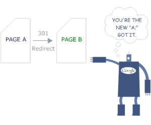
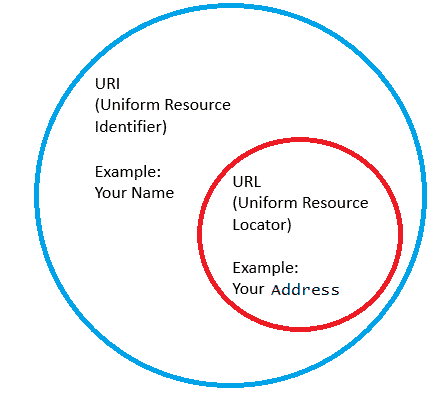

# 网址是什么？

> 噻:[https://www . javatppoint . com/URL](https://www.javatpoint.com/url)

网址是一种统一的资源标识符，是万维网上一个资源的地址和用来访问它的协议。它用于指示访问网页的 web 资源的位置。例如，要访问 javatpoint 网站，您将进入网址 www.javatpoint.com，这是 [javatpoint 网站](https://www.javatpoint.com/)的网址。


URL 将用户发送到特定的在线资源，如视频、网页或其他资源。当您在谷歌上搜索任何查询时，它会显示与您的搜索查询相关的资源的多个网址。显示的网址是访问网页的超链接。

一个[网址](https://www.javatpoint.com/url-full-form)(统一资源定位符)包含信息如下:

*   服务器上的端口号，这是可选的。
*   它包含用于访问资源的协议。
*   服务器的位置
*   片段标识符
*   在服务器的目录结构中，它包含资源的位置。

下面借助一个示例描述了有关该网址的附加信息:

让我们举个例子:https://www.javatpoint.com/jtp.htm,它表明 jtp.htm 是一个位于服务器上的文件，地址是 javatpoint.com。

**http://或 https://**

[http](https://www.javatpoint.com/http-tutorial) 是一种代表超文本传输协议的协议。它告诉浏览器使用哪个协议来访问域中指定的信息。

https(超文本传输协议安全)是一种与 [http](https://www.javatpoint.com/http) 相比增强的协议，因为它关注安全性。它保证通过 [HTTP](https://www.javatpoint.com/computer-network-http) 传输的信息是安全和加密的。冒号(:)和两个正斜杠(//)用于将协议与 URL 的其余部分分开。

**www。**

www 用于区分内容，代表万维网。网址的这一部分可以省略很多次，因为它不是必需的。例如，如果您键入“http://javatpoint.com”，您仍然会得到 javatpoint 网站。对于一个重要的子页面，这个部分也可以被替换，这就是所谓的子域。

**推荐点. com**

javatpoint.com 是该网站的域名。com 被称为 TLD 或后缀。它有助于识别网站的位置或类型。例如，“。org”代表一个组织，“. co.uk”代表英国，以及”。com”是商业广告。有各种类型的域后缀可用；您需要通过域名注册机构注册域名才能获得域名。

**jttp . htm**

jtp.htm 是网页的名称，而。HTML 是网页的文件扩展名，它描述的文件是一个 [HTML](https://www.javatpoint.com/html-tutorial) 文件。互联网上还有许多其他文件扩展名，例如。php，。html，。xml，。jpg，。gif，。asp，。cgi 等。

### 网址在哪里？

网址位于浏览器窗口顶部的地址栏或搜索栏中。除非您的浏览器全屏显示，否则该网址在台式机和笔记本电脑中始终可见。在大多数智能手机和平板电脑中，当你向下滚动页面时，网址会消失，只在可见时显示域名。要显示地址栏，您需要向上滚动页面。此外，如果只显示了域，并且您想要查看完整地址，请点击地址栏以显示完整地址。

### URL 中不能使用哪些字符？

很多人都意识到一个网址是不允许有空格的。URL 字符串只能包含符号**！$-_+*)(**)，包括 ***字母数字字符*** ，如 RFC 1738 中所述。如果需要，任何其他字符都必须在网址中编码。

### IP 地址与网址或网址相同吗？

[IP](https://www.javatpoint.com/ip-full-form) 地址与网址或网址不同，因为它是分配给网络上每个设备的唯一号码。一个域名在万维网上被分配一个唯一的 [IP](https://www.javatpoint.com/ip) 地址，当输入一个像 javatpoint.com 这样的网址时，它被[域名系统](https://www.javatpoint.com/dns-full-form)翻译成一个由路由器用来查找网络服务器的 IP 地址。不使用 IP 地址，而是使用域名，因为它容易被人类记住。例如，要记住一个像 216.58.216.164 这样的 IP 地址很难，而且更容易记住“javatpoint.com”

### 了解更复杂的网址和参数

网址执行附加功能，并在指向脚本时将参数(附加信息)添加到网址的末尾。例如，当您在任何搜索引擎上搜索任何查询时，它会指向搜索结果页面，包括带有搜索查询词的附加信息。

下面给出了一个指向 javatpoint 搜索页面的 URL 示例，包括示例搜索的搜索查询参数。

```

https://www.javatpoint.com/cgi-bin/search.cgi?q=example%20search

```

在 cgi-bin 目录中，被指向的脚本文件是上面 URL 示例中的 search.cgi。假设它是一个 Perl 脚本，因为该文件以. cgi 结尾。

文件名是一个问号(？)之后的剧本。在 URL 中，问号将 URL 与要发送到脚本的所有变量或参数分开。在上面的网址示例中，发送的参数是 q =示例%20search。“示例%20search”是发送给“q”变量的值。空间编码为%20，因为网址中允许有空间。此外，在许多脚本中，a+也被用来表示空间。

当脚本使用变量时，该示例中有一个变量被执行。另外，脚本可以包含多个变量；每个变量由符号&(和符号)分隔，如下例所示:

```

https://www.javatpoint.com/cgi-bin/search.cgi?q=example%20search&example=test

```

上面的例子包含两个不同的变量；q“变量等于”示例搜索“和“示例”变量等于”测试。"

### 为什么是 URL？

*   该网址是有益的，因为该网址中的书面信息为用户提供了只需单击一次鼠标即可从一个网页切换到另一个网页的选项。
*   每个网址都是唯一的，并告诉用户如何访问特定的资源。
*   当用户在网络浏览器中键入网址并打开搜索结果中的任何超链接时，浏览器会向网络服务器转发一个请求，以获取与搜索查询相关的文件。
*   网站域或网址标识一个特定的文件，它是您网站最重要的部分。通常，通过使用以。net，。或者。org，你可以在你的网站上获得流量。

### 什么是网址重定向？

网址重定向是一个网络服务器功能，它接受你的网址并将其指向另一个。例如，考虑一下，你有旧的网址“myvlogsite.com”，你想让访问者直接访问新的网址*“javatpoint . com”*重定向是最好的解决方案；当任何人在浏览器中键入“myvlogsite.com”都会被重定向到新的 URL*“javatpoint . com”*对于 web 开发人员来说，有各种各样的重定向，例如 HTTP 3xx 系列状态代码、手动重定向、JavaScript、metatag 刷新、服务器端脚本、框架重定向等等。此外，网址重定向也可以称为网址转发、域转发、HTTP 代码 3xx 重定向和域重定向。

网络用户从一个网址被重定向到另一个网址的原因有很多，例如:

*   合并两个网站
*   企业名称变更
*   将内容定向到最近更新的域名
*   登录页-营销测试的拆分测试
*   将流量导向最近更新的内容

网址重定向还被用来通过网络钓鱼等非法活动给用户及其计算机带来问题。此外，它可以用来删除网络浏览器的搜索结果，但现在，大多数搜索引擎能够检测到这些类型的欺诈企图。重定向一个网页，这几个 HTTP 协议 3xx 系列代码是最常见的方式。该系列的成员具有各种属性，如下所示:

*   数字 300 提供了各种重定向选择。例如，选择替代语言的选项。
*   数字 301 表示站点何时被永久移动。例如，当企业名称发生变化时。
*   数字 302 用于未指定的重定向。
*   303 显示 CGI(通用网关接口)脚本的输出。
*   当一个站点要重新设计时，使用 307。

当网站访问者被重定向到新命名的网站网址时，网站地址获得新的网址。企业经常把他们网站的主页改成重定向页面。他们用一条简单描述重定向的并发消息来转换页面。一个元标签被嵌入到网站的幕后源代码中。网站的常规访问者将收到一条错误消息“404 -未找到”，并且没有重定向。

**不同类型的重定向**

**1。301 重定向**

这是一种永久性的非屏蔽重定向，它指示 web 浏览器自动从一个站点目的地移动到另一个站点目的地。这是实现重定向最常见和搜索引擎友好的方法之一。当您的网站被永久移动到新地址时，应该使用它。



**2。**重定向也可以用在一些编程语言中，比如 PHP 程序员可以使用规范的 301 重定向来对域中的许多页面执行更改。此外，301 重定向通过超过 90%的链接汁；因此，它也有利于搜索引擎优化的目的。

**3。302 重定向**
这是一种临时类型的未屏蔽重定向，没有广泛使用。这是一个 [HTTP](https://www.javatpoint.com/http-full-form) 状态代码的名称，当某个网址被临时更改为不同的地址时使用。搜索引擎不会索引目的地网址，索引原始网址，并在搜索结果中显示它。在 302 重定向的帮助下，浏览器从一个网址重定向到另一个网址。此外，它的特点是永久重定向，并且基于不同的 HTTP 状态代码。在许多情况下，它可以为用户返回一个更干净、更简单的网址。要使用 302 重定向，其他技术和不同的搜索引擎都有自己特定的策略。

**4。303 重定向**
303 重定向也称为 HTTP 303，是对 HTTP 状态代码的响应。这是一种特定类型的重定向，作为对 URI(统一资源标识符)请求的响应。它也有自己的语法；W3C 指定如果请求不同的 URI，使用 GET 方法来访问期望的目的地。

### 什么时候应该使用重定向？

**1。您有重复的内容**

重复内容是指它在页面上出现不止一次。谷歌上有多个页面包含重复内容。在这种情况下，谷歌很难理解哪个页面是正确的。您可以在复制的内容上使用 301 重定向来指向原始页面。它将为您的用户创造更好的体验，并有助于提高您的搜索引擎排名。

**2。您已经更改了您的域名**

当您更改域名并且可能不想丢失任何已建立的链接时，使用重定向非常有用。

**3。您有多个域**

为了保护在线品牌，有些人购买多个域名。因此，他们需要将任何旧域重定向到新域。许多公司这样做是为了从常见的拼写错误中获得额外的流量。此外，他们可以阻止竞争对手购买类似的域名，并可以将它们重定向到自己的网站。

### 网址和 URI 的区别



URL 和 [URI](https://www.javatpoint.com/custom-uri-in-jsp-custom-tag) 有很多区别，具体如下:

| 统一资源定位器 | 上呼吸道感染 |
| URL 代表统一资源定位符，用于描述项目的身份。 | URI 代表统一资源标识符，它提供了一种定义项目标识的技术。 |
| 网址的主要目的是获取资源的地址或位置。 | 主要目标是找到一个资源，并借助名称或位置将其与其他资源区分开来。 |
| 网址是 URI 的一种类型；因此，所有的网址都可以是 URIs。 | URI 是网址的超集；因此，所有的 URIs 都不是网址，因为 URI 可以是一个名字，而不是一个定位器。 |
| 它仅用于定位网页。 | 它用于各种语言，如 HTML、XML 和其他 XSLT 文件等。 |
| 网址指定资源出现的位置和检索资源的方式。 | URI 通过网址或 URN 或两者来识别资源。 |
| 在 URL 中，方案必须是协议，如 FTP、HTTP、HTPPS 等。 | 该方案可以是 URI 的任何东西，如名称、规范、协议等。 |
| 它包含网址中的协议信息。 | 它不包括协议信息。 |
| 它包括路径、域、散列、字符串、查询等组件。 | 它包括路径、方案、查询、片段组件等组件。 |
| 它提供了使用何种协议的规范。 | 它不包含协议规范。 |
| 网址的一个例子:https://google.com | URI 的一个例子:瓮:isbn:0-486-27557-4 |

* * *