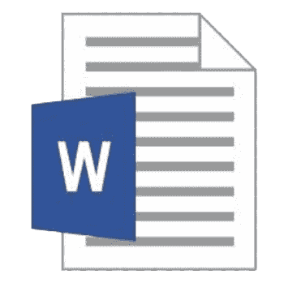
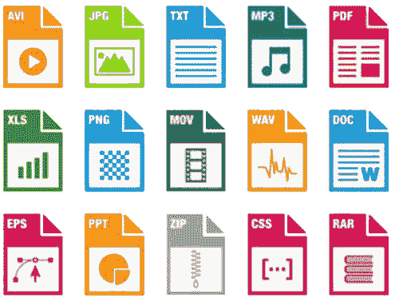
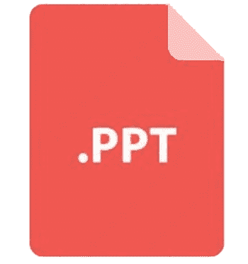
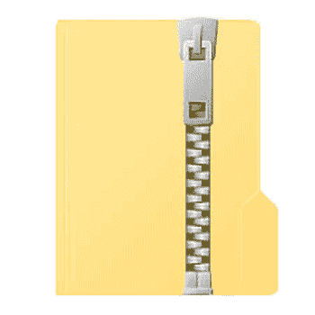

# 什么是文件？

> 原文：<https://www.javatpoint.com/file>

文件计算机系统中存储数据、信息、设置或命令的容器，与计算机程序一起使用。在图形用户界面(GUI)中，例如微软操作系统，将文件表示为图标，这些图标与打开文件的程序相关联。例如，图片显示为图标；与[微软 Word](https://www.javatpoint.com/ms-word-tutorial) 有关。如果您的计算机包含此文件，并且您双击图标，它将在计算机上安装的 Microsoft Word 中打开。



有几种类型的文件可用，如目录文件、数据文件、文本文件、二进制和图形文件，这几种文件包含不同类型的信息。在计算机系统中，文件存储在硬盘、光驱、光盘或其他存储设备上。

在大多数操作系统中，文件必须以唯一的名称保存在给定的文件目录中。但是，某些字符不能在创建文件时使用，因为它们被认为是非法的。文件名由一个文件扩展名组成，也称为后缀。文件扩展名包含两到四个字符，跟在完整的文件名后面，它有助于识别文件格式、文件类型以及与文件相关的属性。

大多数现代计算机系统都有能力保护文件免受损坏。该文件可以包含从系统生成信息到用户指定信息的数据。文件管理有时在用户的帮助下手动完成，或者在第三方工具和操作系统的帮助下完成。

可以对文件执行的基本操作如下:

*   关闭或终止文件操作
*   程序创建
*   从文件中读取数据
*   创建新文件
*   打开文件，以便其他人可以使用其内容
*   数据或文件属性的修改
*   将数据写入文件

### 文件是如何创建的？

软件程序有助于在计算机上创建文件。例如，要创建文档文件，您将使用文字处理器，要创建 [C 编程](https://www.javatpoint.com/c-programming-language-tutorial)文件，您将使用 C 软件，要创建图像文件，您将使用图像编辑器。特定软件用于创建特定文件。

### 文件存储在哪里？

计算机文件存储在硬盘、光盘和软盘上。它也可以存储在驱动器上的文件夹中。

### 非法文件字符

下面给出的字符在大多数操作系统中被认为是非法的，因此不能使用。如果试图用这些字符创建文件名，将会产生错误或使文件不可访问。

```

: * ? " < > | \ /

```

**文件管理**

文件管理也称为文件系统，它是一个创建组织结构并从存储介质(如硬盘)中检索文件的过程。这是一种软件类型，通常包含分成组的文件，称为目录。基本上，它是为处理个人或团体文件而设计的，如记录和特殊的办公室文件。它能够显示报表详细信息，如创建日期、完成状态、所有者和其他类似的详细信息，这些信息在办公环境中非常有用。

现在，NTFS(新技术文件系统)是使用最广泛的 Windows 文件系统。没有文件管理，所有文件都无法组织，一个文件不可能有相同的名称。通常，文件以分层方式管理，允许用户查看当前目录中的文件，然后导航到任何子目录。

### 文件格式

文件格式是文件的结构，它在文件中逻辑地排列数据。它允许程序正确地表示信息，检索数据，并继续处理。例如，Microsoft Word 文档将与一起保存。文档文件格式；最好在微软 Word 软件中查看。虽然另一个软件可以打开此文件，但它可能不像 Microsoft Word 那样具有正确显示文档的所有功能。如果程序与文件格式兼容，它们可能能够给出文件的概述。但是他们可能无法显示所有的文件功能。

此外，文件格式不支持的一些程序可能会在打开文件时给您带来垃圾。例如，如果您将在另一个程序(如记事本)中打开一个. XLS 文件，它将无法正确显示文档，并给您带来垃圾。文件格式最大限度地减少了所需的存储空间，因为它包含数据编码过程。例如，视频和图片通过压缩等嵌入式过程进行编码；在这个过程中，一幅图片被划分成像素。

此外，它还包括演示信息。例如，一个微软。xls 文件包括文档的文本及其最终形式，以及表格、颜色、计算、字体大小、图表和其他必须以标准形式组织在文件内部的信息。



### 常见文件格式

下面是一个表格，其中包含您在计算机上工作时最可能看到的常见文件格式。

| 文件类型 | 文件扩展名 |
| **图像** | 。bmp 格式。EPS . EPS .gif 格式。jpg 格式。pict 格式。png 格式。psd 是什么？tif(基准) |
| **文字** | . ASC . doc . docx . rtf . msg . txt . wpd . WP |
| **视频** | 。avi .mp4 文件。mpg(消歧义)。莫夫.wmv 格式 |
| **压缩** | 。弧！弧！arj(阿拉伯语)。gz 是什么？赫 qx3。-什么事？坐吧 sit .-塔。z .zip |
| **程序** | . bat .com .exe |
| **声音** | 亚银。-你好。mp3 播放器。-是啊。snd(消歧义)。wma(气象组织)。wav(音乐) |

### 文件扩展名

文件扩展名是一种标识符，有助于识别操作系统(如微软视窗)中的文件类型。它可以被归类为一种元数据，它帮助操作系统理解文件的预期用途和特征。文件扩展名可以包含一到四个字符，并用作文件名的后缀。例如，在微软视窗系统中，文件扩展名后面通常有三个字符。



一个点(。)符号用于分隔文件扩展名和文件名。没有文件扩展名的文件名被认为是不完整的；因此，要完成一个文件名，它必须包含在文件扩展名中。一般在 [Windows 操作系统](https://www.javatpoint.com/windows)中，文件扩展名是对用户隐藏的。虽然文件扩展名可以重命名，但不一定通过重命名文件扩展名将一种文件格式转换为另一种文件格式。文件扩展名在两个方面对用户和文件系统都有帮助:

1.  它有助于识别文件保存的数据类型。
2.  它允许操作系统选择适当的程序或应用程序来打开文件。

**有效的文件扩展名是什么？**

文件扩展名总是在文件名的末尾，以句点(点符号后)开头。虽然通常在一到三个字符之间，但有些程序也支持三个以上的字符。例如，在最新版本的微软 Word 中文件将与一起保存。docx 扩展和一些网页。html 文件扩展名。

### 文件扩展名可以超过三四个字符吗？

是的，文件扩展名可以超过三个或四个字符。这取决于程序是如何设计的。有些程序设计用于识别和打开文件扩展名较长(超过三或四个字符)的程序。但是，大多数程序不超过四个字符，以保持整个文件名简短。

### 文件扩展名的限制

在文件名、路径和扩展名没有组合之前，文件扩展名的限制不超过最大文件名字符的限制。下面给出了一个列表，其中包含微软操作系统(Windows)版本及其文件名字符限制。

*   **Windows XP:** 最多包含 255 个字符。
*   **Windows 7:** 包含 260 个字符的限制。
*   **Windows 2000:** 其限制为 254 个字符。
*   **Windows Vista:** 其限制为 260 个字符。
*   **Windows 8:** 包含 260 个字符的限制。
*   **Windows 10:** 最多包含 260 个字符。

### 不同类型的文件扩展名

有各种类型的文件扩展名可以与一个或多个应用程序连接。下面给出了一个列表，其中包含一些更常见的文件扩展名及其相关程序。

**音乐和声音文件**

。wav
.mp3

**图片文件**

。bmpjpg
。gif 格式

**文本和文字处理文档**

. doc
rtf
docx
txt

**操作系统文件**

. dll〔t0〕exe

**网页文件**

。htm
。超文本标记语言

**电子表格文件**

。xls〔t0〕。xlr
。xlsx〔T2〕。csv 文件

### 文件压缩

文件压缩也称为文件压缩。这是一种数据压缩方法，它包含一个或多个小于原始文件大小的文件或目录。它用于减小文件大小以节省存储空间，并通过网络或互联网提供更快的传输。压缩文件允许更多的数据存储在可移动媒体上，使下载更快。压缩文件扩展名的常见类型有。RAR。ARJ，。邮政编码，TGZ，and.TAR.GZ。



文件压缩过程是在数据或文件压缩软件的帮助下完成的，该软件处理所有文件并创建一个压缩版本。通常，它扫描整个文件，识别重复的模式和数据，并用唯一的标识符替换重复的。与原始文件相比，创建的标识符文件的大小要小得多。虽然压缩文件没有固定的大小，但在压缩文件时，它会将大小减少原始文件的 50%到 90%。

有各种类型的压缩文件扩展名，下面是包含一些常见类型的压缩文件扩展名的表格:

| 。pf〔t0〕。rar
。rpm〔T2〕。lzh
。我〔T4〕。
女士。朴老板 | . b64
。btoa〔t1〕。BZ〔T2〕。arc〔T3〕。arj
。是吗 | 。cab〔t0〕。CPT〔t1〕。gz
。hqx〔T3〕。iso〔T4〕。你呢 | 。z
。zip〔t1〕。zipx〔T2〕。动物园〔T3〕。tgz
。uu〔t5〕。哦，天啊 | . tar.gz
。tbz
。tbz 2
。海〔T3〕。坐〔T4〕。西斯廷 |

### 如何复制文件

文件名必须唯一；如果在同一个目录或文件夹中复制同名文件，文件名的末尾会附加一个数字。可以在文件名的末尾添加“- Copy”，而不是数字。比如一个文件名是 smith.doc，复制在同一个目录或文件夹中，复制的文件名可能是 **snkh143(1)。doc** 或 **snkh143 - Copy.doc** 。

虽然将计算机文档从一个位置复制到另一个位置非常容易。要复制文件，请按照以下步骤操作:

**在微软 Windows 中复制文件**

*   首先，转到要复制的文件或文件夹，然后通过单击鼠标选择它们。如果要复制多个文件，需要选择所有文件。按住键盘上的 Ctrl 或 Shift 键并同时单击鼠标，可以突出显示多个文件。
*   选择文件后，您需要右键单击选定的文件，并从打开的列表中选择复制选项。也可以按 Ctrl+C 快捷键。此外，在窗口资源管理器中，您可以单击程序窗口顶部的编辑选项并选择复制。
*   现在，您需要打开要复制文件的目标文件夹，右键单击目标文件夹中的空白区域并选择粘贴选项。

### 如何移动计算机上的文件或文件夹

有许多方法可以将计算机上的文件、文件夹或目录从一个位置移动到另一个位置。

**在窗口中移动文件**

在 Windows 中，可以使用不同的方法移动文件，如剪切和粘贴、拖放或使用移动到文件夹选项。下面描述了可以轻松移动文件的所有方法。你可以据此选择任何方法。

*   **剪切粘贴法**
    要使用剪切粘贴法，首先需要选择要移动的文件。然后，右键单击所选文件，并从打开的列表中选择剪切选项。现在，打开要移动文件的目标文件夹，右键单击文件夹中的空白区域，然后从出现的列表中选择粘贴选项。
    另一方面，选择文件，点击文件菜单中的编辑选项，选择**剪切**选项。然后，浏览要移动文件的文件夹，点击文件菜单中的编辑选项，选择**粘贴**选项移动文件。
    或者，您也可以使用快捷键来移动文件。为此，您需要高亮显示要移动的文件，然后按快捷键 **Ctrl+X** 。现在，浏览要移动文件的文件夹，按快捷键 **Ctrl+V** 粘贴文件。
*   **拖放方法**
    首先需要选择想要移动的文件，然后在文件上按住鼠标右键，在继续按住鼠标右键的同时拖动文件，在想要移动文件的位置释放鼠标按钮。
*   **“移动到文件夹”方法**
    通过单击文件名突出显示文件，然后从文件菜单中单击编辑并单击移动到文件夹选项。在新窗口中，浏览要移动文件的文件夹，然后只需点击移动按钮将文件移动到浏览过的文件夹。

* * *