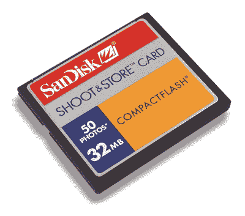

# 紧凑型闪存卡(CF 卡)

> 原文：<https://www.javatpoint.com/compactflash-card>

CompactFlash 卡是 SanDisk 在 1994 年创建的一种存储卡，它使用闪存技术在相对较小的便携式计算机上存储数据。它没有移动的机械元件，也不需要数据检索电池。小型存储卡允许消费者使用各种各样的计算设备来添加数据。如今，CF 卡主要被高端数字成像和摄像机用作可互换内存。

最初的 CompactFlash 卡是使用 NOR 闪存开发的。NOR flash 的好处是可以远程执行存储程序，而无需将它们复制到计算机的随机存取存储器框架中。然而，NAND 更适合海量数据存储，是所有一次性存储卡(包括 CompactFlash 卡和稳定数字(SD)卡)上的默认闪存形式。

由于闪存是非易失性存储器，无论计算机的电源被关闭还是被破坏，存储的数据都会被保留。CF 卡的固态架构特性使其比大多数传统存储单元更耐用。对于 CF 卡来说，操作冲击水平(基本上，它们可以降低并仍然工作的高度)是 2000 高斯(G)，而对于标准便携式计算设备的机械驱动来说，是 100 至 200 G。这适用于从 10 英尺到地面的下降，而对于电子盘驱动器是一英尺。

对于数字单镜头反光相机，CompactFlash 是一种常见的替代卡。Ultra-CompactFlash (Ultra CF)是一种高端变体，专为更困难的拍摄而设计，例如高分辨率照片的短镜头序列或运动对象的照片。

### 技术规格和供应商

基于并行高级技术附件接口，CF 卡的尺寸为 42.8 毫米乘 36.4 毫米，存储容量高达 512 千兆字节。紧凑型闪存卡允许 3.3V 和 5V 的服务，并能够在两者之间切换。这与其他只能在 1V 下运行的闪存小尺寸不同。有两种不同厚度的 CF 卡，以适应不同的容量:第一类 CF 卡的厚度为 3.3 毫米，而第二类 cf 卡的厚度为 5.0 毫米。第二类紧凑型闪存卡的额外厚度是，几乎所有的都是 Microdrive 的，最初是由 IBM 创建的，一种微小的旋转硬盘格式。

SanDisk 现在是世界上最大的 CF 卡制造商之一，但它有很多竞争对手。来自金斯顿科技、Lexar 和超越知识的卡片定期获得数字影像网站的良好评级。

### 压缩闪存协会和合规性

成立于 1995 年的 CompactFlash 集团成员制造商对 CF 卡的互操作性进行了自我测试。该组织由 80 名成员组成，主要致力于满足技术照片和视频行业以及制造业的需求。

**完成该测试的卡片标记如下:**

**CF 4.1a:** 商品通常以每秒 90 兆字节的顺序访问限制速度提供。

**CF 5.0:** 货物提供更有效的命令，速度恒定，便于 TRIM 操作。

g>CF 6.0: Implements Ultra Direct Mode Access 7, which provides up to 167 MB/s of bus speed and supports the Sani

除了设置 CF 和 CFast 卡标准外，CFA 还执行最新的可移动闪存卡格式 XQD 的标准。xd 卡与速度更快的 PCI Express 总线连接，而不是与 CF 卡上的 PATA 总线或 CFast 卡上的 SATA 总线连接。

### 附加闪存卡格式

新的闪存卡格式已经开发出来，可以在物理尺寸不断下降的设备之间存储和上传文件、图像和歌曲。例如，许多类型和功能来自由 SD 协会(一个接近 CompactFlash 协会的行业组织)管理的安全数字存储卡。SD 卡的尺寸是 32 毫米乘 24 毫米乘 2.1 毫米。由于它们的切角外观，它们很容易被发现。

在很多电脑实现中，SD 卡因为体积更小、重量更轻、成本更低，已经取代了体积更大的 CompactFlash 卡。在同等数据存储容量的情况下，SD 卡的成本可能是 CF 卡的一半，具体取决于供应商和读写速度等变量。

* * *