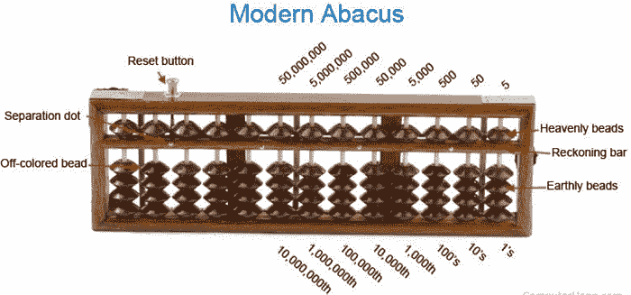
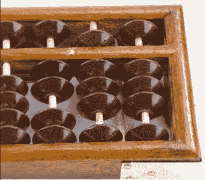

# 什么是算盘？

> 原文：<https://www.javatpoint.com/abacus>

算盘是一种用于快速计算算术运算的机械装置，也称为计数架。它的名字源于拉丁语“abax”或“培根”最初，它是在几千年前发明的，用于进行算术计算，而今天的被广泛用于大脑开发程序。它包括一个长方形的框架，里面装有垂直排列的杆，珠子在杆上上下移动。算盘的主要目的是增加孩子们的智力。

算盘不会自己计算；相反，它帮助用户通过记住已经计算的内容来进行计算。算盘的一些要点如下:

它只是一个包含古代计算方法的装置。

借助于可视化珠算珠的动作，孩子们可以快速地解决心中的计算。

大量研究证明，珠算学习者可以同时使用左右两个大脑半球。

它不仅有助于算术计算，而且在所有学科中都很强大。

再者，也有利于提高孩子的专注力水平。

### 为什么用算盘？

在古代，当没有计算机、计算器或用于进行计算的纸笔时，算盘只能可靠地进行算术计算。除了算盘，人们还用脚趾和手指或泥土中的石头进行计算。这些方法不适合长时间的计算，所以当时使用了算盘。

### 谁发明了第一个算盘？

然而，没有人知道谁发明了第一个算盘工具。据信，美索不达米亚在公元前 2700 年使用了算盘。此外，它还被用于其他文明，如希腊、埃及、中国、波斯、罗马等。

### 算盘还在用吗？

是的，算盘仍在世界上一些地方用于计数和支持现代计数设备。

### 算盘的好处

它提供了几个好处；这些措施如下:

*   它在建筑、工程、科学等领域提供帮助。
*   它为基于计算的科目提供了信心，因为它使数学计算更容易。
*   不仅有利于改善数学条件，还有助于提高整体学术技能水平。
*   它使用户能够轻松解决日常挑战，并增强解决问题的能力。
*   许多著名的医生已经研究过大脑的左半球，它被称为数字大脑，提供分析知识并控制计算、阅读、写作、逻辑思维等。而右半球，被称为控制创造力、艺术感和三维感的模拟大脑。科学认为，如果用户经常使用算盘；它可以增强大脑的右侧，有助于开发人类的整个大脑。
*   它让孩子增强创造力、专注力、创新力、准确性、想象力、速度、听力等技能。
*   它帮助在拼写、阅读和写作方面缺乏专业知识的阅读障碍儿童。它提高了阅读障碍儿童通过触摸可以理解的数字技能水平。

### 算盘的作用

人脑在感觉器官的帮助下工作；我们身体中的运动神经和感觉神经将信息从器官传递到大脑，反之亦然。大脑接受器官的输入；因此，在算盘中，珠子是这样排列的。当孩子们用手指控制它时，神经末梢被激活，然后它激活大脑中的细胞。当使用左手时，大脑右侧的细胞被激活。当右手用在算盘上时，大脑的左侧细胞被激活。左脑活动是解释，右脑活动是想象。因此，大脑的左右两侧共同工作，有助于全脑发育。

### 如何使用算盘？

在知道如何使用算盘之前，了解有几种类型的算盘可用。例如，上面的两颗珠子和下面的五颗珠子是由中国或古典算盘包含的。顶部的一颗珠子和底部的四颗珠子包含在现代算盘工具 soroban 算盘或日语中。我们以现代算盘为例:

位于框架下方的珠子被称为“地球珠子”，这些珠子在第一列中包含一个值。框架中的中间条称为推算条。当珠子向计算条移动时，它们被计数，如果任何珠子没有接触到计算条，该列包含值零。不同算盘工具上的杂色珠子和分离点可能不同，但总是具有将数字分成三组的相同功能。如果你不想从最右边开始计数，这些标记(分离点和有色珠子)有能力标记你的第一个位置。珠子的值从右侧的 1 列开始，取值范围在 1 到 9 之间。珠子的值从右到左依次增加到 10 位、100 位、1000 位等等。

使用算盘时，将其放在一个平面上，并将其排列为零，并确保任何珠子都没有接触到中间的杆(清算杆)。如果您有重置按钮，也可以使用重置按钮重置珠子。借助你的大拇指，将一颗地球上的珠子移到计算杆上。当一颗珠子碰到算尺，就使算盘等于 1。然后，再移动三颗珠子，使算盘值等于四(3 + 1= 4)，因为现代算盘只包含四颗俗世珠子。如果你想数到 5，你需要将天珠向下移动到中间一栏(清算栏)。你必须借助食指移动。同时，如果你想要总数是 7，你必须向下移动所有的俗世珠子，并向上移动两个俗世珠子到中间条(5 + 2= 7)。

如果你想计算更高的数字，你需要根据你想计算的数字的高度向左移动。例如，如下图所示，算盘等于 283，包括 9 个移动到计算栏的珠子。如上图所示，第三列(100 的列)包含两个计数为 200 的珠子，由 10 定义的第二列包含一个计数为 50 的天珠和三个计数为 30 的地珠。最后，将所有(1、10、100)列加在一起(200 + 80 + 3)，总计为 283。

### 如何用算盘加数字？

如果你想借助算盘进行加法，你需要把每个数字从左到右排列到算盘上。例如，如果要添加 200 + 125，请按照下面给出的步骤操作:

**求解步骤:**

*   你必须移动 100 列中的 2 颗地球珠子到 200 的计算栏(中间栏)。
*   现在，在 100 的 100 栏中添加 1 个俗世之珠，表示 100。
*   然后，在 10 的列中添加 2 个地球珠子，持续 20 秒。
*   接下来，您需要在 1 的列中添加 3 个珠子，共 5 个。
*   最后，一旦完成，你就可以在算盘上数到 325。

### 如何用算盘减去数字？

算盘上的减法过程更类似于算盘上的加法过程。在算盘中设定你的第一个数字，然后从这个数字开始从左向右减去。

例如，首先，如果你想减去 200 - 100，你必须在 100 栏中移动 2 个地球珠子的帮助下在算盘上加上 200。然后，从 100 栏减去 100，得到答案 100。

### 算盘的历史

算盘一词源于拉丁语“abakon”或“abax”它是一种强大的算术计算设备，在公元前 300 年至 500 年间被引入。在发明的时候，它走遍了各个国家。苏安潘，创新的中国算盘之一，有 2/5 副牌，但难度更大；所以，它被日本的索洛班算盘所取代，而日本的索洛班算盘是由著名数学家 Seki Kowa 改进的。

Seki Kowa 从上层和下层甲板上移除了一颗珠子，用于制作 1/4 层甲板的算盘。现在用的是索洛班算盘。它在全球化之后变得流行，当时世界上在一个共同的平台上有激烈的竞争。它也影响了不同国家的教育体系。此外，算盘提高了数学的整体概念，也增强了解决问题的能力和更快的计算技能。

### 算盘的种类

算盘的类型及其历史描述如下:

1.  **灰尘算盘:**以覆盖有细沙或灰尘的板的形式，算盘通常用于计算。沙子被分成几条线，其中所有的线描述一个不同的数字位置。数字和数量是在用线画的几个记号的帮助下计算出来的。据信美索不达米亚的文明可能使用了这种类型的初始计算器。
2.  **线算盘:**久而久之，就发展成了直纹板，上面有鹅卵石位于线上。它广泛应用于希腊、埃及、罗马、印度和其他非常古老的文明。保存在雅典博物馆的萨拉米斯算盘是线算盘的一个流行例子。它包含一个白色大理石板，上面画有线条。
3.  **凹槽算盘:**除了线算盘之外，罗马人还被用作高度先进的布局。每一个上面的小树林包含一个柜台，和下面的小树林包含四个柜台。此外，一些其他的计数器被包括在右边，以使与分数相关的计算更容易。
    T3】
4.  **中国古代算盘:**无论是结构还是计算方法，都与古槽算盘极为相似。下图描述了从一本书中推测出的早期中国算盘。这本书的名字叫《数学论文集》，是徐游在 1700 年前写的，300 年后由陈鸾注释。
    T3】
5.  **日本算盘:**在日本，中国算盘及其功能是在 15 世纪初引入的。在日本呆了很长时间后，日本人引进了一种不同于中国算盘的索洛班运算方法。它是由著名数学家不断努力研究后发展起来的。中国算盘的尺寸很大，它被改进，做得更小。

后来，索罗班在 19 世纪末被引进，在它的每个杆上包括一个五单位计数器和四个一单位计数器。它是随着老式算盘一起引入使用的。索洛班运算的功能在 1938 年教育部编写的全国小学算术教科书中被提及。

今天，在每个杆上，标准 soroban 包含一个五单位计数器和四个一单位计数器。日语除法提供了一种更简单的方法来使用乘法表。它取代了能够利用复杂的分区表的旧的中国划分方法。soroban 在日本受欢迎的背后有两个原因，如下所示:

*   被列入日本义务教育大纲。
*   索罗班效率测试系统自 1928 年建立以来的实施情况。

* * *