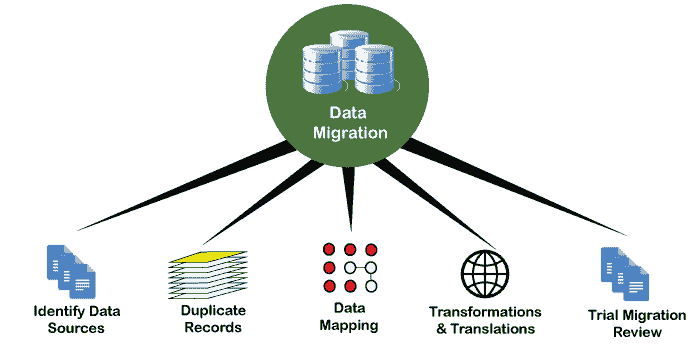

# 数据迁移

> 原文：<https://www.javatpoint.com/data-migration>

数据迁移是将数据从一台设备传输到另一台设备的有用方法。虽然这听起来很简单，但涉及到存储和数据库或程序的转变。任何数据迁移都至少需要提取/转换/加载过程意义上的转换和加载阶段。这种方法表明，在规划中，检索到的信息经过一系列功能，然后将被放置到目标位置。公司出于各种目的进行数据迁移，例如，他们需要重新设计整个基础架构、升级数据库、构建新的数据仓库或集成来自收购或其他来源的新数据。当安装与当前应用程序并列的另一个框架时，数据复制通常很重要。

### 数据移动器分为三大类。

*   对于特定于应用程序的迁移，例如平台升级、数据库复制和文件复制，基于主机的软件是最佳选择。
*   基于数组的软件主要用于在相关结构之间传输数据。
*   根据其配置，网络设备会迁移卷、文件或数据块。

### 创建数据迁移计划

数据转换项目可能是一个挑战，因为经理需要保护数据隐私并安排项目时间，以便组织对业务的影响有限，并关注成本。数据迁移过程中的任何问题都会影响组织的业务，因此数据迁移方法对于确保成功的业务流程的中断和停机时间最少至关重要。

数据迁移项目期间必须考虑的因素包括迁移需要多长时间、所需的停机时间以及公司因技术兼容性、数据损坏、应用程序性能问题和丢失数据而面临的风险。

### 数据迁移的类型及其挑战

**应用迁移:**切换到另一个厂商程序或平台时，可以进行应用迁移。当系统与其他系统交互时，这种方法有其固有的复杂程度，并且每个系统都有其自己的数据模型。虚拟机的控制工具、操作系统和实现都将不同于创建或实现程序的环境。为了克服技术差距，成功的程序迁移可能需要使用中间件产品。

**数据库迁移:**如果需要切换存储厂商、更新数据库基础设施或者将数据库迁移到云端，则数据库迁移完成。当协议或数据语言更新发生时，底层数据将以这种影响应用层的转换形式发生变化。服务器数据复制处理数据的变更，而不修改模式。一些主要任务包括确定数据库的大小以评估有多少存储可用、检查软件以及维护记录的机密性。在迁移过程中，可能会出现兼容性问题，因此有必要验证该过程。

**存储迁移:**通过基础架构升级，存储传输是合理的，该过程被视为通过检测过时或损坏的数据来验证和最小化数据的绝佳时机。该方法包括将磁盘、磁带或云上的数据块和文件从一个存储设备传输到另一个存储设备。有各种物品和工具可用于存储位置调整，有助于顺利进行。存储位置调整还提供了修复任何孤立存储或低效存储的能力。

### 数据集成与数据迁移

迁移数据不应与数据集成混淆。数据传输需要将数据从一个设备传输或复制到另一个设备，或者从一个环境传输或复制到另一个环境，而数据转换处理不同程序和结构之间的数据移动。合并数据的管理员应该熟悉提取、处理和加载技术。这种方法有自己的底层复杂性，每一层都有自己的数据模型。应用程序不是手持的。虚拟机的控制工具、操作系统和实现都将不同于创建或实现程序的环境。为了克服技术差距，成功的程序迁移可能需要使用中间件产品。

如果需要切换存储提供商、升级数据库体系结构或将数据库迁移到云中，则完成数据库位置调整。在这种类型的转换中，当协议或用户语言更新发生时，底层数据将会移动并影响应用层。服务器数据的复制处理数据的修改，而不改变模式。确定归档的大小以决定有多少可用空间、审查代码和保护文档的机密性是一些关键活动。在迁移过程中，可能会出现兼容性问题，因此有必要首先检查该过程。

当迁移到另一个供应商应用程序或平台时，可能会发生设备迁移。当系统与其他系统通信时，这种方法有其内在的复杂程度，并且每个系统都有其自己的数据模型。

### 大爆炸”迁移

在大爆炸式数据迁移中，整个过渡是在很短的时间内完成的。当数据通过 ETL 处理并传输到新的数据库时，实时系统会宕机。

当然，这种策略的好处是，这一切都发生在限时活动中，完成的时间非常少。然而，这种压力可能很大，因为该组织利用其特性之一离线运行。这威胁到已损坏的安装。

* * *