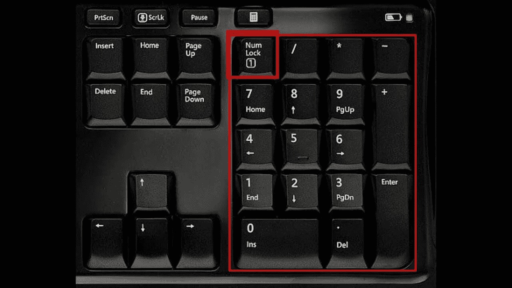
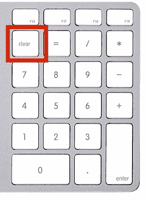
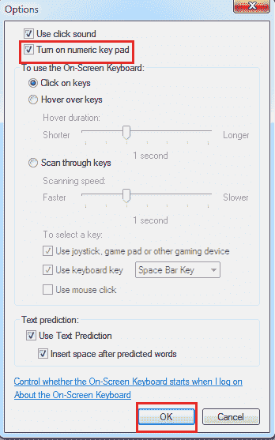
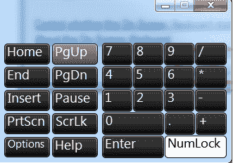

# 什么是数字锁？

> 原文：<https://www.javatpoint.com/num-lock>

Num lock 是一把放置在典型计算机键盘上的钥匙。也称为 **Num 键、Num Lock、**或 **Num Lk** 键。这是一种启用和禁用数字键盘的切换键。启用时，用户可以使用数字键，禁用时，这些键执行其他操作，通常是方向键。例如，如果 num lock 被禁用，并且您按下与之关联的键，这些键可能会像箭头键一样工作。

典型地，为了表示数字键的状态，一个[发光二极管](https://www.javatpoint.com/led-full-form)灯被放置在按钮中或[键盘](https://www.javatpoint.com/keyboard)的顶角上。在不同的键盘设计中，num locks 有多种应用方式，在一些较小的键盘设计中开始停止使用。类似于滚动锁和大写锁定键，数字锁是一个切换键。因为旧键盘的按键更少；因此，引入了 num 键来为数字键提供额外的功能。在某些计算机中，该键对于将主键盘变成数字键盘也很有用。

通常，数字锁是单独建立在键盘上的。但是，在某些计算机中，该键可能会带来一个功能键和其他组合键，因为 num lock 是通过在这些计算机中按组合键来启用的。此外，通过对键盘设置进行一些更改，也可以打开或关闭 num lock。这个键在苹果电脑中被称为清除键，与基于 [MS-Windows](https://www.javatpoint.com/windows) 的电脑中的 num 键相比，它的用途略有不同。清除键通常用于数字输入，而不是光标控制，并且仅在具有单独数字键的全尺寸键盘中使用。

由于键盘的设计发生了变化，对数字锁的需求减少了，键盘上包括了独立的数字键盘和箭头键。但是在大多数现代键盘中，为了方便起见，它们仍然被包括在内，因为有些人习惯于使用该功能。此外，该键已被某些键盘上的组合键取代，尤其是笔记本电脑键盘。

## 苹果键盘上的数字锁定键在哪里？

苹果电脑键盘没有替代的按键，数字键盘只能作为数字键盘使用。因此，苹果键盘上没有数字锁定键。代替 num 键的是 clear 键，如下图所示:

## 笔记本电脑键盘上的数字锁定键在哪里？

数字锁定键位于笔记本电脑的相同位置，带有数字键盘，如下图所示。然而，为了使笔记本电脑更紧凑，大多数笔记本电脑键盘不包含数字键盘。具有数字锁定键且没有数字键盘的笔记本电脑允许用户通过退格键周围可用的键进行数字输入或其他操作，如下图所示。

有一些笔记本电脑使用两个键作为一个键；在这种情况下，您需要将 Fn 键与您想要使用的第二个键一起使用。例如，与其他键相比，Break、Scr Lk 和 Pause 都是蓝色，颜色不同，如给定图片所示。如果您想使用暂停键，您需要用 Fn 键按下该键。同样，您也可以使用带有蓝色文本的其他按键。根据示例图片，如果需要 Num Lock，可以自行按 Num Lk 键，同时按下 Fn + Scr Lk 键可以使用滚动锁。

实际上，当这些键开始出现在电脑笔记本电脑上时，它们在键盘上没有静态位置。也许，你的笔记本电脑没有包含这些键的相同位置和配置，如图所示。但是，所有电脑都有相同的过程来使用这些密钥或遵循上面声明的相同步骤。

## 受数字锁定影响的钥匙

当数字锁定被启用和禁用时，所有数字小键盘按键所做的事情在下面给出了一个表格，其中包含关于每个数字小键盘按键的附加信息。例如，当数字锁定关闭时，您按“8”键，它将向上箭头一行，当数字锁定启用时，您按“8”，输入数字“8”

| 数字键盘上的键 | 数字锁定开启 | 数字锁定关闭 |
| one | one | 目标 |
| Two | Two | 下箭头键 |
| three | three | 下一页 |
| four | four | 向左箭头 |
| five | five | 什么都不做 |
| six | six | 向右箭头 |
| seven | seven | 主页 |
| eight | eight | 向上箭头 |
| nine | nine | 页上移 |
| Zero | 0(零或逗号) | 插入 |
| 。 | 、(逗号)或。(点) | 删除 |

## 如何打开和关闭数字锁定

### 使用数字锁定键

要打开数字锁定键功能，您需要按键盘上给出的数字锁定键；按键，直到看到数字键盘上方的发光二极管灯亮起。同样，要关闭它，您需要按下数字锁定键，直到指示灯熄灭。数字锁定键功能会一直打开，直到您不再按数字锁定键。

### 如果 Num Lock 键没有建立在键盘上或者坏了怎么办？

笔记本电脑或其他一些较小键盘上的键盘不包含数字锁定键。另一方面，如果 Num Lock 键不存在、损坏或用户无法找到该键。幸运的是，Windows 包括一个名为屏幕键盘的功能，可以帮助用户克服这些问题。为此，请遵循以下步骤:

1.  按下**窗口键**或点击**开始**按钮，或点击**窗口+ R** 打开运行对话框
2.  然后，输入 **OSK** ，按回车键，打开*屏幕键盘*。
3.  之后，你会看到一个键盘的图像，如下图所示。现在你需要点击屏幕键盘窗口右下角的选项键。
    
4.  当你点击选项按钮时，你会看到一个如下图所示的窗口。在窗口中，您需要确保“打开数字键盘”框选中，然后在旁边单击确定。
    
5.  最后，您将能够在屏幕键盘窗口的右下角看到数字锁定键。您可以使用它来打开或关闭数字锁定键功能。
    

## 为什么 Num Lock 一直开着？

大多数电脑每次开机都会自动打开数字锁定键，因为在开机模式下使用数字键盘数字的机会更多。例如，如果您在这种情况下使用数字键盘输入您的登录密码(如果它有数字)，您将无法输入数字，并且在没有启用数字锁定的情况下会失败。

* * *