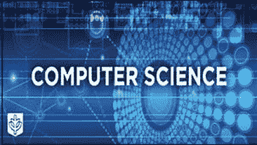
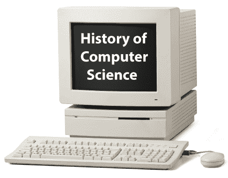

# 什么是计算机科学

> 原文：<https://www.javatpoint.com/what-is-computer-science>

一般来说，**‘科学’**这个词指的是对原理的研究和对特定概念的计算。像普通科学或社会科学一样，计算机科学是对计算机系统的科学研究。它代表了计算机系统的理论研究和实际应用。它包含了所有关于[硬件](https://www.javatpoint.com/hardware)和[软件](https://www.javatpoint.com/software)部件的信息。从简单到详细，计算机系统的每个相关概念都在其中进行了解释。它描述了计算机系统中的每个部分和过程，涵盖了从核心到高级主题的所有部分。它让我们了解和学习算法、过程、程序、数据表示和计算数字信息的方法。它的学科介绍了各种算法和数据结构、网络设计、编程和建模概念以及人工智能。计算机科学基础涵盖了导致电子电路设计技术的数学和工程学科、概率和统计技术等。

## 计算学科

计算机科学涉及并属于五个独立但相互关联的学科家族，这些学科统称为计算的**学科**。这些学科是分开的，但相互关联意味着，尽管它们涵盖了不同的研究概念，但它们的研究目标是计算，这对每个学科来说都是一样的。这五个学科是:

1.  计算机工程
2.  计算机科学
3.  信息系统
4.  信息技术
5.  软件工程

包括**IEEE-CS**(IEEE 计算机学会)、 **ACM** (计算机机械协会)和 **AIS** (信息系统协会)在内的协会和学会自 1991 年以来一直合作和工作，以便为全球使用这些学科进行研究、研究生和本科生项目的教育机构开发和加强这些学科的分类和指南。

## 计算机科学领域

计算机科学家是研究计算理论和软件系统设计的人。根据这项研究，计算机科学领域分为两部分:

1.  **理论，或理论部分:**它强调抽象概念，如计算复杂性理论、编程语言理论、人机交互理论(处理计算机系统的有用性、可用性和可访问性)、计算机体系结构、计算机工程等。
2.  **实用学科:**处理计算科学的实际实现。计算科学是指计算和使用算法技术来模拟科学数据。它还强调计算机图形和可视化，以实现真实世界的应用，网络，数据库和信息系统，实用知识的[操作系统](https://www.javatpoint.com/operating-system)成为有能力解决系统问题。

这两个领域共同完成了计算机科学的研究，因为当实际实现时，可能有一些问题或观点可以更好地表达出来。此外，该理论在被实际理解之前仍然是暂时的。

## 计算机科学的历史和发展

计算机科学的发展根源与一些可区分的领域有关，这些领域是:

1.  **数学:**给出了概念，引入了“二进制数系统”和“存储程序”的概念。据了解，我们可以用 0 和 1 的形式表示信息，并将它们存储在系统中。
2.  **物理与电气工程:**它描摹了布尔代数的电路设计思想，通过布尔代数将电路的电脉冲输入组合起来，就有可能产生任意输出(假或真)。有可能设计一个具有二进制值输入的电路，并获得所需的 0 和 1 的组合作为其输出。因此，晶体管的发明，传输和存储信息的光学、电子和磁介质的发明应运而生。
3.  **管理信息系统:**这些系统被称为**数据处理系统**，描述处理数据的方法。它导致了诸如获取信息、搜索、排序、数据库和图形用户界面等概念的产生和发展。

所有这些领域导致了计算机科学的发展。

**1623 年:**一位名叫**威廉·席卡德**的科学家设计并建造了第一台工作计算器**机械计算机**。

**1673 年:**戈特弗里德·莱布尼茨演示了一种被称为**步进计算器**的数字机械计算器。戈特弗里德·莱布尼茨被认为是第一位计算机科学家和信息理论家。

**1820 年:托马斯·德·科尔马**发明了**算术仪**，这是第一台用于办公室日常用途的强大而可靠的计算机器。凭借这一点，他还开创了机械计算器的行业。

**1822 年:查尔斯·巴贝奇**开始设计**差分引擎**(第一台自动化机械计算器)，由此产生了**分析引擎**的想法。分析引擎是第一个可编程的机械计算器。1834 年，他开始开发分析引擎，两年内，他勾画出现代计算机的许多显著特征。

**1843 年:阿达·洛芙莱斯**翻译并写了一篇关于分析引擎的法语文章，她在文章中发表了计算**伯努利数**的算法。它被认为是第一个在计算机上实现的公开算法。

**1885 年:制表师**由**赫尔曼·何乐礼**发明，他用*打孔卡*处理统计信息。有了这个，赫尔曼的公司成为了 IBM 的一部分。

**1937 年:**霍华德·艾肯在说服 IBM 开发后，发起了**ASCC/哈佛马克我**(被称为巨型可编程计算器)。这个巨大的计算器基于查尔斯分析引擎。ASCC/哈佛马克一世能够独立使用穿孔卡片和中央处理器(中央处理器)。人们相信，在经历了 100 年不可能的巴贝奇的梦想后，它已经成为可能，梦想实现了。

**1940 年:****ENIAC**和**阿塔纳索夫-贝里**计算机被称为新的和更强大的计算机器，被开发出来。术语“计算机”指的是机器及其工作。事实证明，除了计算，计算机还可以用于其他计算工作。计算机科学的领域扩展到了计算研究。

**1945 年:IBM** (国际商用机器公司)在纽约**哥伦比亚大学**成立**沃森科学计算实验室**。

**1950 年和 1960 年:**在这一时期，计算机科学开始确立为一门鲜明的学术学科。

**1953 年:**在**剑桥大学计算机实验室**，开始颁发**剑桥计算机科学文凭**。该文凭是世界上第一个计算机科学学位项目。另一边，第一台晶体管计算机由曼彻斯特大学制造。晶体管计算机被称为**晶体管计算机。**

**1962 年:**第一个计算机科学系在美国**普渡大学成立。**

**1959 年:穆罕默德·阿塔拉**和**达翁·康**在贝尔实验室发明了 **MOSFET** 或 **MOS** ，即金属氧化物硅场效应晶体管。金属氧化物半导体是第一个真正紧凑的晶体管，可以小型化和大规模生产，广泛应用。制造被称为**计算机**或**微型计算机革命**的高密度集成电路芯片成为可能。

### 计算机科学的词源

在 **1959** 年，【计算机科学】一词第一次出现在《ACMT2 通讯》的一篇文章中。文章中的作者**路易斯·费恩(Louis Fein)**主张建立一个*计算机科学研究生院*。最后在 **1962** 中，作者的努力，包括数值分析师**乔治·福赛思**的努力都得到了回报。因此，大学开始创建计算机科学系，创建始于*普渡*。丹麦科学家彼得·诺尔提出了“数据学”和“数据科学”这两个术语。1969 年，**哥本哈根大学**成为第一个在其“数据学系”中使用该术语的科学机构，彼得·诺尔成为第一位数据学教授。在美国计算机学会的交流中，许多计算领域的术语被推荐给从业者。这些名字是*流程图-人类，地球学家，旅游工程师，应用元数学家，应用认识论者*。三个月后，ACM 也提出了*计算机学家*一词，然后是*实体学家*，然后是*计算机*一词。计算机科学被认为与数学有着密切的关系，因为计算机科学受到像艾伦·图灵这样的数学家和许多其他人的工作的高度影响。后来，计算机科学和软件工程之间的联系成了一个问题。在这场争论中，**大卫·帕纳斯**声称，研究计算机科学的目的是计算的性质，另一方面，研究软件工程的目的是为实现实际目标而设计具体的计算。因此，可以看出，它的学术、资金和政治方面变得依赖于是形成数学强调系还是工程强调系。最后，两个部门都努力在全球范围内沟通计算机科学教育领域。

## 计算机科学学科

在经历了计算机科学史上的各种革命和计算机科学学位的合并之后，计算机科学领域出现了各种新的学科。因此，如果有计算机科学的追求者，他们必须获得他们能获得的最深刻的知识。所有的考生都应该有效地了解计算机科学的专业和学科。因此，正在攻读计算机科学学位的学生有以下专业领域:

1.  生物信息学
2.  应用数学
3.  计算物理
4.  微程序设计
5.  网络与管理
6.  计算机体系结构网络
7.  密码系统
8.  计算机工程
9.  网络开发
10.  计算机游戏开发
11.  机器人学
12.  软件开发
13.  模拟和建模
14.  计算机编程
15.  软件系统
16.  数字图像/声音
17.  数据管理
18.  操作系统
19.  设计数据库
20.  电脑图形图像
21.  并行程序设计
22.  iOS 开发
23.  移动开发
24.  记忆系统
25.  人工智能

学生们可以在计算机科学的任何一个子领域进行专业学习，也可以在他们的职业生涯中获得巨大的机会。计算机科学已经在全球范围内发展。它就像一种药物，已经让周围几乎 70%到 80%的人上瘾。

## 计算机科学的应用

自从计算机科学发展以来，它已经成为人类生活的一部分。在日常生活中，我们通过计算机科学的各种应用来使用它。这些应用中很少有:

*   **互联网浏览:**每当我们通过互联网连接在网络浏览器上搜索某样东西时，浏览器都会使用搜索算法和并行计算来查找并为您的查询提供最佳结果。因此，通过互联网浏览了解一切变得很容易。
*   **网购:**类似于橱窗购物，购物者坐在一个地方购买物品。他们在网上购物可以得到很多折扣和代金券。这是一个不错的应用程序，但可能有机会窃取信用卡/借记卡信息。但是，难怪人工智能和网络安全发挥得太好，阻止了我们的数据被窃取。
*   **电子游戏:**电子游戏的整个概念都依赖于计算机图形学。图形设计者和开发者负责创建这样的视频游戏。它吸引孩子们玩这些游戏并学习如何玩。

除了这些应用，我们在日常生活中还使用了计算机科学的各种其他应用。

## 计算机科学的职业选择

计算机科学以其迷人而迷人的理论、工程和实验，点燃了世界。它带来了各种各样的发展，节省了人们日常的大量时间，并成为他们的帮手。

计算机科学领域的不同专业吸引了很多学生。因此，如果任何人对这个领域感兴趣，可以在提供该项目的学院或大学攻读计算机科学学位，并在以下领域做出职业选择:

*   数据库管理员
*   网络开发者
*   软件分析师
*   软件工程师/硬件工程师
*   计算机系统操作员
*   测试员
*   编码器
*   计算机图形设计师
*   计算机网络工程师等等。

了解你的兴趣，下定决心，采取措施，抓住你得到的机会。

* * *