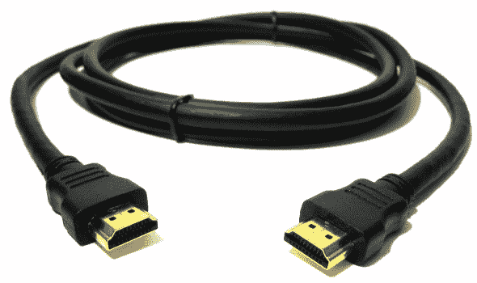
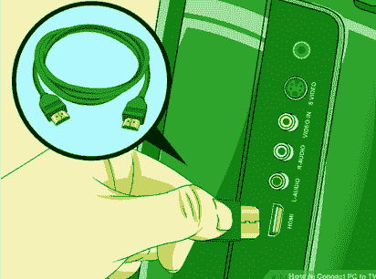
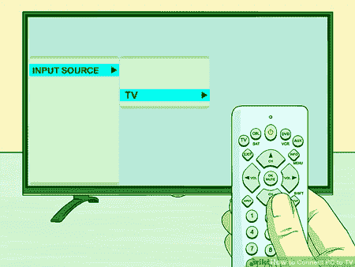
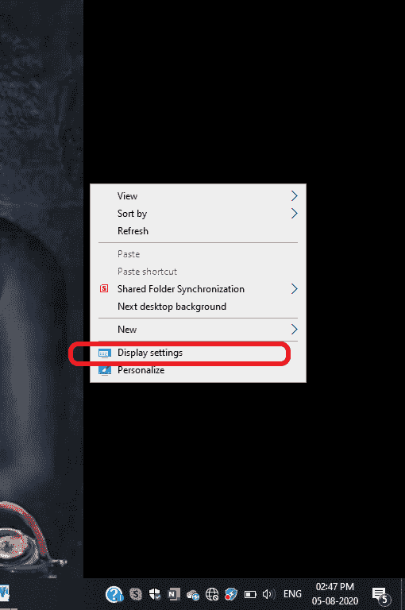
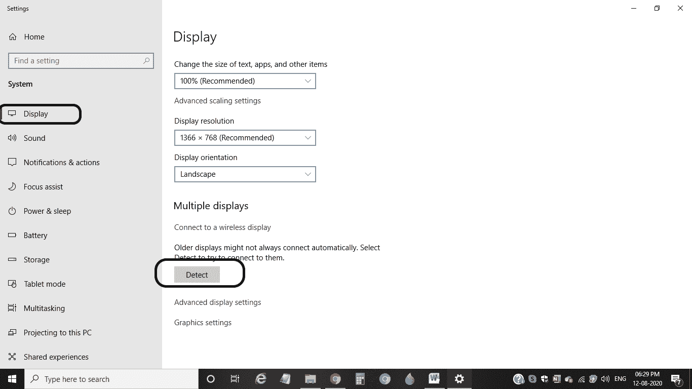
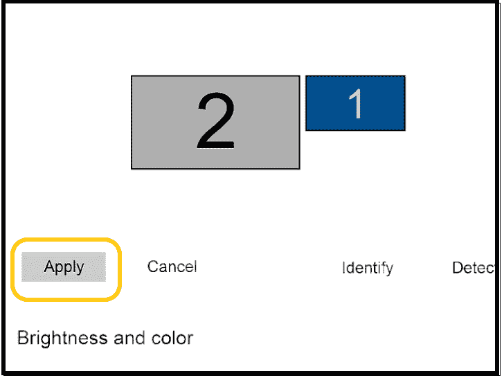
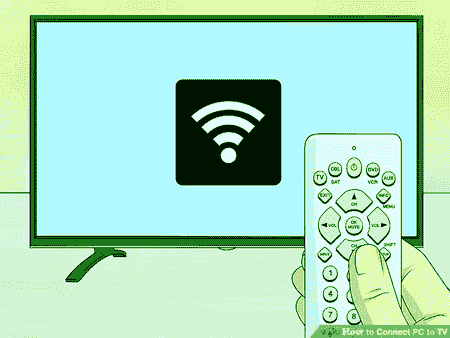
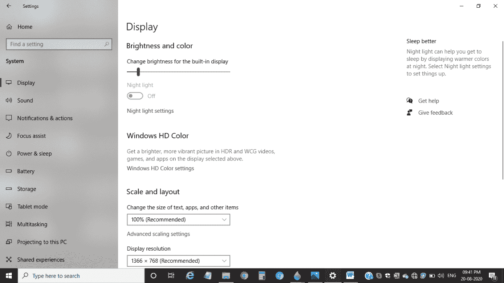
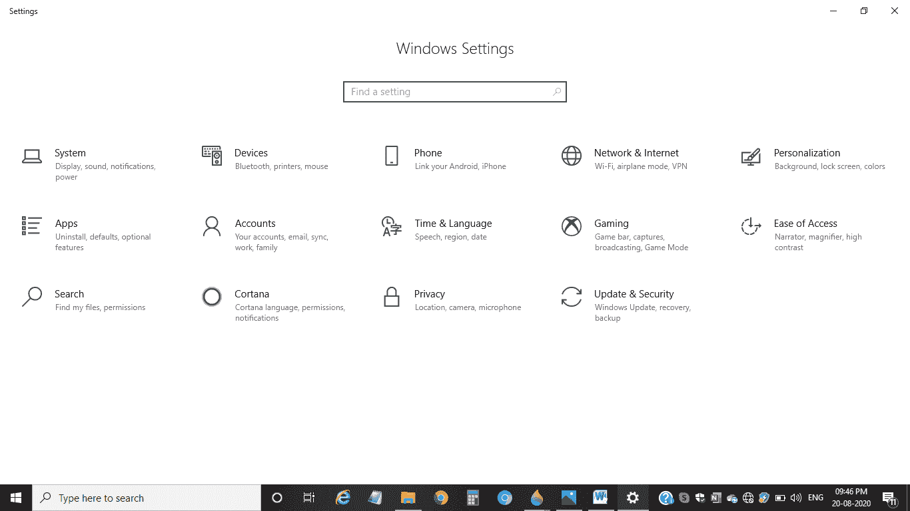
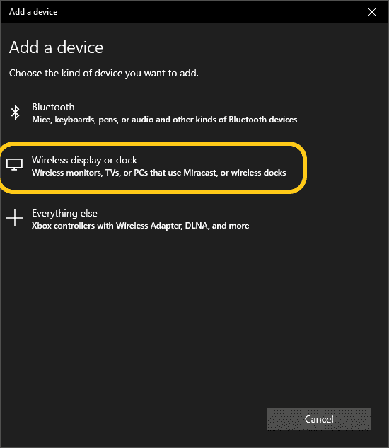

# 如何将电脑连接到电视

> 原文：<https://www.javatpoint.com/how-to-connect-computer-to-tv>

一般爱看大屏高音量电影或视频的人，更喜欢把电脑和电视连接起来。当我们把电脑连接到电视上时，我们可以在大屏幕上看电影、视频或其他东西。还有，喜欢在大显示器上玩游戏的玩家，把电脑和电视连接起来玩。然而，这是一个简单而容易的任务，人们可以在几分钟内完成。在早期，建立这种联系并不容易，今天，随着现代计算机系统和现代技术的出现，建立这种联系已经成为可能

在这里，我们将学习将电脑连接到[电视](https://www.javatpoint.com/android-tv)的方法。我们可以通过无线或有线方式将电脑连接到电视上。

## 使用有线连接将计算机连接到电视

### 使用 HDMI

[HDMI](https://www.javatpoint.com/hdmi-full-form) 或**高清多媒体接口**是将计算机系统连接到电视上最简单的方法之一。在笔记本电脑或台式电脑中，存在不同类型的连接和适配器。例如，如果您有一台太旧的电脑或电视，将有各种选项可用于进行此类连接。因此，您可以查看与您的系统功能相匹配的可用规格。一般来说，在所有现代系统中，HDMI 端口的大小各不相同。这意味着您的系统将有**全尺寸高清多媒体接口**或**迷你/微型高清多媒体接口**，或者两者都有。这些端口位于笔记本电脑的侧面和[中央处理器](https://www.javatpoint.com/central-processing-unit)的背面。HDMI 电缆看起来像:

HDMI 电缆的一个优点是可以轻松处理音频和视频。如果没有 HDMI 电缆，可以从市场上购买。

通过以下步骤，我们可以使用 HDMI 电缆将计算机连接到电视:

**步骤 1)** 找出笔记本电脑和电视上的 HDMI 端口。设备上的两个 HDMI 端口将是相似的，HDMI 电缆的两端具有完全相同的连接器。将电缆连接到各自的端口，并进行公对公 HDMI 连接。

#### 注意:如果设备上有更多的 HDMI 端口可用，请检查您要连接的端口号。

**步骤 2)** 现在，使用您的电视遥控器或电视按钮，并按下**输入**按钮，将输入更改为 HDMI 而不是电视。在某些电视中，它会自动识别并更改 HDMI 的输入。

**第 3 步)**在桌面屏幕任意位置右键打开桌面上的“显示设置”，如下图快照所示:

**步骤 4)** 将打开“设置”窗口。点击屏幕上的“检测”按钮，这将使计算机知道它已连接到电视。

从 **1 显示主显示****2****显示为电视显示的显示编号中选择电视选项，或者您连接到两个以上的显示**。

**第 5 步)**如果您对标签号感到困惑，您可以点击“识别”按钮，该按钮将让您知道分配给电脑显示屏的号码和分配给电视的号码。

**第 6 步)**点击“多显示器”下拉框，选择您想在电视上显示电脑系统的方式。您将在下拉列表中看到以下选项:

*   **复制这些显示:**该选项将在电视上镜像您的系统。
*   **扩展这些显示:**这样的选项选择将使您的电视成为桌面的扩展部分。
*   **仅在 1 上显示:**如果选择此选项，将关闭显示数字 2。
*   **仅在 2 上显示:**与上述选项相反，将关闭显示数字 1。

**步骤 7)** 选择合适的选项，点击‘应用’按钮。这样做时，它将应用于监视器并更改显示设置。现在，您的电脑将连接到您的电视。要进行一些高级设置，请单击标签号，然后单击“高级显示设置”。它将帮助您对所选显示器进行进一步设置。

### 使用 DVI 或 VGA

VGA 和 DVI 连接器用于将视频从源传输到目的地，例如将视频从计算机传输到任何投影仪或电视。 [VGA](https://www.javatpoint.com/vga-full-form) 代表**视频图形适配器**，DVI 代表**数字视频接口**。VGA 连接器电缆只能传输模拟信号。另一方面，DVI 是一种新的连接器电缆，能够承载模拟和数字信号，具有更清晰和更好的显示性能。使用 DVI 或 VGA 电缆将计算机连接到电视的步骤类似于讨论 HDMI 连接的步骤。

## 使用无线连接将计算机连接到电视

### 使用无线网络

[Wi-Fi](https://www.javatpoint.com/wifi-full-form) 是一种无线网络技术连接，能够在设备上进行互联网连接。为了将您的电视与电脑连接，我们需要将电视与 Wi-Fi 连接。

使用无线网络连接将电脑与电视连接时，我们需要遵循以下步骤:

**步骤 1)** 您需要在电视上启用 Wi-Fi 模式。使用电视遥控器或按钮搜索并启用无线网络设置。使用相同的无线网络连接连接电脑和电视。

**步骤 2)** 右键单击桌面任意位置，点击“显示设置”，显示设置页面打开，如下图快照所示:

**步骤 3)** 点击“多显示”下拉框，选择下拉框下的“复制此显示”选项。

**步骤 4)** 现在，点击“应用”按钮。

**步骤 5)** 通过按下窗口按钮或在搜索栏上搜索“设置”，打开[窗口](https://www.javatpoint.com/windows)上的“设置”。将打开 windows 设置页面，如下图所示:

**步骤 6)** 从“窗口设置”中选择并点击“设备”选项，如下图所示:

**步骤 7)** 现在，将打开“设备设置”页面，单击“添加蓝牙”或其他设备(+)按钮，将打开一个新窗口，其中有三个选项，您必须选择要添加的设备类型。在这里，您需要选择“无线显示”并点击它，如下所示:

**第 8 步)**电脑会开始搜索识别设备，找到电视连接后会出现在屏幕上。计算机将自动连接到您选择的设备。最后，您将能够将电脑连接到电视。

通过这些方法，您可以将电脑连接到电视，并在更大的显示屏上享受可视性。

## 设备故障排除

如果在连接设备时出现任何问题，我们需要注意以下几点:

*   选择正确的电缆或适配器进行连接。这是因为有时电缆是可行的，但它可能不适合保存音频和视频信号。因此，请确保只购买音频/视频电缆。
*   确保您在两台设备上都进行了正确的电缆连接。这是因为如果电缆松散地连接到端口或连接到错误的端口，连接可能不正确。此外，如果您使用 DVI 和 VGA 电缆连接，请注意螺钉拧紧。
*   确保设备(电脑和电视)都是全音量的，也就是说，两个设备都不应该静音。如果音量增大，但您仍然听不到任何音量，请更改音频输出。要更改音频输出，右键单击任务栏右下角的“声音图标”。打开“声音设置”并选择合适的输出设备。
*   如果这些问题都没有解决，最后一个选择是重新启动你的电脑和电视，这样它就可以检测到新的显示连接。
*   最后，如果您发现“不支持 HDMI”的错误信息，这意味着您的电脑和电视的分辨率显示设置不同。

因此，使用上述方法，我们可以连接电脑和电视，并解决问题，如果发生。

* * *