# 如何将打印机连接到计算机

> 原文：<https://www.javatpoint.com/how-to-connect-printer-to-computer>

打印机是计算机的重要组成部分，它允许我们将无形的数据打印到纸上。一般都是去网吧打印作品。这是因为他们家里没有电脑，或者不是电脑用户，不了解技术世界。如果非要谷歌这样的问题，很可能意味着你是一个技术人员或者电脑用户，拥有一台打印机或者已经购买了一台，想学习如何将打印机连接到电脑上。如果你家里有一台[打印机](https://www.javatpoint.com/printers)，不仅可以节省你的钱，还可以节省你逛网吧的时间。此外，有时在午夜，打印输出变得紧迫，没有网吧开放，因此在家里安装个人打印机是一个很好的选择。

在这里，我们将讨论将打印机连接到计算机的方法。我们将了解可用的打印机类型，还将了解向计算机添加打印机的有线和无线方法。

## 打印机的类型

在进入连接步骤之前，我们应该简要讨论一下目前可用的打印机类型:

*   **激光打印机:**打印机用于快速打印数百页(只需几分钟)。
    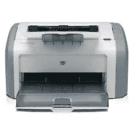
    这种打印机用于打印法律或专业文件。我们可以在网吧或政府部门找到这样的打印机。
*   **喷墨打印机:**这些打印机是普通人群使用的。这种打印机能够打印学校的文件、项目页面、照片、在线表格、在线采购收据等。
    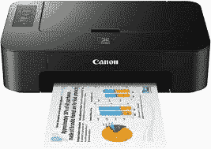
    人选墨客？打印机作为他们的私人助理。
*   **3D 打印机:**是一种用于打印 3D 零件或工具的新型打印机，用于破碎物体的更换零件。它用于拍摄物体的数字蓝图。
    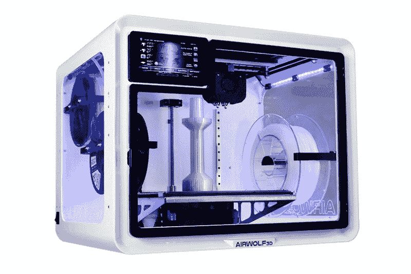
    这种打印机被用于建筑、设计等多种用途。3D 打印机也用于打印儿童玩具。

现在，我们将讨论将打印机连接到计算机的方法。

## 在计算机上连接有线打印机(本地打印机)

本地打印机是指未连接到网络的打印机。有线打印机带有一个通用串行总线端口，允许使用[通用串行总线](https://www.javatpoint.com/usb-full-form)打印机电缆将打印机连接到计算机的通用串行总线端口。要求是要有 USB 打印机线。

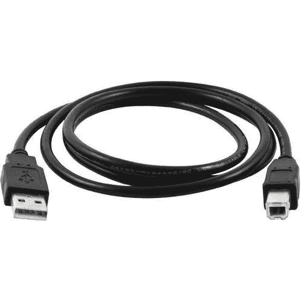

**第一步:**让打印机靠近电脑，因为 USB 线的长度有限。所以，打印机不应该放在离电脑很远的地方。

**第二步:**现在，您需要将电脑和打印机插入电源，然后按下两个设备上的电源按钮，使打印机和电脑都打开。

**步骤 3:** 使用 USB 线将打印机连接到电脑。

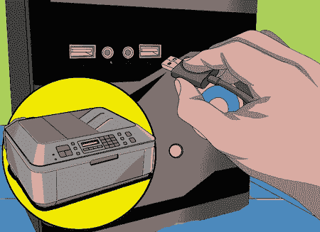

**步骤 4:** 通过按键盘上的“窗口”按钮或单击任务栏左下角的窗口图标，解锁您的窗口并打开设置。截图如下所示:

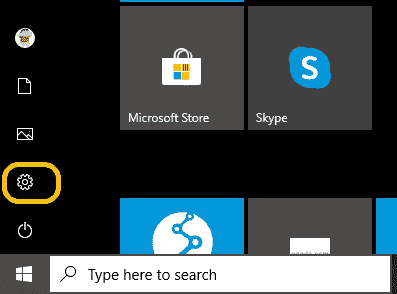

**第五步:**将打开 Windows 设置页面，如下图快照所示:

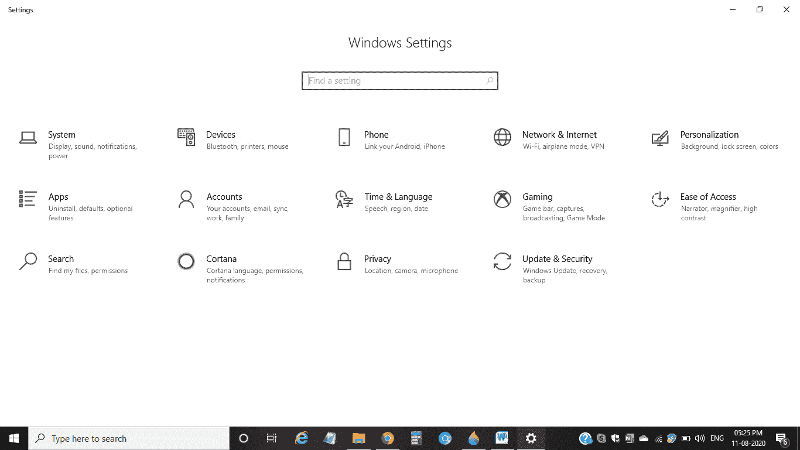

**第 6 步:**点击设置下的“设备”图标。快照如下所示:

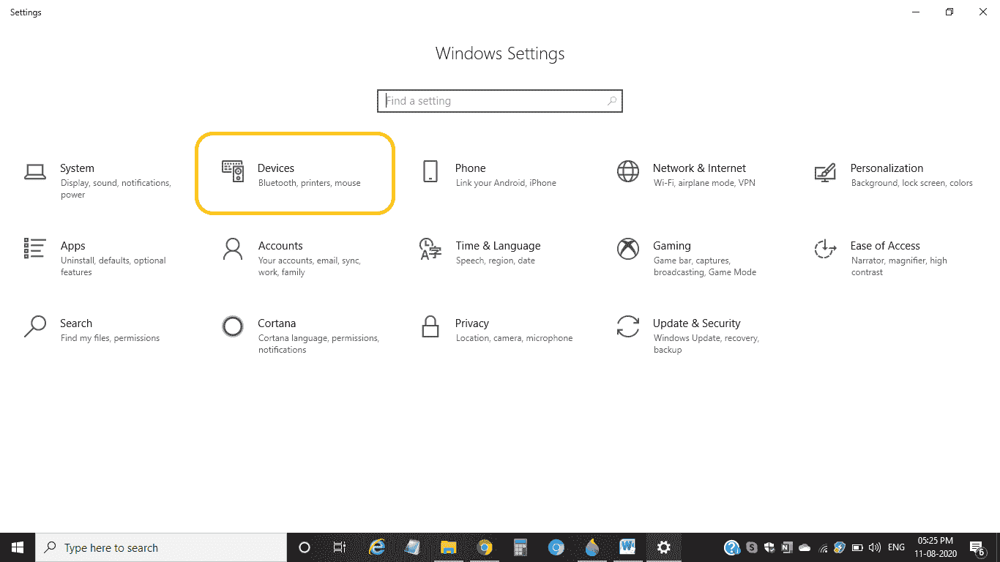

**第 7 步:**设备页面将打开。在“打印机&扫描仪”选项下，点击“添加打印机或扫描仪”(+)按钮。它将搜索连接的设备，如下图所示:

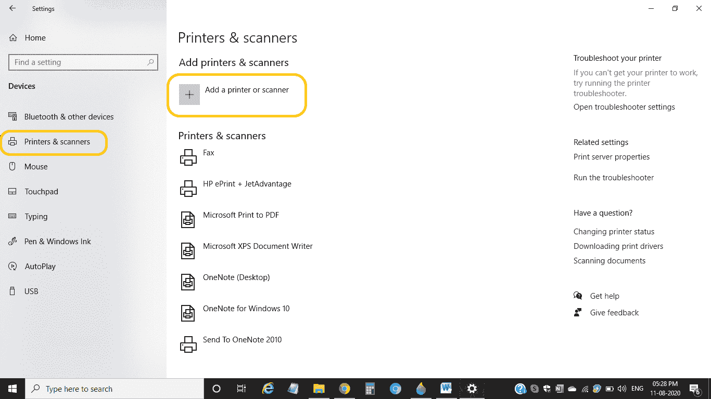

**步骤 8:** 搜索成功后，将显示连接到计算机的打印机名称，点击打印机名称下的添加设备。

但是，如果您在下面看不到所连接打印机的名称，请单击“我想要的打印机未列出”选项。快照如下所示:

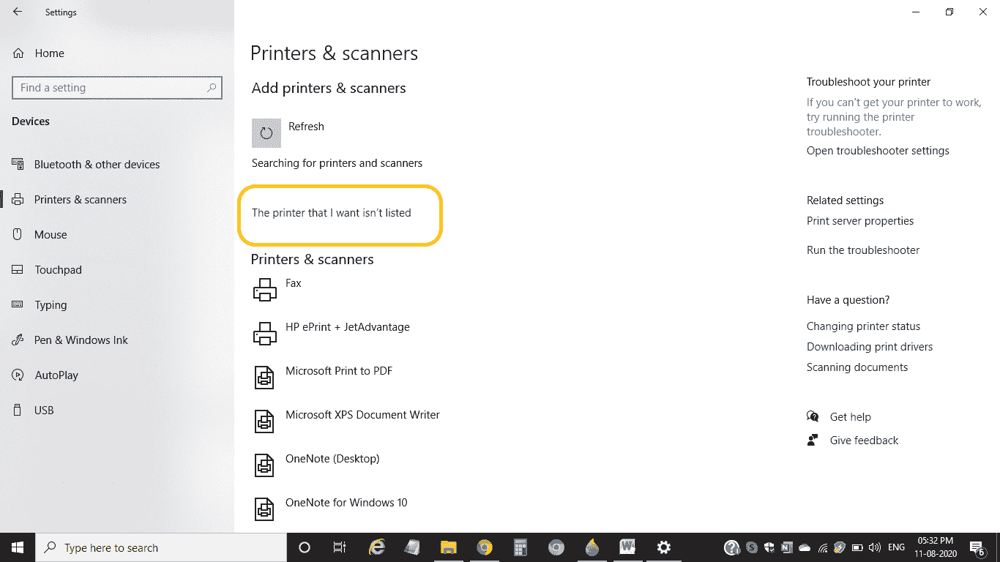

**第 9 步:**将打开一个确认对话框，即“用户账户控制”，询问权限。点击它下面的“是”，你的打印机将被安装在系统上，你可以随时使用它。

所以，通过这种方式，您可以将有线打印机与您的计算机系统连接起来。

## 将无线打印机连接到计算机

无线打印机不同于有线打印机，因为安装无线打印机的方法因制造商而异。将无线打印机连接到计算机时，可以找到以下网络连接:

*   **选择 Wi-Fi 网络:**对于这样的连接，应该知道家庭网络的 SSID。
*   **利用打印机的液晶面板获取无线设置:**在打印机上，转到**设置>无线局域网设置**。
*   **输入您的网络密码:**有时您可能需要使用 USB 电缆将打印机临时连接到计算机系统，以便在计算机上安装软件。但是，这只是一次。之后，您可以在“打印机&扫描仪”列表下自动看到打印机名称。让打印机和计算机彼此靠得太近，即在路由器的范围之内。

要将打印机连接到计算机，您需要遵循以下步骤:

**第一步:**根据打印机的制造商进行适当的网络连接，将打印机放在路由器的范围内，以获得良好的网络信号。

**第二步:**按下电源按钮，打开打印机的电源按钮。在此之前，将打印机和计算机插入电源。

**第三步:**每台打印机或电子设备的盒子里总是装着一本说明书。把你从打印机里拿到的手册挑出来。阅读并遵循每条说明，以正确的方式进行连接。但是，如果您没有手册，只需访问制造商支持网站，您就可以找到说明并遵循它们。

**第 4 步:**现在，您需要准备打印机进行连接。为此，请使用打印机屏幕设置无线网络。对于[无线](https://www.javatpoint.com/wifi-full-form)设置，输入网络密码，电脑和打印机的无线设置应该相同。如果您的连接是通过蓝牙进行的，请为您的系统设置蓝牙连接。要进行蓝牙设置，请按打印机上弯曲的蓝牙图标，并将打印机与计算机系统配对。

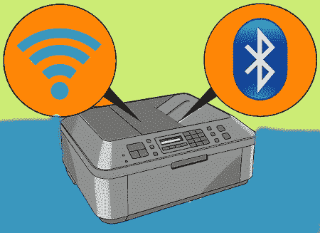

**步骤 5:** 通过直接在搜索栏上搜索或按任务栏左下角的“窗口”按钮，打开窗口上的“设置”。将打开 windows 设置页面，如下图所示:

**第六步:**点击设置页面下的“设备”图标，设备窗口将打开，如下图截图所示:

**步骤 7:** 如果是 Wi-Fi 连接，点击“打印机”&扫描仪的连接选项，然后从左侧菜单面板中选择相应的选项(如有线连接中所述)。如果是蓝牙连接，从左侧菜单面板选择“蓝牙&其他设备”选项。

对于无线网络连接

对于蓝牙连接

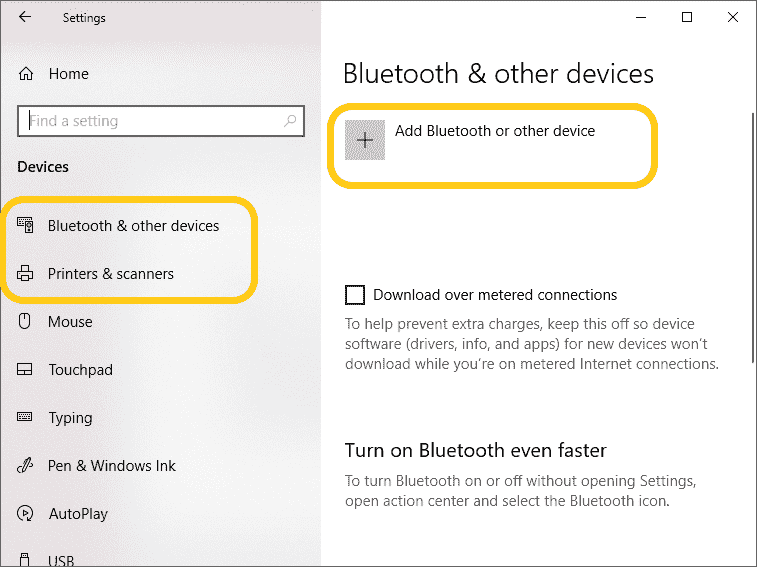

**第 8 步:**现在，打开相应的选项，点击相应页面顶部的“添加打印机或扫描仪”选项或“添加蓝牙或其他设备”选项。如果是 Wi-Fi 连接，计算机将开始搜索连接的设备，搜索成功后，将显示连接的打印机的名称。如果是蓝牙连接，请打开电脑上的蓝牙，然后它会搜索连接的打印机。

**第九步:**当列表中显示打印机名称时，点击名称下的“添加设备”，打印机将连接到计算机。

## 连接网络上的共享打印机

当我们想要从多台计算机或设备打印页面时，需要共享打印机。对于这样的任务，我们通过在系统中为计算机设置共享设置来使用共享打印机。

要在网络上共享打印机，您需要遵循以下步骤:

**步骤 1:** 通过建立无线连接或有线连接(如我们上面所讨论的)将打印机安装到您想要共享的计算机上。

**步骤 2:** 通过在搜索栏上搜索或按下窗口图标并从中选择“设置”选项，在窗口上打开“设置”。

**第三步:**Windows 设置页面打开，点击【网络】&互联网图标，如下图快照所示:

**第四步:**现在，将打开“网络&互联网”设置页面，从左侧菜单面板点击“状态”，如下图所示:

**步骤 5:** 在“更改您的网络”设置下，单击“共享”选项。它能让你决定你想分享什么。截图如下所示:

**第 6 步:**将打开“共享”选项窗口，点击“展开”( ^)'按钮出现在“私人”的右侧，如下所示:

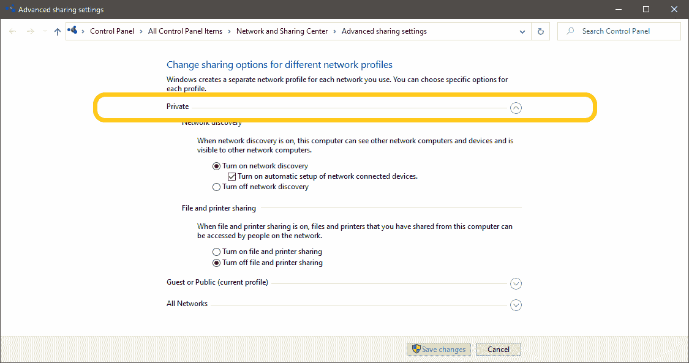

**步骤 7:** 在“文件和打印机共享”下，选中“打开文件和打印机共享”复选框选项，启用网络上的打印机和文件共享，如下所示:

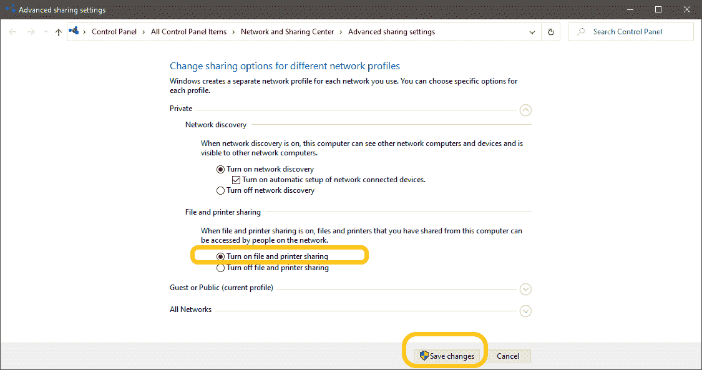

**第 8 步:**现在，点击共享打印机名称下的“添加设备”连接到共享打印机。

#### 注意:确保共享打印机的计算机已启用或未启用连接。

因此，这些是将打印机连接到计算机系统的可能方法。

* * *