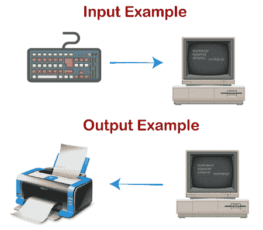

# 输入和输出设备的区别？

> 原文：<https://www.javatpoint.com/input-device-vs-output-device>

有许多输入设备，如键盘、鼠标、网络摄像头、麦克风等，可以将信息发送到计算机系统进行处理。输出设备，如监视器、[打印机](https://www.javatpoint.com/printers)等，显示输入设备产生的处理结果。输入设备仅用于向系统提供数据输入，输出设备在处理其他设备的数据后接受输出。

输入设备和输出设备之间的主要区别之一是，输入设备是用户用来向系统提供输入的设备，而输出设备是用于为用户再现输出信号的设备。

有各种各样的设备用来接受用户的数据输入或输出计算机产生的数据；因此，它们被称为输入设备或输出设备。然而，有些设备被称为输入/输出设备，因为它们可以接收输入和再现输出。

例如，如上图所示，键盘是一种输入设备，向计算机系统发送电信号。计算机系统接受这些信号作为输入，然后翻译它们，并在监视器上以文本或图像的形式向用户产生或显示输出。在图像的下半部分，还显示了处理后，计算机向打印机发送数据或输出。然后，一旦计算机将输出发送到打印机，它就会被打印到同样被视为输出的纸张上。

## 输入设备

一个[输入设备](https://www.javatpoint.com/input-devices)可以接收来自用户的指令或者将信息转发到另一个设备，但是它不能接受来自另一个系统的数据。它接收输入后，将这些数据翻译成二进制代码的电信号，人类无法理解，只有数字计算机才能理解。输入设备的例子有很多，下面讨论:

*   **[键盘](https://www.javatpoint.com/input-devices#Keyboard)[鼠标](https://www.javatpoint.com/input-devices#Mouse) :** 这些都是用户用来给电脑输入的输入设备。他们将接收到的用户输入(数据)发送到系统。由于这些是输入设备，它们不能从计算机接收或显示输出(信息)。
*   **[麦克风](https://www.javatpoint.com/input-devices#Microphone) :** 另一种输入设备是麦克风，它接受输入源产生的声音，并允许用户将音频发送到他们的计算机中。在麦克风中，接受的信号可以被转换成数字信号或者可以被放大成模拟信号。
*   **[网络摄像头](https://www.javatpoint.com/input-devices#Webcam) :** 网络摄像头是一种连接电脑并面向用户的视频摄像头，用于通过电脑系统拍摄图片、制作视频。它从指向的地方获取图像作为输入，用于呼叫和自拍。然而，大多数现代网络摄像头都有麦克风，这为用户在制作视频时提供了更好的音质。网络摄像头安装在台式电脑的显示器上，也安装在笔记本电脑上。

## 输出设备

[输出设备](https://www.javatpoint.com/output-devices)是计算机设备的一部分，从另一个设备接收数据，并利用该信息产生输出。虽然它不能将数据发送到另一个设备，但它有能力将数据从一台计算机转发到另一个计算机系统。它的功能是从输入设备获取数据，并将数字化信号转换成用户可以理解的形式。有各种输出设备的例子；下面将讨论一些问题:

*   **显示器:**显示器是一种计算机硬件，它接受来自计算机的数据(输出)，并通过计算机的视频卡将其显示在系统屏幕上。显示器能够以更高的分辨率显示信息。此外，这些非常像电视，也称为视频屏幕、显示器、视频显示终端或视频显示单元。
*   **扬声器:**最常见的输出设备，扬声器接受来自电脑的声音数据，并将声音播放给用户听。虽然扬声器可以与任何类型的音响系统一起使用，但有些扬声器只为计算机制造。它是一种设备，不能接收用户产生的声音，也不能将声音传递给另一个设备。扬声器的主要目的是为听众产生声音或音频输出。
*   **投影仪:**投影仪是一种输出设备，它接受来自计算机的数据(输出)，并将该数据或信息作为图片投射到墙壁或屏幕或任何大的表面上。它不能从用户那里接收数据，也不能将数据发送到另一个设备。当您向一大群人显示视频或图像时，投影仪比显示器更有利于使用，因为它在一个大的表面上显示数据，许多人可以清楚地看到这些数据。

## 输入输出设备

输入/输出设备能够接受来自用户或另一个设备的数据(输入)，以及将数据转发到另一个设备(输出)。输入/输出设备的一些例子讨论如下:

*   **光驱和 DVD 光驱:**这些驱动器的功能是接受来自计算机的数据作为输入，以复制到可写的 CD 或 DVD 上。并且，包含在[光盘](https://www.javatpoint.com/cd)或 DVD 上的数据由驱动器发送到计算机。
*   **[u 盘](https://www.javatpoint.com/usb-flash-drive) :** 也称钥匙扣盘、数据棒、u 盘、拇指盘、内存单元、笔盘。它是一种便携式存储设备，用于保存或接受来自计算机的数据(输入)。它通过 USB 端口连接到计算机，并将数据转发到计算机或其他设备(输出)。

## 输入和输出设备之间的区别。

下表包含了输入设备和输出设备之间的主要区别。

| 输入设备 | 输出设备 |
| 输入设备接收来自用户的数据。 | 输出设备在屏幕上为用户显示数据。 |
| 它用于将用户友好的指令翻译成机器友好的指令。 | 它的工作原理是将机器的指令翻译成用户可理解的语言。 |
| 用户可以命令输入设备。 | 处理器命令输出设备。 |
| 它接受来自用户的数据作为输入，并将其转发给处理器进行进一步处理。 | 由处理器处理的数据被发送到输出设备，以将其发送回用户；这意味着输出设备从处理器获取处理后的数据。 |
| 它的设计比较复杂。 | 与输入设备相比，它的设计没有那么复杂。 |
| 输入设备帮助计算机接收用户的指令。 | 输出设备帮助计算机产生或向用户显示信息。 |
| 有各种可用的输入设备，如麦克风、操纵杆、键盘、定点设备、图像扫描仪、图形输入板等。 | 有几种输出设备可用，如扬声器、打印机、绘图仪、投影仪、监视器等。 |

* * *