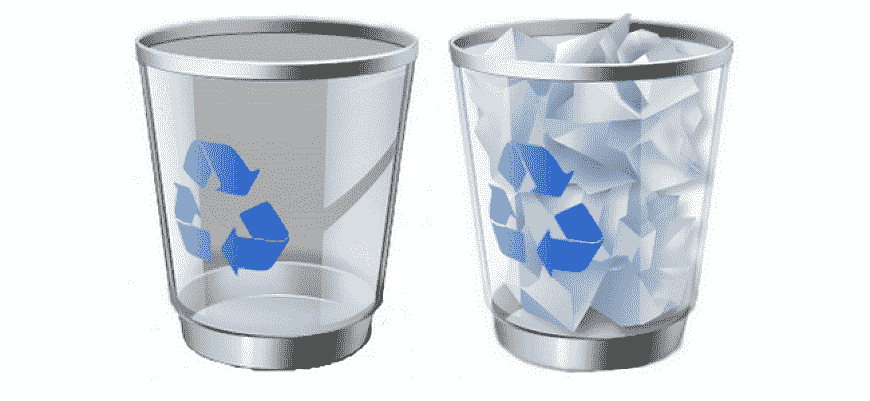
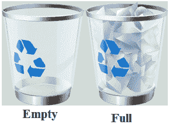

# 什么是回收站？

> 原文：<https://www.javatpoint.com/what-is-recycle-bin>

回收站是删除的项目临时存储在窗口中的地方，除非它们被永久删除。它为用户提供了恢复自 Windows 95 以来在 Windows 操作系统中删除的文件的选项。在用户没有永久删除文件之前，这些文件不会从硬盘上永久删除；所有这些已删除的文件或文件夹都存储在回收站中。此外，回收站允许您将其中存储的所有文件恢复到其原始存储位置。

您不能在回收站中直接使用该文件；您必须先恢复文件才能使用它们。从 Windows 95 开始，它就出现在所有版本的 Windows 中。但是，在较新版本的 Windows 操作系统中，其图标可能不会出现。在这种情况下，您可以通过进入设置从窗口显示此图标。如果回收站没有任何回收站，它将显示为空回收站。当它有一些数据时，它会出现，其中有论文，如下图所示。

如果数据被错误删除，回收站是最有用的。如果从系统中删除一个文件，实际上，它不会从系统中删除；它存储在回收站文件夹中。如果您从回收站中删除该文件，它将不会被移动到回收站，这意味着它将被永久删除；因此，它无法恢复。此外，如果您想防止文件进入回收站，您可以使用快捷键 Shift +从键盘上删除该键。

此外，如果您在 DOS 命令提示符的帮助下删除文件，它将不会被移动到回收站，无法恢复。如果用户想要立即永久删除文件或文件夹，他们可以配置其设置，使删除的文件不被发送到回收站。此外，您可以通过将文件拖到回收站图标来将文件移动到回收站，并可以从键盘上单击所选文件和文件夹上的“删除”按钮，或者右键单击文件并从下拉菜单中选择“删除”选项。如果要查看已删除的文件，您必须通过双击其图标来打开回收站。然后，用户可以看到存储在回收站中的已删除文件。

但是，在窗口的左侧栏中有一个“回收站任务”。当您右键单击回收站图标时，会出现一个带有选项的弹出菜单，如恢复所有项目、清空回收站等。如果选择“清空回收站”选项，所有文件将被删除并永久存储在回收站中。而且，如果您选择“恢复所有项目”，每个文件都将被放回硬盘的原始位置。如果您想要还原所需的文件，也可以单独选择文件。

## 回收还是垃圾？

与麦金塔电脑上的垃圾桶一样，回收站在 Windows 中执行相同的工作。因为它的名字和垃圾有关，所以更环保。如果您的回收站包含更多已删除的文件，而您清空回收站，它会腾出更多存储空间来存储文件。此外，磁盘的分区会回收以前的数据。

## 为什么回收站被清空了？

除非您不从回收站移除文件，否则它们仍会占用硬盘上的存储空间。尽管如此，当您确定永远不会恢复已删除的文件时，清空回收站会更好。因此，大多数人在不想恢复已删除的文件时会清空回收站，这有助于提供额外的硬盘空间。

## 项目在回收站中停留多长时间？

除非清空回收站，否则所有临时删除的文件都将被存储。但是，如果回收站的存储限制已过，或者硬盘即将满或磁盘空间不足，您的文件将开始从回收站中删除。

## 如何清空或管理 Windows 回收站？

默认情况下，微软视窗 95 和所有后续版本都包含回收站功能，并利用计算机硬盘 10%的存储空间来存储删除的文件。如果用户不小心删除了文件，它会为用户提供恢复文件的好处。如果回收站已完全满，或者您的硬盘即将满或磁盘空间不足，或者回收站的存储限制已过，在这种情况下，旧文件将开始自动从回收站中删除，以便为最近删除的文件腾出空间。下面介绍回收站的使用术语及其几个功能。

## 如何知道回收站是否有文件

当用户简单地从系统中删除一个文件时，它不会被永久删除并自动发送到回收站。要知道回收站是包含文件还是空的，您可以看到回收站图标出现在系统上。如果回收站包含文件，其图标将看起来像一个装满皱纹纸的篮子。并且，一个空的回收站将显示为一个空的篮子，如图所示。

## 如何管理回收站容量

您可以通过右键单击回收站图标来修改回收站的存储容量，然后您需要从许多选项的下拉列表中选择*属性选项*。您可以在“回收站属性”窗口中调整回收站用于存储已删除文件的空间。通过指定 MB 数或向左或向右拖动滑块，您可以调整存储空间以将删除的文件存储在回收站中。此外，还可以从系统中禁用回收站功能。

## 如何恢复发送到回收站的文件

有不同的方法来恢复已删除的文件；这将在下面讨论:

*   导航桌面窗口，其中将显示回收站图标。如果回收站中有任何文件，图标将显示为回收站中有垃圾。
*   要查看已删除的文件，您必须在双击回收站图标的帮助下打开回收站窗口。
*   现在，您需要从回收站窗口中选择要还原的文件，然后在选定的文件上单击鼠标右键后选择“还原”选项。文件将被移动到用户删除它的硬盘上的原始存储位置。
*   回收站还允许您将文件还原到您想要存储在硬盘上的位置。为此，您需要选择要恢复的文件，然后右键单击该文件。然后选择剪切选项，或者也可以使用快捷键 Ctrl + X 来剪切文件。
*   现在，选择想要恢复已删除文件的位置，并使用 Ctrl + V 或单击粘贴选项。
*   您也可以使用拖放选项将已删除的文件从回收站还原到所需的位置或文件夹。

## 如何才能更改回收站图标？

在微软视窗中，回收站图标总是被视为基本垃圾的图像。它可以是满的，也可以是空的。如果您想更改回收站图标，您可以更改您选择的内容。下面是根据不同的 Windows 操作系统更改回收站图标的完整描述。

### Windows Vista 及更高版本

以下步骤将指导微软视窗操作系统和更高版本的用户更改回收站的图标。

*   首先，您需要右键单击 Windows 桌面上的任何位置(空白)。然后你会看到一个包含多个选项的下拉菜单，你要选择*个性化选项*。
*   现在，点击将在左侧导航窗格中显示的*主题*选项。
*   接下来，您将向下滚动到选择了主题的设置窗口的底部。并且，在相关设置部分下，您需要单击桌面图标设置选项。
*   现在，您将能够更改回收站的图标，单击桌面图标设置窗口中的更改图标按钮。
*   当你点击改变图标按钮时，你可以在互联网浏览的帮助下选择图标，也可以从你的电脑硬盘中选择。此外，您可以从可用列表中选择图标；最后，在每个打开的窗口上，您需要单击“确定”按钮。

## 如何将回收站添加到闪存驱动器

有时，您可能正在另一台计算机系统上工作，并且希望将所有已删除的文件存储在该计算机使用的闪存驱动器上。在这种情况下，您可以使用 iBin 实用程序，该程序能够将所有已删除的文件发送到连接的闪存驱动器上的回收站文件夹。它为您的数据提供了额外的安全性。

要使用 iBin 实用程序，您需要从闪存驱动器下载并运行 ibin.exe 文件。然后，在按下窗口删除键的帮助下删除文件。首次安装或使用闪存驱动器时，安装该实用程序可能需要几分钟时间。当您完成 iBin 的配置设置后，所有临时删除的文件将被发送到闪存驱动器回收站文件夹，而不是 Windows 回收站。此外，您可以通过从 iBin 通知区域图标打开自定义选项来相应地调整该实用程序的设置。您可以通过打开闪存驱动器上的 iBin contain 文件夹或 iBin 文件夹来查看所有已删除的文件。

* * *