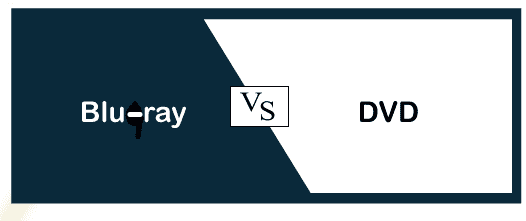

# 蓝光与 DVD |蓝光与 DVD 的区别

> 原文：<https://www.javatpoint.com/blu-ray-vs-dvd>

蓝光和 DVD 都是光盘存储格式，也出现了相似之处。但是这两种存储格式有很大的不同。蓝光是现代的磁盘存储格式，与 DVD 相比有几个优点。蓝光和 DVD 的主要区别在于存储容量和流媒体质量。与 DVD 相比，蓝光可以存储大量数据，并且视频质量比 DVD 好得多。在这个主题中，我们将了解什么是蓝光和 DVD，以及这两者是如何区分的。

## 什么是 DVD？

**DVD 代表“数字多功能盘”或“数字视盘”。它是一种数字光盘存储格式，用于存储任何类型的数字数据，尤其用于存储照片、音乐和视频**。一些 DVD 主要用于存储可以使用 DVD 播放器观看的视频，而另一些可能有软件程序或计算机文件。

第一张 [DVD](https://www.javatpoint.com/dvd-full-form) 格式是在 **1995** 年发明开发的，在 **1996** 年发行。与相同尺寸的光盘相比，它可以存储大量数据。与 CD 和 VHS 相比，它还提供了更好的图像质量，具有更大的数据坑。

### 优势

*   它可以提供标准清晰度的视频质量。
*   很划算。
*   兼容新旧 DVD 播放器和 BDP。
*   它很耐用

### 不足之处

*   与现代或蓝光光盘相比，存储容量更小。
*   它不能提供高清晰质量的图像。

## 什么是蓝光？

**蓝光是一种类似于 CD 和 DVD 的数字盘存储格式，旨在以高清质量记录和播放海量数据**。它可以高质量地存储几个小时的视频。它之所以被命名为“蓝光”，是因为蓝色激光用于读取光盘，与光盘中使用的红色激光相比，它能够以更高的密度存储信息。这是因为与红色激光相比，蓝紫色的波长更短，这使得用户可以在更小的区域内存储更多的信息。

蓝光是 DVD 的高级版本，由日立、LG、松下(松下)、先锋、飞利浦、三星、夏普、索尼和汤姆逊在 2006 年合作开发。

蓝光光盘的尺寸为直径 **120 毫米**，厚度为 1.2 毫米，与一张[光盘](https://www.javatpoint.com/cd)和 DVD 的尺寸相同。

蓝光的存储容量为单层 25 GB，双层 50 GB。

蓝光光盘不能在当前的 [CD](https://www.javatpoint.com/cd-full-form) 和 DVD 播放器上播放，因为这些播放器缺少读取蓝光光盘所需的蓝紫色激光。但是，光盘和 DVD 可以由蓝光光盘播放器播放。

### 优势

*   它可以在一张光盘中存储大量数据。
*   它提供高质量的视频。
*   它提供了向后兼容性。

### 不足之处

*   它不像 DVD 那样划算
*   蓝光光盘不能使用 DVD 播放器播放。

## 如何找到最好的蓝光光盘？

蓝光购买者共同的问题是如何选择和识别最好的蓝光光盘。但不幸的是，我们无法通过检查盒盖来识别它。

一般来说，从 2006 年开始发行的电影和电视节目在蓝光上看起来会很好，因为原始内容被改编成高清蓝光光盘。但是老电影可能看起来没有那么好，因为它们提供了重新掌握的待遇。**因此**，建议检查蓝光是否已经重新录制(来自原始来源)。

## 蓝光和 DVD 的特性比较

现在让我们根据不同的功能来比较蓝光和 DVD:

*   **存储容量**
    正如在介绍部分已经讨论过的，与 DVD 相比，蓝光光盘格式能够存储大量数据。一般来说，一张标准的 DVD 可以存储 4.7 GB 的数据，也就是说一部电影 2 个小时。但是如果一部电影超过 2 个小时，那么我们需要两个 DVD 或者双层 DVD，可以存储高达 9GB 的数据。相比之下，蓝光光盘可以在单层中存储 25 GB 的数据，在双层光盘中存储高达 50 GB 的数据。
*   **图像分辨率**
    图像分辨率定义了图片的质量，它意味着我们在播放光盘时图片的外观。对于 DVD 来说，画质是标清或者 480SD，但是我们用 DVD 是无法得到高清视频画质的。同时，蓝光光盘旨在提供高清画质。它为我们提供了 1080 高清的最佳图像。

*   **激光技术使用**
    蓝光和 DVD 光盘都是基于光存储并使用激光技术读取光盘。但是 DVD 使用红色激光读取光盘，其工作波长为 650 纳米。另一方面，蓝光光盘工作在蓝色激光上，蓝色激光工作在更短的波长或 450 纳米。这意味着它可以更精确、更近距离地阅读信息。
*   **光盘构造**
    蓝光和 DVD 肉眼看起来都一样。两种光盘的光盘直径都是 120 毫米，厚度也是一样的 1.2 毫米，蓝光光盘比 DVD 耐刮擦很多。
*   **安全性**
    蓝光光盘与 DVD 相比安全性更高。

## 蓝光和 DVD 的对比图

| 蓝光 | 数字影碟 |
| 蓝光是一种光盘格式，用于存储不同类型的数据，包括视频。 | DVD 也是一种光盘存储格式，可以存储可在计算机上使用的不同类型的数据。 |
| 蓝光光盘的存储容量对于单层光盘来说大约是 25 GB 的数据。双层光盘可以包含高达 50 GB 的存储数据。 | 一张标准的 DVD 最多可以存储 4.7 GB 的数据。双层 DVD 可存储高达 9 GB 的数据。显然，DVD 的数据存储容量比蓝光光盘小得多。 |
| 与 DVD 相比，这些光盘价格稍高。 | 光盘比蓝光光盘便宜。 |
| 由于它可以存储大量数据，因此它可以包含更多的视频，并允许提供高质量的视频和音频。 | 由于存储容量低，它无法在 DVD 上拥有高清视频质量。它只能有标清数据。 |
| 蓝光是比 DVD 更现代的技术，因此旧电影仍然没有蓝光格式。 | 自 1996 年以来，可以获得数字视盘；因此，几乎所有新旧电影都有 DVD 格式。 |
| 3d 电影有蓝光光盘。 | 最新的三维电影没有 DVD 格式。 |
| 数据传输速率比 DVD 高得多，数据传输速率为 36Mbps，音频/视频传输速率为 54Mbps。 | 与蓝光相比，数据传输速率要低得多，数据传输速率为 11.08 Mbps，视频/音频传输速率为 10.08 Mbps。 |
| 它提供了高度的数据安全性。 | 数据安全性较差。 |
| 它使用波长为 405 纳米的蓝光激光器。 | 它使用波长为 650 纳米的红色激光。 |
| 蓝光的数值孔径(NA)为 0.85。 | DVD 的数值孔径(NA)为 0.60。 |
| 蓝光光盘中可用的视频编解码器有 MPEG-2、MPEG-4 和 SMPTE VC-1。 | DVD 上可用的视频编解码器是 MPEG-2。 |
| 最适合存储拍摄视频等大数据。 | 最好适合存储少量数据，比如一部电影。 |
| 它含有一层坚硬的涂层。 | 它不含硬涂层。 |
| 它使用 0.1 毫米的保护层。 | 它包含 0.6 毫米的保护层。 |

## 结论

根据上面的讨论，很明显，与 DVD 光盘相比，蓝光提供了高数据存储、高清质量视频、安全性和兼容性。但是由于所有这些原因，所有的光盘都是无用的吗？所以，答案还没有。DVD 比蓝光便宜很多，所以如果你不太在意画质，想少花点钱，那么 DVD 是个不错的选择。DVD 可以在 DVD 播放器中播放，也可以在蓝光播放器中播放，而蓝光只能使用蓝光播放器播放，所以这也是一个需要考虑的事实。

* * *