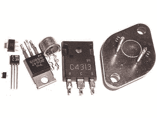
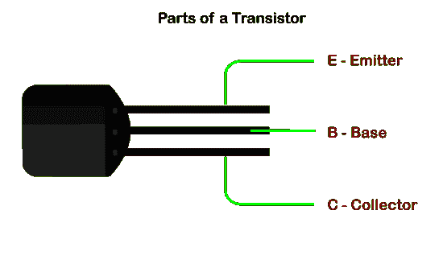
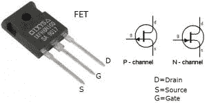
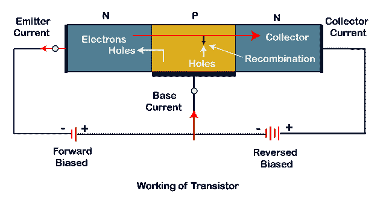

# 什么是晶体管？

> 原文：<https://www.javatpoint.com/what-is-a-transistor>

晶体管是一种半导体器件，是传输电阻的简称，用于调节或控制电流或电压等电信号。1947 年 12 月 23 日，它由三位美国物理学家威廉姆·肖克利、沃尔特·布拉坦和约翰·巴丁开发。一般来说，它是一种开关器件或微型器件，用于将微弱信号从短路电阻电路传输到高阻电路。它是一种由半导体组成的元件。下图是晶体管的例子。

在大多数电子设备中，晶体管是关键部件之一，它产生二进制位 0 和 1，计算机使用它们来建立通信以及处理布尔逻辑。在科学史上，最重要的发明之一被认为是当放置在不同的配置中时形成逻辑门的晶体管。这些门组合成全加器或称为半加器的阵列。晶体管中包含两个 PN 二极管，背靠背连接。

晶体管由三个端子组成:输入、输出和控制开关。晶体管包含的三个端子的名称是发射极、基极和集电极。

这些端子名称是根据晶体管的公共端子指定的。它被广泛嵌入到集成电路中，或者作为分立元件存在于电路板中。对于现代电子设备来说，它是重要的结构块。掺杂，一种用于制造晶体管的化学过程，其中半导体材料获得额外的正电荷(P 型)或额外的负电荷(N 型)。PNP 或 NPN 是两种配置，中间材料用作基础或流量控制。通过整个组件，当中间基层的电压或电流稍有变化时，就会有大量的电流流动，这可以作为放大器使用。

## 晶体管的零件

更具体地说，晶体管是由端子或三层半导体材料制成的，它们引导电流并建立与外部电路的连接。在其他端子对的帮助下，电流由电压控制。晶体管有三个端子，如下所示:

*   **基极:**基极端子的主要功能是激活晶体管，晶体管设计了两个电路；输出电路连接集电极和发射极。薄层用于制造它，这是晶体管的中间部分。正向偏置的发射极-基极电路为电路提供低电阻。集电极-基极结为电路提供了更高的电阻，它位于相反的偏置位置。
*   **集电极:**是二极管的左边部分，也是晶体管的正极引线。从与基极的连接处移除大部分电荷是集电极的主要功能。
*   **发射极:**发射极二极管是二极管的右边部分，作用为多数信任载体的大扇区。晶体管的负极引线是基极的主要电荷载体。

## 晶体管符号

NPN 晶体管和 PNP 晶体管是晶体管的两种。同样，具有两层 P 型材料和一层 N 型材料的晶体管被称为 PNP 晶体管。下图是代表 NPN 和 PNP 晶体管的符号。箭头符号描述了正向偏置下发射极电流的流动，正向偏置作用于发射极-基极结。电流的路径是 PNP 和 NPN 晶体管的主要区别。

在 NPN 连接中，常规电流从发射极流出，如图中引出箭头所示。类似地，在 PNP 连接中，常规电流流入发射极；在图中可以看到，图中用向内的箭头表示。

## 晶体管的类型

根据它们在电路中的使用方式，晶体管主要有两种类型，如下所示:

### 双极结型晶体管(BJT)

双极结型晶体管是由端子、基极、发射极和集电极组成的晶体管。它被认为是一种电流控制器件。集电极和发射极之间更大的电流可以通过进入晶体管基极区的小电流来控制。此外，BJT(双极结型晶体管)还有另外两种主要类型，PNP 晶体管和 NPN 晶体管，将在下面讨论:

*   **PNP 晶体管:**另一种类型的双极结型晶体管，具有两种 p 型半导体材料，其中 n 型材料被引入或放置在两者之间。并且使用薄的 n 型半导体层来分割这些材料。PNP 晶体管包含两个串联的晶体二极管。此外，在这种配置中，该器件控制电流。该晶体管中二极管的左侧称为发射极-基极二极管，二极管的右侧称为集电极-基极二极管。
    在 PNP 晶体管中，电子是少数电荷载流子，而空穴是多数电荷载流子。这个晶体管中箭头符号的作用是指示常规电流。在该晶体管中，电流路径是从发射极端子到集电极端子。下面给出的图片用符号表示 PNP 晶体管。
*   **NPN 晶体管:**双极结型晶体管(BJT)的其他类型之一，广泛用于电路中，由两种 n 型材料之间的薄 p 型半导体层组成。NPN 晶体管的主要功能是将弱信号增加到强信号。在 NPN 晶体管中，当电子从发射极转移到集电极区时，晶体管中的电流运动。与空穴的迁移率相比，NPN 晶体管的电子迁移率更高；因此，它们目前被普遍使用。下图用符号表示 NPN 晶体管。

### 场效应晶体管

栅极、源极和漏极这三个端子用来组成场效应晶体管。这种晶体管被认为是压控器件。栅极端子控制源极和漏极之间的电流。该晶体管中的 P 沟道场效应晶体管或 N 沟道场效应晶体管用于导通。

根据欧姆定律，电路的阻抗值反过来影响电流。这意味着如果阻抗很高，电流就很低。因此，从一个电路的电源，场效应晶体管吸取的电流很少。下图是场效应晶体管。

因此，连接到晶体管的原始电路功率元件不受晶体管的干扰。与双极晶体管相比，场效应晶体管不能提供高放大，而高放大是场效应晶体管的主要限制。

场效应晶体管提供了一些优势，例如它们导致更少的负载，更容易制造，并且成本更低。然而，双极晶体管更好，因为它们提供更大的放大。jfet 和 MOSFETs 是场效应晶体管的主要类型。虽然 MOSFET 和 jfet 彼此非常接近，但与 jfet 相比，MOSFET 具有更高的输入阻抗值。场效应晶体管包括以下讨论的一些特性:

*   该晶体管具有高输入阻抗，由于反向偏置，输入电流将流经该阻抗。
*   在场效应晶体管中，电荷载流子负责电子或空穴的传输，这使得它成为单极的。
*   有时，这种晶体管被称为压控器件；当栅极的输入电压控制场效应晶体管的 o/p 电压时，就会发生这种情况。
*   与双极晶体管相比，场效应晶体管的噪声更小，因为传导通道中没有结。
*   增益的表征是输入电压变化和 o/p 变化电流的比值；因此，可以利用跨导来实现。

**FET 和 BJT 的一些区别**

*   BJT 是双极器件，而场效应晶体管是单极器件。
*   BJT 是电流驱动器件，而场效应晶体管是电压驱动器件。
*   与双极晶体管相比，场效应晶体管的噪声更小。
*   场效应晶体管的热稳定性高，而 BJT 的热稳定性低。
*   BJT 的增益特性可以通过电压增益来实现，而在具有跨导的场效应晶体管中。

## 晶体管的工作

通常，晶体管由硅制成，因为它具有更大的电流、更高的额定电压和更低的温度敏感性。基极电流由保持正向偏置的发射极-基极部分建立，发射极-基极部分通过基极区移动。基极电流的幅度非常小。基极电流负责在基极区形成一个空穴或电子转移到集电极区。

与发射极相比，晶体管的电子数量更少，因为晶体管的基极掺杂较轻且非常薄。发射极的少数电子向集电极区域移动。因此，可以说通过改变基极区域，获得了大的集电极电流。

## 晶体管历史

电子设备的关键部件是控制电流或电压等电信号的晶体管。虽然真空管是由古怪的美国发明家德·福雷斯特在 1906 年开发的，但它使用了大量的电力，而且体积庞大。此外，与真空管相比，晶体管使用更少的功率和更小的尺寸，是电子产品的合适解决方案。

战争期间，该团队利用半导体研究的一些进展使雷达成为可能。

1947 年 12 月 23 日，晶体管由三位美国物理学家威廉姆·肖克利、沃尔特·布拉坦和约翰·巴丁开发，并在新泽西州默里山的贝尔实验室成功演示。然而，与另外两个相比，威廉姆·肖克利在晶体管的发展过程中扮演了重要的或截然不同的角色。十多年来，肖克利一直致力于这类项目。虽然他有能力成功地解决这个理论，但经过八年的实践，他可能无法构建一个工作模型。

为了处理工程和开发，巴丁和布拉顿被叫来。他们创造了“点接触”晶体管。但是双极晶体管是由肖克利设计的，它取代了“点接触”晶体管，并且比它优越。因此，肖克利在晶体管的发明中起了很大的作用。威廉姆·肖克利在完成博士学位时去了贝尔实验室工作，专攻量子物理。1936 年，他开始研究晶体管的基础——固态物理理论。早期无线电所包含的信号探测器中包含一根细导线，它撞击到一颗方铅矿晶体上。这根细金属丝被称为猫须。然而，这些早期的收音机无法连续工作。但它是“点接触”晶体管的基础，这是晶体探测器的工作原理。

在第一个晶体管，而不是方铅矿，布拉坦和巴丁使用锗。然而，他们使用了类似的猫须。肖克利设计的双极晶体管消除了麻烦的点接触

1954 年，达拉斯的德克萨斯仪器公司首次开始了便携式收音机结型晶体管的商业生产。同年，即 1954 年，IBM 宣布计划用其计算机中的晶体管取代真空管，并推出了第一台拥有 2000 个晶体管的计算机。晶体管的生产也是由主导市场的日本索尼公司开始的。索尼在 20 世纪 60 年代开始借助晶体管生产电视机，而不是真空管。而且，晶体管取代了真空管，几乎真空管技术变得过时。截至 2016 年，最强大的计算机处理器可以包含超过 70 亿个晶体管。

## 晶体管的优点和缺点

下表包含了晶体管的优点和缺点。

| 优势 | 不足之处 |
| 

*   For the common collector BJT amplifier, the output impedance of the transistor is the lowest and the input impedance is the highest.
*   It consumes very low voltage and is used as a current source for current control.
*   Longer life, able to withstand mechanical vibration.
*   Its cost is not high and its size is small.
*   In the transistor, the cathode heater does not consume electricity.

 | 

*   The fault point in the transistor is difficult to trace because of its small size. In addition, it is not easy to unpack and replace with a new one.
*   The manufacturing technology of transistors is much more complicated.
*   It is easy to be damaged due to the second failure or hot runway.
*   Moreover, the reverse blocking ability is very low.

 |

* * *