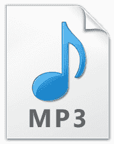

# 什么是 MP3？

> 原文：<https://www.javatpoint.com/what-is-mp3>

MP3 是一种标准技术，压缩音频文件格式代表 MPEG(运动图像专家组)开发的“MPEG 音频第三层”。一种文件扩展和压缩方法，用于将声音序列压缩成非常小的文件，同时仍然保持与光盘相比的音频质量。通常，MP3 文件需要较少的磁盘空间，用于保存一首歌曲或整个光盘数据。由于 MP3 文件需要非常小的存储空间，一台计算机可以保存许多歌曲，甚至几百首或几千首。有许多网站允许用户下载 mp3 文件，这些文件以“. MP3”作为文件名后缀。

使用视窗操作系统的用户在他们的操作系统中内置了一个 MP3 播放器。在 20 世纪 90 年代末和 21 世纪初，高保真度和小文件大小有助于普及数字音乐下载。一个 MP3 文件可能是 4 MB，而不是一首歌 40 兆字节的下载量。

在电脑和像 iPod 这样的便携式音乐播放器上，MP3 是十多年来最常见的存储音乐文件的方式。对于音频压缩，也使用其他文件格式；然而，MP3 在互联网上仍然很常见。例如，对于苹果 iTunes Store 上的歌曲，使用 AAC(高级音频编码)。对于免版税的压缩和流式传输，经常使用 Ogg Vorbis，这是一种开放的容器格式。MP3 文件通常是下载播放文件，而不是流式声音文件，可以与任何音频播放器或其他类似产品链接。

有几种 MP3 播放器，如 iTunes(苹果电脑)、Winamp(个人电脑)和 mpeg123 (UNIX)。一个名为“开膛手”的程序被用来创建 MP3 文件，它允许用户从光盘上选择文件到他们的硬盘上。然后，使用编码器(另一个程序)将所选文件转换为 MP3 文件。然而，大多数人只是从网站或其他人那里下载 MP3 文件并播放。

创建数字音频文件的主要目的是每秒采集 16 个二进制数字样本的模拟信号。一秒钟的光盘质量声音需要 140 万比特的数据，因为这种信号通常在一秒钟内的 441000 个周期的频谱上爆裂。人们实际上是如何感知声音的，利用他们的知识，MP3 的开发人员设计了一种压缩算法，可以减少大多数听众无法感知的声音数据。电影专家组(MPEG)开发了一系列音频编码标准，其中 MP3 是目前最强大的算法。

## MP3 文件格式

头压缩音频和元数据包含在 MP3 文件中。关于音频的信息包含在标题中。较高的比特率和采样率可以产生较好的音质，但会使文件变大。关于实际记录的信息由 MP3 元数据提供。通常，它以一种格式保存，ID3 标签，大多数硬件和软件媒体播放器都支持这种格式。

## 下载 MP3

下载音频文件类似于在互联网上下载其他文件。你只需要搜索包含音频文件的网站，就可以下载。然而，从包含嵌入网页的音频的网站下载 MP3 并不容易。

## MP3 文件是如何使用的

*   在驱动器上，您可以在驱动器上存储数千甚至数百万首歌曲。
*   **从文件-** 分享服务，购买或下载的帮助下，可以即时获得歌曲。
*   您可以与其他互联网用户共享 MP3 文件。
*   还可以创建在互联网上收听的播客**。**

## MP3 简史

1894 年，美国物理学家阿尔弗雷德·梅耶尔报道，借助一种较低频率的音调，可以使另一种音调听不见。关于这一现象，理查德·埃赫默在 1959 年描述了一整套听觉曲线。

德国弗劳恩霍夫-格塞尔夏夫特公司开发了 MP3，并拥有 MP3 技术的专利。1987 年，弗劳恩霍夫研究所(Fraunhofer Institute Integriete Schaltungen)开始了对高质量、低比特率音频编码的研究，该研究所是弗劳恩霍夫研究所(Fraunhofer-Gesellschaft)的一个研究中心和一部分，并将该项目命名为 EUREKA EU147。在埃尔兰根大学，迪特·塞策尔在研究通过标准电话线传输音频文件信息时，帮助进行了编码。卡尔海因茨·勃兰登堡，最初被称为 MP3 之父，因为他的大脑是 MP3 发展的幕后黑手。

1972 年，纳西尔·艾哈迈德提出了一种用于有损压缩的变换编码，即离散余弦变换，1973 年，艾哈迈德与纳塔拉詹和拉奥一起开发了这种编码。此外，他们在 1974 年公布了结果。

自 1977 年以来，他一直在研究压缩方法，因为他是一名电子专家和数学。自适应预测编码(LPC)语音编解码器是由曼弗雷德·施罗德(Manfred R. Schroeder)和比什努·阿塔尔(Bishnu S. Atal)于 1978 年在贝尔实验室提出的，其中，利用人耳的掩蔽特性，使用心理声学编码算法。1979 年晚些时候，阿塔尔和施罗德报道了一篇进一步优化的论文。

在此之后，1987 年，普林森、约翰逊和布拉德利通过效仿早期的做法，于 1989 年 4 月将这项技术的专利授予了弗劳恩霍夫。根据勃兰登堡的说法，几乎不存在 MP3 文件格式。在 1991 年的修改测试中，这种编码并不想工作。但是他们发现并解决了编译器错误；在此之前，MP3 编解码器的第一个版本没有提交。1999 年，为了将他们的音乐作为 MP3 在网上发行，第一个唱片公司是唱片公司 Sub-Pop，这是今年一个相对不为人知的小事实。

## MP3 播放器

第一台 MP3 播放器被认为是半身播放器，是弗劳恩霍夫在 20 世纪 90 年代初开发的。AMP MP3 播放引擎，第一个成功的 MP3 播放器，是由高级多媒体产品的开发者 Tomislav Uzelac 发明的。不久之后，AMP 播放器被 Dmitry Boldyrev 和 Justin Frankel 移植到 Windows 上创建 Winamp 他们当时是大学生。Winamp 在 1998 年将 MP3 的成功提升到了一个全新的水平，因为它成为了一个免费的 MP3 音乐播放器。

## MP3 技术细节

就表示人类听觉感知的局限性而言，音频信号由 MP3 编码器进行分析，并与心理声学模型进行比较。然后，基于由编码器应用中建立的采样和采样频率设置的限制，由 MP3 编码器尽可能多地编码有用信息。对流程进行编码有不同的步骤，包括:

*   **最小听觉阈值:**人耳由于音频的不同方面而不敏感。首先，大多数音频流覆盖了一个频率范围，人类可以听到。人类最敏感的听觉范围在 2 千赫到 4 千赫之间，听觉范围通常在 20 赫兹到 20 千赫之间。随着年龄的增长，大多数人听不到超过 6 千赫的音调，因为他们的听力减弱了。超过或低于该范围的频率可以被 MP3 编码器丢弃。人耳感知声音的水平由最小听觉阈值表示。低于或高于该阈值的频率将不会被感知；因此，它不需要编码。
*   **掩蔽效果:**有两种声音；一种声音比另一种声音大；如果两种声音都一次播放，声音越大隐藏或“掩盖”，音调越柔和。另一方面，如果这两种声音在频谱上靠得很近，它们可能看起来彼此不同。然而，如果这两种声音足够明显，它们是可以独立感知的。保留磁盘空间，不可检测的声音将从录音中删除。这两种效应最好通过类比来理解，这就是所谓的时间掩蔽和听觉掩蔽。
    飞鸟的轮廓可能与天空不同。但是当它经过太阳的前面时，太阳的亮度超过了鸟的轮廓。而且，当鸟向太阳的另一边移动时，它又变得可见了。在 MP3 编码中，同样的原理用掩蔽效应实现。
*   **字节库:**字节库的主要功能是从未填充的帧中提供借用的空间，供 MP3 编码器保存相邻帧的数据，这需要额外的空间。字节库有助于保证数据的一致流动和质量，因为它是一种空间借贷概念。
*   **联合立体声:**在大多数编码器中，联合立体声通常是默认启用的，这是一个选项。然而，它不是 MP3 编码过程的重要部分。立体声允许用户在启用时混合真正的立体声和单声道声音。这也有助于节省结果文件中的空间，因为 MP3 格式在单声道中编码非常低和非常高的频率。
*   **霍夫曼编码:**使用心理声学，因为在使用 zipping 压缩 WAV 文件时，文件大小不会被切断更多。然而，MP3 编码过程采用了经典的霍夫曼编码算法。

## MP3 比特率

MP3 压缩格式创建的 MP3 文件不会产生像原始录音一样的声音；因此，它被称为有损格式。就减小文件大小而言，MP3 编码器不得不丢失音频信息。无损压缩格式保留完整的音频信息，因为它们不必牺牲任何音频信息。但是，与有损压缩格式相比，无损压缩格式创建的文件更大。

在压缩和编码 MP3 文件时，它允许您选择要保留或丢失多少信息。此外，从相同的数据来源，创建两个不同的文件大小和音质不同的 MP3 文件是可能的。此外，当用户通过 MP3 编码软件将文件转换为 MP3 格式时，可以选择比特率。当用户压缩文件并选择较低的比特率时，编码器将丢弃更多的信息。

有些人看不起 MP3 格式(寻找最佳质量来听音乐或找到最佳体验音乐方式的人)。他们不同意音质，即使在最高比特率下，也与光盘和黑胶唱片不匹配。但也有人说人耳无法识别以 320 Kbps 比特率编码的 MP3 和未压缩的 CD 文件之间的区别。

抛开质量问题不谈，但毫无疑问，MP3 格式正在改变音乐。用户可以通过音乐服务(如 e music 和亚马逊)按歌曲购买音乐。此外，几乎光盘时代正在消失，随着音乐行业的回归，音乐单曲正在变得流行。此外，考虑到一些音频工程师和音乐家，音乐工作室混合录音的方式正在通过 MP3 格式发生变化。

* * *