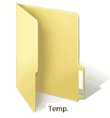

# 什么是临时文件

> 原文：<https://www.javatpoint.com/what-is-a-temporary-file>

临时文件是为临时存储数据而创建的文件类型。用户使用的程序或窗口本身会创建这类文件。当用户使用相关程序或任务时，这些文件帮助计算机顺利运行；它也被称为 foo 文件或临时文件。关闭程序时，临时文件会被删除。这些文件。临时扩展名被称为临时文件。然而，根据负责创建它们的程序，它们可能会有所不同。当您在计算机上的编辑软件上进行与文本书写、媒体或图形相关的工作时，会为正在进行的工作创建临时文件。

这些文件不仅有利于你的程序运行得更快更流畅；此外，如果计算机意外或自动关闭，它们有助于创建数据的恢复备份。临时文件是由于各种原因创建的，例如将大块数据分解成更易于管理的部分，或者当程序只是作为执行进程间通信的过时方式来处理更大的数据时。

就创建备份而言，微软的 Office 应用程序是这些文件的最佳实例。例如，与当前打开的文档相关联的微软 [Word](https://www.javatpoint.com/ms-word-tutorial) 和 [Excel](https://www.javatpoint.com/excel-tutorial) 会保存一个临时文件，指示计算机已经从意外关机或崩溃中恢复。

虽然临时文件会不断更新，但并不总是保存所有工作。临时文件也由互联网浏览器创建，包括经常访问的网站信息或缓存信息；这些被称为“临时互联网文件。”这些文件有助于在随后打开时更快地加载页面。

### 电脑中临时文件的使用

ISO RAR 文件被计算机上的许多用户使用；他们可能看到了文件的临时提取。在你的临时文件夹中，它们会在解压后自动删除文件；当这个过程完成时，它就完成了，然后你将能够使用它们安装或其他目的。任务完成后，大部分临时文件会自动删除；但是，有些文件会留在您的存储中，以便将来使用。

## 临时文件是如何命名的？

临时文件的名称取决于所使用的程序和操作系统。例如，通常情况下，文件是由 Windows 程序和 Microsoft Windows 创建的临时文件，扩展名为. tmp。像微软 Word 这样的程序可能会创建一个临时隐藏文件；它是用一个波浪号和一个美元符号(例如，~$example.doc)创建的。并且，在 [Linux](https://www.javatpoint.com/linux-tutorial) 中，临时文件可以由扩展名为. foo 的程序创建。

## 临时文件的位置

基于操作系统和程序，临时文件的位置也是依赖的。因为驱动器被认为是安装 Windows 的主要位置，并且系统通常利用该驱动器来实现系统的基本利用率。因此，临时文件保存在这个主驱动器中，因为您的其他系统文件也位于这个驱动器中。

在早期版本的 Microsoft Windows 中，临时文件存储在 C:\Windows\Temp 目录中，而在新版本的 Windows 中，临时文件保存在 AppData 文件夹中。

此外，使用 Windows 7、8 和 10 等最新版本的用户可以通过单击“开始”按钮，然后键入%temp%来打开临时文件。

许多程序可能会将临时文件存储在“程序”文件夹中的某个文件夹中，因为它们也可能不会使用操作系统的临时目录。计算机用户希望清空驱动器中的空间，以便系统能够快速工作，而没有任何延迟或挂起。相比之下，如果主驱动器没有更多空间，它会对系统产生一些影响。

## 删除临时文件安全吗？

是的，删除临时文件是安全的，因为可能有一些文件您可能需要每天使用它们，但是它们中的大多数临时文件是没有价值的，不会有任何用处，并且它们只存储在硬盘上以占用内存空间。此外，在大多数情况下，当存储临时文件的文件夹变大时，临时文件会降低您的电脑速度。临时文件的含义是暂时保存信息。此外，临时文件不依赖于文件中存储的信息。但是，如果您正在使用某个程序并删除临时文件，您可能会因该程序正在使用而出错。许多程序不允许删除正在使用的临时文件，因为它们锁定文件有助于防止出现问题和被删除。

当程序创建临时文件时，它会在程序或文档关闭后被删除。如果所有程序关闭后临时文件仍然存在，可以安全删除。因此，如果您需要关于安全性的明确结论，删除临时文件是安全的。

临时文件很容易删除，最好在删除所有临时文件后重启电脑。当您删除临时文件时，您可能会注意到计算机系统的一些好处，但这些好处不会那么明显。有一些像“CCleaner”这样的第三方软件可以用来清理你的系统。但是，这些文件可以手动删除。如果临时文件已被删除，任何人都想重新创建它，则该文件将在再次打开程序时自动创建。

## 如何查看和删除临时程序文件

### Windows 98、XP、Vista、7、8 和 10

如果您正在使用这些操作系统版本中的任何一个，如 Windows 98、XP、Vista、7、8 和 10。您可以手动删除系统中的所有临时文件，也可以使用 Windows 磁盘清理实用程序来帮助您删除临时文件并清理计算机系统的其他部分。

### 查看和删除临时文件

您可以通过单击“开始”按钮，然后在“搜索”字段中键入%temp%来打开临时文件。在 Windows XP 和以前的版本中，要打开临时文件，您需要单击“开始”菜单中的“运行”选项，并在“运行”字段中键入%temp%。然后按回车键或点击确定；将打开一个临时文件夹。现在，您可以通过轻松删除来删除此文件夹中的所有文件，如果这些文件正在使用，它们将被跳过。然后重启你的电脑系统，你会发现性能有所提升。

### 寻找。tmp 文件

下面给出了一些说明，可以帮助搜索和删除任何。适用于使用 Windows NT、Windows 95、Windows 98、Windows ME、Windows 2000 或 Windows XP 的用户的 tmp 文件。

*   首先，您需要通过单击开始按钮打开开始菜单。
*   接下来，您需要单击“查找”选项，然后选择“查找文件或文件夹”选项。
*   要搜索系统上具有“tmp”文件扩展名的文件，请键入*。命名框中的 tmp。
*   您需要验证搜索框的“查找”部分是否指示文档文件夹并指向 C:驱动器。
*   然后，要开始搜索，请单击立即查找按钮。
*   最后，您将能够删除文件夹中所有可用的文件。

完成上面给出的所有说明后，现在需要借助下面给出的步骤确保临时文件夹是空的:

*   在 Windows 桌面上，双击“我的电脑”图标，打开硬盘。
*   现在，您需要双击 C:驱动器。
*   然后，通过双击临时文件夹(如果存在)打开临时文件夹，并确保已删除文件夹中所有可用的文件。
*   接下来，在关闭窗口后重新打开“我的电脑”。
*   再次，打开 C:驱动器。
*   然后，双击窗口文件夹。
*   然后，在双击临时文件夹(如果存在)的帮助下打开临时文件夹，并确保该文件夹中的所有可用文件都已删除。

此外，还为微软操作系统或视窗 3.x 用户提供了一些步骤，有助于删除计算机上的任何临时文件。

1.  目前，如果您在窗口中，您需要单击文件并选择关闭窗口的选项。
2.  要删除 c 盘根目录中所有可用的临时文件，请在提示符下运行以下命令。
    
3.  要删除在目录 C:\TEMP 中找到的任何文件(如果存在)，请运行以下命令:
    
4.  要删除在目录 C:\WINDOWS\TEMP(如果存在)中找到的任何文件，请运行以下命令:
    

## 哪些临时文件可以安全删除？

所有临时文件都可以安全删除，因为临时文件的意义是临时保存信息。但是，如果文件或程序正在使用该文件，您可能无法删除该文件。

## 无法删除。tmp 文件

有时您无法删除. temp 文件，并在删除时出错；这背后的原因是该文件当前正在运行，正在被 Windows 或其他软件程序使用。在这种情况下，您应该在关闭所有打开的程序并重新启动计算机后，再次尝试删除文件。

## 窗口中其他类型的临时文件

在 Windows 计算机上，临时文件和其他不再需要的文件组不仅存储在 Windows 临时文件夹中。在 Windows 中，您会发现存储由某些操作系统创建的所有临时文件的临时文件夹；但是大量其他不需要保留的文件都包含在 C:\Windows\Temp\文件夹中。

## 检查您的浏览器缓存

网页浏览器还包含临时文件，以便在您重新访问网页时加快浏览器的速度。另一方面，临时文件也包含在难以找到的位置。在所有版本的 Windows 中，都包含一个名为“磁盘清理”的实用程序。该实用程序有可能自动删除其他临时文件夹中的文件。要打开它，首先，您需要打开运行对话框，该对话框可以通过按下 WIN+R 并键入 cleanmgr 命令来打开。

* * *