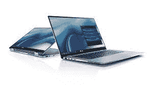

# 为什么我的笔记本电脑不开？

> 原文：<https://www.javatpoint.com/why-does-my-laptop-not-turn-on>

如果您的笔记本电脑无法开机，即使插上电源，显卡、主板、电源、电池或内存也可能出现问题，导致笔记本电脑无法开机，甚至无法开机。此外，内部组件可能有问题。

当你的笔记本电脑不开的时候，你应该从最基本的开始。您可以尝试通过各种方法来解决问题，例如检查电源线、注意过热、检查连接和电池以确保连接没有松动。如果您的笔记本电脑仍然无法开机，请按照下面的故障排除步骤找出可能导致其关机的原因。

在开始故障排除过程之前，请断开连接到笔记本电脑的所有设备，如鼠标或 u 盘。

### 连接电源线

如果您的笔记本电脑完全由电池供电，您可以连接交流适配器，连接交流适配器可能会解决问题；虽然，这看起来很明显。确保适配器没有松动，并且两端连接正确牢固。如果在插入适配器的情况下笔记本电脑开始工作，则表明笔记本电脑电池有缺陷或没电。

### 检查交流适配器和电源端口是否有弯曲的针脚

在某些交流适配器的末端，包括一个插入笔记本电脑的针脚。确保适配器的连接器正确插入笔记本电脑，并且针脚没有弯曲或折断。如果是这样，电源不会从交流适配器转移到笔记本电脑；因此，您需要更换交流适配器来解决问题。

此外，在电源端口内，一些笔记本电脑包含一个引脚，可以与交流适配器建立牢固的连接。如果此针脚断裂或弯曲，笔记本电脑将无法通电，也无法开机。在这种情况下，您需要更换或修复笔记本电脑上的电源端口来解决问题。但是，您可能还需要根据笔记本电脑的类型更换完整的主板。

### 从扩展坞断开连接

断开坞站(也称为通用端口复制器)与笔记本电脑的连接，并将电源线直接连接到笔记本电脑。然后你应该试着打开笔记本电脑。

### 当心过热

大多数笔记本电脑处理器都包含内部热保护，导致笔记本电脑关机。在系统冷却下来之前，它不会再打开。如果您在柔软的表面上使用笔记本电脑，例如在床上或枕头上，这样笔记本电脑的通风孔可能会被堵塞，请确保电脑的通风孔没有被堵塞。此外，确保热空气被适当转移。笔记本电脑可能有一个故障风扇，如果它没有正确通风；你可能需要更换这个风扇。首先检查你的笔记本电脑是否变热；让笔记本电脑适当冷却，然后尝试打开它。一旦您的笔记本电脑冷却下来并重新打开，很可能这台笔记本电脑会出现过热问题。

### 取出并重新连接电池

许多笔记本电脑制造商在设计笔记本电脑时，不允许用户从笔记本电脑上取下电池。如果您的笔记本电脑没有可更换电池，您可以继续下一节。

排除电源故障后，检查笔记本电脑上的电源连接器。随着时间的推移，电源连接器可能会松动并停止工作。取出电池并断开笔记本电脑的电源线，然后尝试仅在连接电源的情况下打开它。如果您的笔记本电脑在没有电池的情况下开机，则电池有问题。因此，您应该更换电池，以确保它能正常充电和通电。此外，卸下电池后，将电源线和电池从笔记本电脑上断开一段时间。之后，更换笔记本电脑中的电池，附上电源代码，并尝试打开它。

### 耗尽电脑的电量

有时，笔记本电脑由于残留电荷而无法打开，这可以被认为是“电力堵塞”。通过以下步骤，您可以有效地耗尽笔记本电脑的所有电量，并可以重新开始；因此，它正在通电。

1.  拔下交流适配器，如果可能，卸下笔记本电脑的电池。
2.  为了耗尽笔记本电脑的剩余电量，您需要*按住电源按钮*三十秒。
3.  现在，无需更换电池即可将交流适配器插回笔记本电脑。如果您的笔记本电脑无法卸下电池，仍需插入交流适配器，则需要集中精力。
4.  要打开笔记本电脑，请按下电源按钮，并确保它能够正确启动。
5.  接下来，如果笔记本电脑开机，请正常关闭笔记本电脑。
6.  如果您已从笔记本电脑上卸下电池，请再次将电池连接回笔记本电脑。
7.  然后，打开笔记本电脑，确保它正常启动。

### 拔下 u 盘或存储卡

确保屏幕和电源一切正常；如果不正常，笔记本电脑可能会在加载 Windows 之前遇到问题或卡住。

u 盘或存储卡是典型的罪魁祸首，它被插入读卡器或 USB 端口。通常，显示屏上会显示一条错误消息，如“未找到操作系统”，这将导致不必要的死机。BIOS 通常设置为先尝试从外部 USB 设备启动，而不是从内部存储驱动器启动。它也可能是一张 CD 或 DVD 光盘；因此，也要仔细检查这些。

### 检查有无故障或不兼容的硬件

如果您已经遵循了以上建议的所有故障排除步骤，您仍然无法打开笔记本电脑；问题可能出在笔记本电脑的硬件上。处理器或主板出现故障的可能性最大。不幸的是，确定笔记本电脑不工作的原因需要更深入的故障排除。找到问题硬件后，您需要维修或更换特定硬件。

虽然你可以去电脑维修店修理你的笔记本电脑，但他们可以解决你的问题或根据需要更换有缺陷的硬件。但是，您可以联系笔记本电脑制造商，以获得修复有缺陷硬件的帮助。

* * *