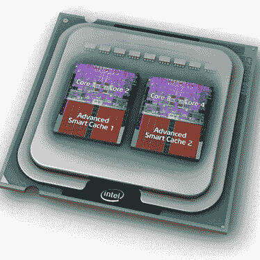
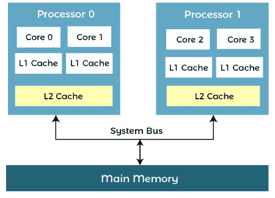

# 什么是多核处理器？

> 原文：<https://www.javatpoint.com/what-is-a-multicore-processor>

多核处理器是一种集成电路，其上连接有两个或多个处理器，可以更快地同时处理多个任务、降低功耗并获得更高的性能。一般来说，它由两个或更多的处理器组成，这些处理器读取并执行程序指令。

换句话说，在单个芯片上，多核处理器由许多处理单元或“内核”组成，每个内核都有可能完成不同的任务。例如，如果您同时执行许多任务，例如看电影和使用 WhatsApp，一个核心将处理像看电影这样的活动，而另一个核心处理像 WhatsApp 这样的其他职责。

双核配置相当于在同一台计算机上安装几个不同的处理器，但它们之间的连接更快，因为两个 CPU 插入同一个插座。多个并行指令可以由单个内核执行，从而提高了利用该架构的独特功能构建软件的速度。

与单核处理器相比，双核处理器在理想情况下的性能通常是单核处理器的两倍。实际上，性能提升预计在 50%左右:双核处理器的性能大约是单核处理器的 1.5 倍。

随着单核处理器达到其复杂性和速度的物理极限，多核计算变得越来越流行。在现代，大多数系统都是多核的。众核或大规模多核系统是指具有大量 CPU 内核的系统，例如数十或数百个。

21 世纪初，英特尔和 AMD 发布了第一批多核处理器。在现代，中央处理器有两个(“双核”)、四个(“四核”)、六个(“六核”)和八个(“八核”)内核(“八核”)。基于 FPGA 的处理器包含多达 100 个物理内核和 1000 个有效的独立内核(现场可编程门阵列)。

## 多核处理器的架构

多核处理器的设计支持所有可用内核之间的通信，它们适当地划分和分配所有处理任务。一旦所有的处理操作完成，来自每个核心的处理数据通过一个公共网关被传输回计算机的主板(主板)。就整体性能而言，这种方法胜过单核中央处理器。

## 多核处理器的优势

多核处理器有许多优势，包括:

### 表演

与单核处理器相比，多核处理器本质上可以做更多的工作。集成电路内核之间的间距允许更快的时钟速率。因此，信号不需要经过很长的距离就能到达目标，并且是持久的。与使用单独的处理器相比，速度要快得多。

### 可靠性

在多核处理器中，软件总是被分配给不同的内核。当一个软件出现故障时，其他软件不受影响。每当出现缺陷时，它只影响一个核心。因此，多核处理器能够更好地抵御故障。

### 软件交互

即使软件运行在多个内核上，它也会相互通信。空间和时间隔离是多核处理器要经历的过程。核心线程永远不会因为这些进程而延迟。

### 多任务处理

一个操作系统可以使用一个多核 CPU 同时运行两个或多个进程，即使许多程序可能同时执行。例如，photoshop 应用程序可以用来同时执行两项任务。

### 功率消耗

另一方面，使用多核 CPU 进行多任务处理需要更少的功耗。只会使用 CPU 中产生热量的部分。功耗最终降至最低，导致电池利用率降低。另一方面，与其他操作系统相比，一些操作系统需要更多的资源。

### 避免过时

架构师可以通过使用多核 CPU 来避免技术过时并提高可维护性。芯片制造商正在他们的多核处理器中使用最新的技术进步。随着内核数量的增加，单核芯片变得越来越难获得。

### 隔离

与单核系统相比，多核处理器可能会增加(但不能保证)地理和时间隔离。如果两个内核都在同一个单核上执行，那么一个内核上的软件不太可能影响另一个内核上的软件。这种解耦是由于地理和时间隔离(一个内核上的线程不会被另一个内核上的线程延迟)而发生的。借助于将错误的影响限制在单核，多核处理可以提高健壮性。当单独执行混合关键度计划时，这种增强的隔离非常重要(安全关键、任务关键和安全关键)。

**多核处理器的其他一些优势要点:**

*   与单核处理器相比，多核处理器具有执行更多任务的潜力。
*   一次做多项活动能耗低。
*   数据到达目的地的时间更短，因为两个内核都集成在一个芯片上。
*   通过使用小电路，可以提高速度。
*   玩游戏时用杀毒软件检测感染是多任务处理的一个例子。
*   利用低频，它可以同时完成许多任务。
*   与单核处理器相比，它能够处理大量数据。

## 多核处理器的缺点

我们将讨论多核处理器的一些限制(缺点)，包括:

### 应用速度

尽管多核 CPU 是为多任务处理而设计的，但其性能不足。每次应用程序处理时，它都有从一个内核跳到下一个内核的趋势。因此，缓存会填满，从而提高其速度。

### 振动

随着多核 CPU 中内核数量的增加，会产生更多的干扰，从而导致过度抖动。因此，您的操作系统的程序性能可能会受到影响，并且可能会经常出现故障。只有通过使用适当的同步和微内核，用户才能处理抖动。

### 分析

当您同时做两件或更多事情时，您将需要使用额外的内存模型。在多核机器中，这使得分析变得困难。尤其是时间限制，很难确定，而且可能不准确。

此外，随着内核数量的增加，干扰分析变得更加复杂。因此，操作系统将无法交付承诺的结果。

### 资源共享

多核处理器共享各种内部和外部资源。这些资源包括网络、系统总线和主存储器。因此，任何运行在同一个内核上的程序被中断的几率都会更高。在这种形式的干扰中，地理上和时间上的隔离都可能发生。

### 软件干扰

由于资源共享，软件干扰会导致空间和时间隔离的问题。如果有额外的核心，这个机会会增加得更多。更多核心的存在意味着更多数量的干扰路由。几乎不可能检查所有可能的干扰途径。

**多核处理器其他一些限制要点:**

*   虽然它包含几个处理器，但它的速度不是简单处理器的两倍。
*   与管理单核中央处理器相比，管理任务更加复杂。
*   多核处理器的性能完全取决于用户执行的任务。
*   如果其他处理器需要线性/顺序处理，多核处理器需要更长的处理时间。
*   电池消耗得更快。
*   与更简单的处理器相比，它的功耗非常高。
*   此外，与单核处理器相比，它更贵。

## 为什么使用多核处理器？

配置类似于双核处理器。多核处理器根据内核数量和内核类型进行分类。多核 CPU 的目标是获得出色的性能。它旨在克服单核中央处理器的物理限制。

多核处理器的支持操作系统包括:

*   Linux 操作系统
*   微软视窗(视窗 XP 或以上)
*   大多数基于 BSD 的系统
*   操作系统
*   Mac OS X

## 多核处理器简史

因为最初制造基于芯片的处理器的公司只能在单个芯片上安装一个处理器，所以他们只能在单个芯片上安装一个处理器。随着芯片制造技术的进步，芯片制造商能够制造具有更多电路的芯片，最后，芯片制造商能够制造具有多个处理器的芯片，从而产生了多核芯片。

1998 年，斯坦福大学电气工程教授 Kunle Olukotun 和他的学生发明了第一个多核处理器。多核芯片最早是在 2005 年从高级微设备公司(AMD)和英特尔公司获得的。此后，几乎每一家芯片制造商都开始制造多核处理器。

## 多核处理器用在哪里？

在现代，多核处理器出现在大多数设备中，如平板电脑、台式机、笔记本电脑、智能手机和游戏系统。

提供的两个核心选项展示了处理器的型号如何不能说明性能的全部情况。与双核 i5 相比，四核 i5 的性能要优越得多，电脑的价格就体现了这一点。目前 i5 机型的所有笔记本电脑型号都是双核的，而在撰写本文时，所有台式机型号都是四核的。因为笔记本电脑版本是双核而不是四核，所以笔记本电脑中的 i5 性能会比台式机中的 i5 差。双核类型更适合需要更长电池寿命和更低功耗的便携式笔记本电脑，但台式机使用的中央处理器消耗的功率更大，例如四核型号，因为它不需要电池寿命。多核处理器的一些应用如下:

*   高画质的游戏，如《守望》和《星球大战前线》，以及 3D 游戏。
*   多核处理器更适合在 Adobe Premiere、Adobe Photoshop、iMovie 等视频编辑软件中使用。
*   带有计算机辅助设计的 Solidworks。
*   高网络流量和数据库服务器。
*   例如，工业机器人是嵌入式系统。

* * *