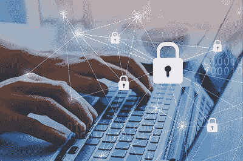
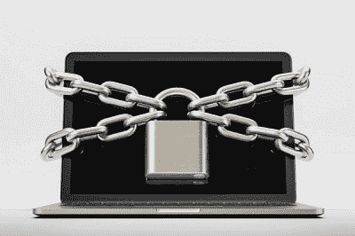

# 上网时如何保护自己

> 原文：<https://www.javatpoint.com/how-to-protect-yourself-while-on-the-internet>

在互联网上，有很多不正确的信息，可怕的人，危险的网站。网络威胁变得如此普遍，以至于美国政府成立了一个研发机构，以制定一项开发技术和建立规则的战略，从而减少网络空间的危害。

随着人们花更多的时间在社交媒体网站和网络上，他们正在向互联网世界分享更多的个人信息，这导致保存有价值的数据变得越来越困难。幸运的是，下面给出了几个步骤和建议，当您连接到互联网时，每个人都应该遵循这些步骤和建议来保护您的在线身份和个人数据。

#### 注意:所有计算机用户都可以阅读并遵循以下说明，即使使用什么类型的设备、计算机或操作系统。

### 验证数据是否加密

当您连接到互联网时，以安全的方式向他人发送机密信息，如信用卡号、全名、年龄、出生日期、用户名或密码。你可以用一个小小的锁，叫做互联网浏览器安全锁，来验证这一点。该锁可能位于浏览器窗口的右下角，靠近地址栏。如果出现锁定图标，应该锁定而不是解锁。

当锁被锁定时，数据被加密，如果被截获，防止任何人解码。当锁被解锁或不可见时，所有数据都是纯文本，这意味着它可以被任何人读取，或者如果被拦截也可以被读取。使用一个密码，如果一个网站不安全，比如一个在线论坛，你就不会在像你的网上银行网站这样的安全网站上使用这个密码。

### 使用安全的密码

对于存储机密数据的网站，如网上银行，需要强密码。此外，我们建议每个需要登录的网站使用不同的密码。如果您在记住密码方面遇到问题，还有一个可用的密码管理器可以帮助您解决问题。

建立密码时，选择一个难以破解的密码。不要使用你的个人信息，如姓氏、名字、中间名、出生日期、电话号码、孩子姓名、地址、配偶姓名、雇主或其他可能与你相关的识别字母或数字。

为了保护自己免受网络安全漏洞的侵害，请更改密码中的字母和数字；此外，尽可能使用符号和大小写字母的组合。此外，你永远不应该向任何人透露你的密码。您可能需要每年更新几次密码。

### 安装安全套件

安全套件是保护您的计算机免受有害个人或程序感染并窃取您的信息和数据的程序。这包括防止在您在线时安装恶意软件，如恶意软件、病毒和网络钓鱼方案。一些最受欢迎的安全软件包是迈克菲病毒防护、诺顿防病毒软件、广告感知专业安全和 AVG 网络安全。请确保在您的计算机上购买并安装这些套件之一，以确保您的个人信息在线安全。

### 打开网页浏览器黑名单

您使用的浏览器可能是缺乏互联网安全性的部分原因。许多在线浏览器都提供了额外的安全功能，如黑名单。这允许您根据自己的条件选择要访问的网站；你只能查看安全可信的网站。

### 如果可用，请始终启用双因素身份验证

通过在登录过程中要求第二步，双因素身份验证增加了一层额外的保护。当您在登录时输入密码时，如果服务在使用双因素身份验证验证您的密码后无法识别您的设备，它会向您的手机发送带有验证码的短信。这是最合适的方法，因为如果有人试图使用有效密码访问您的帐户，但他们没有电话，他们将无法访问您的帐户，因为登录过程将需要一个验证码，该验证码将出现在您的电话上。

**提示**

您的电子邮件帐户至少应该设置双因素身份验证。通过发送链接或新密码将密码更改为文件中的电子邮件地址，丢失密码工具可用于重置大多数帐户密码。任何有权访问您的电子邮件帐户的人都可以获得您的新密码。

### 避免网络钓鱼诈骗

网络钓鱼诈骗使用多种策略来窃取您的身份并获取您的个人信息。有许多不同种类的网络钓鱼诈骗，但是了解如何发现它们将有助于您避免它们。不要打开来自未知发件人的电子邮件或附件，也不要在奇怪的通信中点击危险链接，以免成为网络钓鱼骗局的受害者。

此外，对奇怪的工作机会、提供金钱或慈善捐赠的请求要小心，因为这可能是窃取你的在线身份和个人信息的诡计。了解用于欺骗您泄露帐户信息的网络钓鱼技术和策略。目标包括亚马逊、易贝、在线银行网站、贝宝和其他需要登录的著名网站。

### 让您的操作系统和软件保持最新

操作系统开发人员发布了许多与计算机安全漏洞有关的操作系统更新。请验证您的操作系统是最新的，并且开发人员仍然支持它。微软不再支持较旧的操作系统，如视窗操作系统，因此不再获得更新。

### 获得私有数据保护

当您连接到互联网并共享您的敏感信息时，获得私人数据保护是保护您个人数据的另一种方法。任何敏感数据，包括社交网站、电子邮件、私人消息程序或许多博客，都将受到这类安全套件的保护。通过使用私有数据保护套件，您可以进一步保护您的个人信息免受黑客攻击。

### 电子邮件没有加密

信用卡号码、用户名、密码和其他机密信息绝不应该通过电子邮件提供。如果电子邮件因未加密而被拦截，可能会被第三方读取。

### 密码保护您的无线路由器

密码保护的无线路由器是用来连接到互联网在你的房子或公司。如果您不为路由器设置密码，您的无线网络范围内的任何人，包括黑客，都可以使用和访问您的互联网。如果网络罪犯进入您的路由器，他们会利用这一点，并窃取您电脑中的数据。打开无线路由器上的加密功能，以更好地保护您的敏感数据。这会打乱你在网上发送的任何数据。

### 隐藏您的个人信息

如果您没有正确设置您的网络浏览器，您可能会无意中向他人透露您的敏感信息，这对您有害。当你得到一台新电脑时，你可以定制它或者下载并安装一个新的浏览器。为此，请选择“从浏览器的“设置”菜单中配置浏览器，以便它不会显示您的个人信息，如电子邮件地址、姓名或其他信息”。

### 接受或同意提示时要小心

在被请求安装程序或附件时，请确保您阅读并理解协议或条款和条件，然后单击“确定”按钮。如果您觉得安装软件不是必需的，并且不理解协议或有关程序的条款和条件，请取消或关闭窗口。

此外，留意任何询问您是否要安装第三方软件、工具栏或其他附件的复选框。这些很少是必要的，它们通常引起的问题多于解决的问题。应该取消选中这些复选框。

### 在您登录的地方要小心

**业务**

当你在工作场所上网时，你的雇主可以通过使用键盘记录器或其他方法来监控你的电脑。有权访问这些信息的人可以查看这些记录，并且可以收集用户名和密码。此外，如果您与他人共享您的计算机，请不要在浏览器中保存任何密码。

**无线网络**

当您使用无线网络时，您需要记住，附近的任何人都可以读取和拦截所有传入和传出您的计算机的信息。为避免这种情况，请在连接到安全网络时仅使用 WEP 或 WPA(如果 WPA 不可用，请使用 WEP)。此外，如果您在家使用无线网络，请确保网络安全。

**朋友家**

当您使用朋友的电脑并登录您的帐户时，在这种情况下，在安全性方面要小心。如果您使用不熟悉的计算机或网络，计算机或网络可能会有意或无意地记录用户名和密码。最后，永远不要在登录网站或其他帐户时将密码信息保存在朋友的计算机上。

### 仅在需要时才在网络浏览器上启用 Cookies

将浏览器设置为仅在网站需要时接受 cookies，这是另一种在线保护数据的方法。Cookies 是网站保存在您计算机上的微小数据，例如您浏览的网站信息以及您在这些网站上执行的活动。虽然他们中的大多数人都把信息藏在心里，但这也是不诚实的人获取你敏感信息的一种手段。Cookies 应该只在需要的网站上启用。

### 使用替代浏览器

11 之前的 Internet Explorer 版本是出了名的易受攻击。如果您还在使用互联网浏览器，请考虑使用不同的浏览器，如 Mozilla Firefox 或谷歌 Chrome。如果您想坚持使用微软浏览器，并且在您的系统上使用 Windows 10 操作系统，微软边缘是 Internet Explorer 的一个很好的替代方案。

### 注意你周围的人

小心任何人在任何公共场所冲浪，如在工作、学校、图书馆或其他任何公共区域，其他人可能正在看你的屏幕。在这种地方，当你在系统上输入密码进入你的账户时，有人可能会看密码。因此，他们可以访问您的帐户。

如果您需要在屏幕上显示信息以保持私密性，请考虑在显示屏上使用隐私过滤器。

### 更新互联网浏览器插件

在使用浏览器插件的帮助下，许多攻击者发现了像 Adobe Flash 这样的安全缺陷。确保所有安装的互联网插件都是最新的。

### 保护保存的密码

密码和登录凭证应保存在安全的地方。切勿将您的机密信息保存在未加密的文本文件或便笺中。保存密码最简单的方法是使用密码管理器，它保存您的所有登录信息，并对其进行安全加密和密码保护。

如果您将密码信息保存在浏览器中，访问您浏览器的人可能会看到您的密码。例如，任何可以访问火狐中所有保存的密码的人都有可能在没有主密码的情况下访问它们。

### 备份重要数据

因为没有 100%的计算机安全性，所以备份重要数据对于防止丢失重要数据至关重要。如果您的计算机在连接到互联网时发生故障，备份可以消除数据丢失。

### 验证下载文件的校验和

如果您从提供软件的网站下载软件，请检查文件校验和是否与您刚刚下载的文件匹配。验证下载的应用程序的校验和确保您正在安装的程序正是您想要的。

### 保护自己免受恶意软件、间谍软件和病毒的侵害

在计算机上安装防病毒软件的帮助下，您可以保护计算机免受病毒、恶意软件和间谍软件的侵害。如果您的计算机正在运行较新版本的 Windows，并且不想在您的计算机上安装防病毒软件，请至少打开 Windows Defender。此外，使用恶意软件保护应用程序(如 Malwarebytes)来保护您的计算机免受恶意软件和间谍软件的攻击是一个明智的想法。

### 不要总是相信你在网上读到的东西

认识到互联网上的任何人都有能力建立一个有害的网站。例如，可以设计一个网站来帮助传播恐惧、错误信息或恶意软件。

* * *