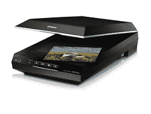
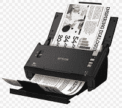
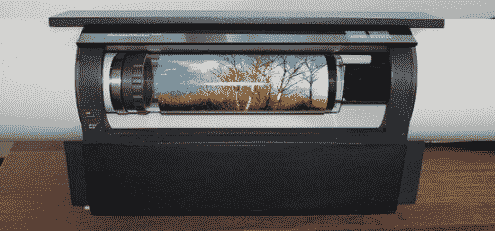
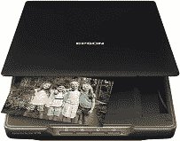
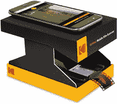
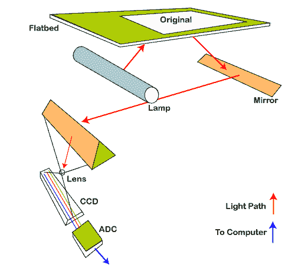

# 什么是扫描仪？

> 原文：<https://www.javatpoint.com/what-is-scanner>

扫描仪是一种电子设备，可以读取照片和文本页等文档并将其转换为数字信号。这改变了文档的形式，可以通过使用软件应用程序在计算机系统上查看和/或修改。市场上有许多不同分辨率的扫描仪。

大多数扫描仪都有一个平坦的扫描表面，因为它们是平板设备，主要用于扫描杂志、照片和许多文档。此外，因为大多数平板扫描仪都有一个可以抬起的盖子，所以它们可以扫描书籍和其他重物。单张纸扫描仪是另一种只能接受纸质文档的扫描仪。尽管单张纸扫描仪没有扫描书籍的能力，但它们的一些型号包括自动文档馈送器(ADF)功能，允许按顺序扫描各种页面。

扫描仪与计算机软件应用程序交互以执行任务。扫描仪的数据被导入这些应用程序。大多数扫描仪包含基本的扫描软件，使用户能够配置、启动和导入扫描。扫描仪还能够通过各种软件直接导入扫描图像。软件通过扫描计算机安装的插件来实现这一点。例如，如果安装了 Adobe Photoshop 的扫描仪插件，用户可以直接从链接的扫描仪创建新照片。

虽然像 OmniPage 和 Acrobat 这样的程序可以识别扫描的文本，但扫描的图像也可以由 Photoshop 编辑。这是通过一种被称为光学字符识别(OCR)的技术来实现的。包括光学字符识别的扫描软件能够将扫描的文本文档转换成数字文本，其形式可以在文字处理器的帮助下查看和修改。一些光学字符识别程序还能够捕获页面和文本格式，从而可能生成物理文档的电子副本。在电子数据传输领域，扫描也是最可靠、最具成本效益的图像传输方法。

## 扫描仪的类型

有各种类型的扫描仪与计算机一起使用，用于不同的功能。具体如下:

### 平板扫描仪

最流行的光学扫描仪是平板扫描仪，它在平面上扫描文件。这些扫描仪不需要移动文档，并且能够捕获文档的所有元素。平板扫描仪有两种不同的尺寸，适用于标准纸张，对于易碎的材料也很有效，比如易碎的文件，也包括老式照片和纸张。还有一些型号的扫描仪有助于缩小桌面空间。例如，您可以通过购买包括扫描仪和打印机的一体机来最大限度地减少所需的桌面空间。平板扫描仪如下图所示。

这些扫描仪对扫描书籍、文章、报纸，甚至 DVD 盒也很有效。如果您购买了高分辨率扫描仪，它们也更适合扫描照片。因为要扫描的每个物体都必须放在平板上，并在这台扫描仪上进行处理，所以这是一个耗时的选择。对于需要扫描大量论文的个人来说，这是一个更好的选择。

与其他类型的扫描仪不同，平板扫描仪扫描文档的过程非常简单。用户只需将纸张放在玻璃上，合上盖子即可扫描文件。此外，一些其他型号的平板扫描仪可以包括先进的功能，如蓝牙或无线连接以及自动文件馈送器。

平板扫描仪比单张纸扫描仪更通用，因为它们可以扫描较厚的物体。此外，与鼓式或手持式扫描仪不同，它不需要移动文件，从而大大降低了扫描过程中文件损坏的危险。它也有缺点；平板扫描仪也很贵，与其他扫描仪相比，它们占用的空间更大。

### 单张纸扫描仪

一种只允许扫描纸张的扫描仪，称为单张纸扫描仪。这些扫描仪比普通平板扫描仪小一点，图像分辨率较低。它们非常适合扫描大量纸张。如果你处理的空间有限，这些扫描仪就很有用。它们通常被企业用来扫描办公室文件，但不太被档案馆和图书馆用来扫描书籍，它们是专门为扫描松散的纸张而构建的。这些扫描仪具有双面打印功能，能够处理，具有占空比等级，并且在纸张重量和尺寸(每分钟页数)方面速度很快。单张纸扫描仪如下图所示。

单张纸扫描仪允许您一次扫描多个文档，而不是在每次扫描后手动翻页。像复印机一样，这些扫描仪允许您将纸张插入送纸器托盘，然后一次扫描一页。此外，与其他类型的扫描仪相比，单张纸文档扫描仪的成本可能会高一些。但是如果考虑到时间，额外的投资可能是有益的。

### 手持扫描仪

便携式扫描仪是一种紧凑的手动扫描设备，其功能类似于平板扫描仪。它位于待扫描物体的上方。您必须将文件放在平板和单张扫描仪的扫描仪内进行扫描。另一方面，手持扫描仪被拖过要扫描的页面。它将物理文档扫描成数字形式，这使得它能够以数字方式存储、修改、转发和发送电子邮件。由于平板扫描仪占据更多空间；因此，就空间而言，手持式扫描仪是一种主要有用的设备。下图是手持扫描仪的示例。

使用便携式扫描仪时，手必须始终保持稳定，这使得操作困难。即使手稍微动一下，也会导致扫描图片变形。通常主要用于评价商场的商品。此外，条形码扫描仪是手持扫描仪的一大优势。这些扫描仪非常受欢迎，尽管考虑到质量较低的扫描仪。与平板车相比，它们更便宜，体积也更小。此外，由于尺寸或位置的原因，它们有可能扫描平板扫描仪无法扫描的物品。市场上有一些型号的手持扫描仪，包括额外的功能，例如将扫描的内容存储和发送到计算机和其他设备，包括翻译、定义和朗读打印文本。

### 鼓形扫掠器

使用光电倍增管从图像中捕获最高分辨率的扫描仪被称为光电倍增管扫描仪。它用光电倍增管而不是电荷耦合器件进行扫描。电荷耦合器件是平板扫描仪中常见的小工具。鼓式扫描仪使用的光电倍增管是对光过度敏感的真空管。鼓式扫描仪中有一个玻璃管，图像安装在玻璃管上。当扫描仪开始扫描图像时，光束在图像上移动，光电倍增管(PMT)拾取其反射并对其进行处理。

鼓式扫描仪以高分辨率著称，分辨率可达每英寸 10，000 多点(dpi)。此外，由于它们的成本和大尺寸，它们在市场上并不比平板扫描仪更受欢迎。

### 照片扫描仪

一种主要用于扫描照片的光学扫描仪。照片扫描仪提供高分辨率和颜色深度。与通用扫描仪相比，它们更小。通常，照片扫描仪能够以更高的分辨率扫描 3x5 英寸或 4x6 英寸的照片。此外，底片和幻灯片也可以由高端照片扫描仪扫描。一些照片扫描仪附带的软件可以帮助您清理和恢复过时的照片。下图显示了一台照片扫描仪。

### 胶片扫描器

胶片扫描仪是一种扫描照相胶片并将其传送到计算机的设备。它扫描时不需要任何版画中间体。与平板扫描仪相比，它为扫描任何尺寸的印刷品提供了不同的优势；摄影师可以直接执行某些方面，如胶片上原始图像的比例、裁剪、调整、胶片上无干扰图像等。此外，许多胶片扫描仪可以通过特殊的软件或硬件去除胶片颗粒和划痕，并改善胶片的色彩再现。

### 便携式扫描仪

便携式扫描仪被设计成体积小，便于携带。甚至有些也可以放在口袋里，因为它们和你的掌上电脑一样小。它们对文本文档扫描有效。它们在分辨率方面有局限性。它们还配有无线设施。下图是有线便携式扫描仪的示例。

这些不能扫描照片以及需要高分辨率扫描的应用程序。现在你甚至不需要桌面来完成你的工作，因为许多智能手机都有很多应用程序，可以让你的智能手机变成口袋大小的扫描仪。这些应用程序可用于扫描图片和编辑图片，扫描文档并将其转换为 pdf，包括扫描条形码。然而，如果你想扫描清晰详细的图像，平板或鼓式扫描仪是最好的选择。否则，您可以在这些生产力应用程序的帮助下完成您的工作。

## 扫描仪的优点

使用扫描仪有很多好处；今天的多功能打印机的设计方式包括功能强大的扫描仪，允许您扫描文档，而无需单独购买任何东西。它们也不会占用更多空间。下面给出了一些优势，其中包括突出的好处。

*   **可靠性:**与某些数据传输模式不同，扫描只是将物理图像转换为数字图像。在扫描的情况下，最终用户的角色是有限的。它们还可以帮助传输或存储重要信息，因为它们不依赖于双向通信。
*   **质量:**扫描仪能够以高分辨率和精度再现图像。与传真机相反，扫描确保了数码照片的最高分辨率，而传真机可能难以复制正确的细节。扫描仪在摄影和工程领域也更有用。
*   **效率:**现代扫描仪既方便又易用。而且，它们旨在提供更好的速度和效率。
*   **节约成本:**将物理文件转换为数字形式是扫描最大的优势之一。使用扫描仪也有利于环境，因为它有助于节省原本用于存储的物理空间。
*   **易用性:**扫描仪是非常容易使用的电子设备。在现代，内置在多功能打印机中的扫描仪可以自由使用，无需指导或担心。用户只需要选择基本选项，如文档或照片或彩色与黑白，因为大多数设置都是自动调整和微调的。扫描完成后，您也可以将文件发送到电子邮件帐户或计算机。此外，用户还可以将扫描的文件保存为不同的格式，例如 PDF 文档。

## 扫描仪的缺点

虽然使用扫描仪有很多好处，但也有缺点。如果您在家中和办公室使用桌面扫描仪，它可能是完成工作的宝贵工具。此外，台式和大容量扫描仪可能对业务都有用。在投资昂贵的扫描系统之前，家庭用户和公司所有者都应该了解扫描仪的所有限制。主要缺点如下:

**1。扫描输出质量可能不同**

根据因素的数量，扫描输出的质量可能会有所不同。这些因素包括扫描仪镜头的质量、原稿和扫描仪玻璃的状况以及扫描仪玻璃的清洁度。如果原始文件是电子格式，像 Adobe Acrobat 这样的工具通常是最好的选择。这个程序将帮助把这些文件转换成 PDF 格式，任何有互联网接入或连接的人都可以阅读。

**2。扫描仪维护可能很昂贵**

在维护方面，扫描仪的使用可能很昂贵，因为有许多公司需要大量的文书工作。为了解决这个问题，他们使用大容量扫描仪，这可能会更贵。尽管这些大容量扫描仪可能是有用的工具，但所有者必须定期更换灯，以保持它们以最佳状态工作。此外，还需要对相机和镜头进行维护。因此，维护成本可能非常昂贵。

**3。扫描仪相对较慢**

个人和公司的用户需要考虑扫描他们的文件所花费的时间，因为扫描仪也相对较慢。尽管自动送纸器有助于节省时间，但扫描一组文档仍然需要更多时间。此外，扫描仪操作员需要检查所有页面，以确保每一页都已成像。通过自动输稿器时，页面粘在一起并不罕见。因此，运营商需要仔细关注这些问题。

## 扫描仪的用途是什么？

扫描仪利用反射光捕捉图像，并将它们转换成计算机可以读取和解释的文件，以便显示它们。扫描仪可以扫描黑白或彩色图像，它们有高分辨率和低分辨率两种型号。根据用户的要求，该扫描仪可用于多种用途。

### 复制

复印是扫描仪最常见的用途之一。扫描仪可用于制作海报、小册子、工作表或其他文档的多个副本，以便可以根据需要多次打印。它的功能就像你的电脑连接到打印机一样。此外，与复印机相比，扫描仪为用户提供了在打印副本之前修改文档的好处。

### 研究

扫描仪在研究项目中也发挥了重要作用。长期研究项目，无论是学校还是商业项目，几乎总是需要从图书馆借来的书或其他私人来源获得信息。如果这些信息是从这些来源收集的，对以后的研究是必要的。因此，以后可以引用它，而不必将原始文档扫描到您的计算机中。这使得用户能够返回源，而不需要丢失其中的信息。

### 归档

数字存档是扫描仪的另一个流行用途。这是一种制作和保存文档硬拷贝的数字拷贝的方法。商业记录、个人文件、税务文书以及家庭信件都是这些文件的例子。它包含许多重要文件的副本，以便在原件丢失、被盗或被销毁时帮助找回。

### 共享照片

通过互联网，用户也可以使用扫描仪与亲朋好友分享硬拷贝照片。虽然专业和业余摄影师通常使用流行格式的数字摄影，但许多人仍然有从未被数字记录的旧家庭照片，因为这些照片是用传统的胶片相机拍摄的。

## 扫描仪是如何连接到计算机的？

虽然今天的 USB 电缆是大多数用于将扫描仪连接到计算机的接口，但也有许多不同的接口可以使用。它们如下:

*   法尔接口
*   平行的
*   通用串行总线
*   小型计算机系统接口

**火线连接:**和其他方法相比是最快的方法，被称为 IEEE-1394。它由苹果公司于 1995 年开发，并已被引入最新的高端扫描仪。它处理扫描高分辨率图像，因为它是一条带宽超过 400-800 Mbps 的数字总线。它是热插拔的，可以以最高 800 MBPS 的速度传输数据，并在同一总线上处理多达 63 个单元。

**并行连接:**这是将扫描仪连接到计算机的最古老也是最慢的方法，在发明它的公司之后，它也被称为 Centronics 接口、Centronics 端口或 Centronics 连接。爱普生后来把它变成了 25 针(DB-25 型)电脑接口。它的数据传输速率为 70 kbps，通常用于连接打印机和计算机。

**通用串行总线(USB)连接:**是最经济、最新的数据传输方式，代表通用串行总线。这是一个简单的即插即用接口，可以快速连接到扫描仪。它还使计算机能够以每秒 60 兆比特的速度与外围设备和其他设备通信。

### 小型计算机系统接口(SCSI)连接:

一个 SCSI 接口卡，发音为“Scuzzy”，可以用来实现这个策略。一种专用的 SCSI 卡被用在旧的扫描仪中。它于 1982 年首次完成，使用宽 SCSI 可以容纳八到十六台设备。

## 平板扫描仪的工作

旧扫描仪和现代扫描仪的基本区别在于它们使用的图像传感器类型。现代扫描仪使用电荷耦合器件，而旧扫描仪使用光电倍增管。电荷耦合器件传感器的主要工作是从扫描仪中捕获光线，并将其转换成比例电子。如果照射到传感器上的光的强度更高，产生的电荷会更高。平板扫描仪包含许多设备，包括:

*   电荷耦合器件阵列
*   镜头
*   电源
*   扫描头
*   步进电机
*   玻璃板
*   灯
*   过滤
*   稳定杆
*   腰带
*   涉及
*   控制电路
*   接口端口
*   镜子

尽管根据制造商的设计，上述组件的配置不同，但基本功能几乎相同。

扫描仪中有一个透明的玻璃平板，在它下面有透镜、灯、滤光器、电荷耦合器件传感器和镜子。当要扫描文件时，需要将其放在玻璃床上。扫描仪还带有一个盖子，可以是白色的，也可以是黑色的，用来关闭扫描仪。这个封面的颜色有助于提供均匀的背景。而且，这种一致性有助于分析要扫描的文档的大小。如果你要扫描一本书的一页，你可能无法使用封面，因为它的尺寸较大。大多数扫描仪使用 CCFL(冷阴极荧光灯)。

扫描仪中包括一个步进电机，它将扫描头从一端移动到另一端。扫描仪头压缩电荷耦合器件赞助商、镜子、过滤器和镜头。扫描头以恒定的路径平行于玻璃床移动。由于稳定杆的运动可能出现偏差，将提供一个稳定杆对其进行折衷。扫描取决于扫描头。当扫描头从一端移动到另一端，文件到达机器的另一端时，文件扫描完成。对于某些扫描仪，当扫描头在完成扫描之前需要返回其原始位置时，会执行双向扫描。

当扫描头在玻璃床下滑动时，灯的光照射到纸张上，并通过倾斜的镜子反射回来。根据设备的设计，可能有双向或三向反射镜。反射镜将根据反射图像倾斜，反射图像将与较小的表面相交。最后，图像在到达镜头之前将通过一个过滤器，这将导致图像聚焦在电荷耦合器件传感器上。然后，光被电荷耦合器件传感器转换成电信号。下面给出的图片可能有助于理解扫描仪的工作原理。

电信号随后将在计算机内转换成图像格式。由于镜头和滤镜设计的不同，接收效果可能会有所不同。采用的方法是三遍扫描。在这种技术中，随着扫描头从一端到另一端的每次移动，每种复合颜色都在镜头和电荷耦合器件传感器之间传递。扫描三种合成颜色后，扫描仪软件将三种过滤图像转换为一种单色图像。

还使用了另一种方法，即单程扫描法。在这种方法中，图像将被分成三部分，这些图像由镜头捕获。任何彩色复合滤光片都有助于通过这些部分。然后，CCD 传感器接收输出。因此，在扫描仪的帮助下，单色图像将被组合。

在最近的一些扫描仪中，**CCD**传感器已经被接触式图像传感器 **(CIS)所取代。**虽然与电荷耦合器件扫描仪相比，这种方法成本不高，但图像质量和分辨率较低。

## 第一台扫描仪是什么时候发明的？

现代扫描仪是以早期的远摄和传真输入设备为模型的。由乔瓦尼·卡塞利发明的 pantelegraph 是一种通过标准电报线路传输的早期传真机。这是 19 世纪 60 年代第一次用于实际服务的仪器。它使用电磁铁来驱动和同步钟摆运动，并从远处扫描和复制图像。它能够传输 150×100 毫米大小的图纸，包括签名和手写。

通过光电管的帮助进行扫描，并通过标准电话线进行传输，1913 年，杜德·贝林的贝利诺图为美国电话电报公司无线照相服务奠定了基础。从 20 世纪 20 年代到 20 世纪 90 年代中期，一种类似于 wirephoto 的服务 Belino 在欧洲得到了应用。它被新闻机构使用，由一个带有单个光电探测器的转鼓组成。它平均每分钟旋转 60 到 120 圈。他们向接收器发送线性模拟调幅信号，接收器可以使用传统电话线在特殊纸张上打印相应的强度。由于传输费用，彩色照片以三种不同的 RGB 过滤图像的形式交付。

第一台扫描仪发明于 19 世纪 60 年代。然而，在美国国家标准局，一个叫拉塞尔·基尔希的人开发了一种至今仍在使用的扫描仪。这个小工具第一次扫描了基尔希儿子的照片。这张黑白图片每面的分辨率为 176 像素，大小仅为 5×5 厘米。

## 为什么扫描仪是输入设备？

计算机扫描仪，通常被称为数字化仪，是一种输入设备。它从文档或照片中提取数据，并将其转换为数字数据。扫描仪就像打印机(一种输出设备)一样，不能从计算机接收数据，只能向计算机提供数据。因此，它被称为输入设备。

## 扫描仪的参数是什么？

*   扫描仪的主要参数之一是图像的分辨率。根据分辨率和成本，每台扫描仪各不相同。分辨率可以借助每英寸的样本以及每英寸的像素来表示。制造商通常定义扫描仪的插值分辨率，而不是扫描仪的精确光学分辨率。最新的平板扫描仪插值分辨率为 5400 ppi，甚至鼓的分辨率为 12,000 ppi。
*   插值分辨率表示通过扫描软件提高图片的分辨率。这是通过增加由电荷耦合器件阵列实际扫描的文档或图像之间的额外像素来实现的。但是只能将相邻像素的平均值加到这些额外的像素上。例如，制造商宣称扫描仪的插值分辨率为 600300 dpi，实际分辨率为 300300 dpi。因此，在软件的帮助下，在电荷耦合器件传感器的每行中增加了一个额外的像素。当分辨率增加时，文件的大小也会增加。JPEG 等有损压缩技术有助于减小文件大小。这种方法的好处是将图像质量降低到很小的程度。
*   至少，扫描仪的分辨率约为。每英寸 300300 点(dpi)。借助步进电机的精度，以及逐行增加 CCD 传感器的数量，它得到了改进。
*   当扫描仪的灯亮度随着高质量光学器件的使用而增加时，图像清晰度会提高。另一个设置是密度范围，它有助于扫描再现小阴影和亮度细节。
*   另一个参数是颜色深度，指的是彩色扫描中的颜色数量。扫描仪能够复制它。尽管市场上有 30 位和 36 位扫描仪，但 24 位/像素扫描仪就足够了。

* * *