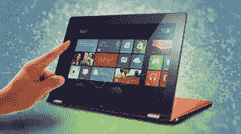

# 什么是触摸屏？

> 原文：<https://www.javatpoint.com/what-is-a-touch-screen>

触摸屏是一种也可以用作输入设备的显示器。它使用户能够通过触摸屏幕上的图像或短语来与计算机互动。屏幕是压敏的，因此当用户用手指或触笔触摸屏幕时，它会记录事件并将其发送到控制器进行处理。触摸屏可能有帮助用户操作设备的图片或文字。

对于导航图形用户界面，触摸屏是鼠标或键盘的替代，也提供了一种更简单的输入方式。智能手机、信息亭、电脑、笔记本电脑显示器、平板电脑和收银机等各种设备都有触摸屏。一些触摸屏不是使用触敏输入，而是使用红外光束网格来检测手指的存在。

虽然它看起来像一个简单的显示屏，但它包含许多识别输入的层。硬保护是第一层，它保留了触摸屏组件和实际显示。保护层下有一个电子网格，用于识别用户的输入。大多数现代触摸屏不是使用这种网格，而是使用电容材料，当触摸屏幕时，电荷会发生变化。液晶屏层，位于用于实际显示的触摸屏层下方。

触摸屏有两个主要优点:它不需要中间设备，允许用户直接与显示的内容交互，而不是使用鼠标或触摸板来控制指针。它们也可以用作连接网络或计算机的终端。在电子游戏、卫星导航设备、个人数字助理和移动电话等数字设备的设计中，触摸屏发挥着至关重要的作用。

现代触摸屏能够支持“多点触摸”输入，而老式触摸屏一次只能识别一个输入点。最初，iPhone 让这项技术流行起来，这使得它能够让屏幕同时识别几个手指动作。例如，在某些触摸屏设备上，您可以通过顺时针或逆时针旋转三个手指来旋转照片。

许多触摸屏应用程序还允许您通过分开两个手指或将它们捏在一起来放大和缩小。由于多点触控和触摸屏技术的其他进步，今天的触摸屏比过去更容易操作，也更自然。事实上，通过改进触摸屏技术，iPad 和其他平板电脑变得越来越受欢迎。

## 触摸屏技术

所有的触摸屏都不一样，因为它们使用不同的技术，让用户能够与屏幕交流。有些技术可能只接受通过手写笔等工具的输入，而其他技术可能只接受来自您手指的输入。下面简单介绍三种主要的触摸屏技术。

### 电容性的

该屏幕由带电材料制成，由每个角落的电路监控。当用户触摸电容屏幕时，电容会发生变化，从而能够发送和确定位置。它有优势；它透明度高，不会被灰尘或水损坏。它也有缺点；它不能由手写笔使用，只能用裸露的手指使用。当大多数用户戴着手套，试图使用智能手机触摸屏，却无能为力时，他们面临着一个问题。

### 电阻的

手指或其他物品的压力是通过电阻式触摸屏上既导电又电阻的薄金属层来检测的。与电容技术相比，这种技术通常是更合适的解决方案。但是如果被尖锐的物体碰到，就会损坏。它提供了好处；响应手指或手写笔，它不会被水或灰尘损坏。还有，更实惠。它有一个缺点；它会被尖锐的物体损坏，只能提供 75%的清晰度。

### 表面声波

当触摸表面波触摸屏时，它通过记录感知到的波的变化来产生超声波。与电容和电阻这两种技术相比，这种技术更先进。但是它会受到外界因素的影响，不能与硬材料一起工作。它提供了一个优势；它很容易被手指或手写笔触摸。它也包含一个缺点；灰尘或水可能会损坏它。

**还有其他触摸屏技术，不太常见。具体如下:**

**分散信号技术:**在这项技术中，传感器在触摸过程中检测机械能，由 3M 在 2002 年发布。为了确定位置，复杂的算法解释数据并将其发送给控制器。它有很多优点，比如可以用手指或手写笔，清晰度极佳，经久耐用，而且不受元素影响。此外，它还有一个缺点，系统不能在初次触摸后检测到静止的手指或触笔。

**声脉冲识别:**泰科国际的 Elo 部门在 2006 年推出了这一系统。它使用放置在屏幕周围的传感器和算法来确定它们的位置，以将振动转化为电能。它具有一些优点，如耐恶劣环境、清晰度高、耐用性好，非常适合大型显示器。它也有一些缺点，比如它不能检测到静止的手指。

**红外线:**这种类型的触摸屏使用红外光束矩阵，通过光电探测器对和屏幕边缘的发光二极管阵列来检测触摸。当手指或其他物品靠近显示器时，红外光束被阻挡。它有很多好处，比如可以使用手指或笔，它不会被自然环境破坏，而且它很坚固，质量很好。

**光学成像:**在这项技术中，图像传感器位于屏幕边缘。在屏幕的另一侧，这些图像传感器(相机)接收黑色红外光。它的优点是:可用于大型显示器，价格实惠，用途广泛。

## 什么电脑支持触摸屏？

在当今世界，每台电脑都可以有触摸屏。使用触摸屏时，大多数笔记本电脑都支持微软视窗 10。而且，许多一体机都设计有触摸屏显示器。有各种制造商生产带有触摸屏的产品，如微软、联想、戴尔、惠普、宏碁等。此外，一些高端的谷歌 Chromebooks 也在那里提供。然而，许多 Chromebooks 没有触摸屏来维持较低的成本。请记住，并非所有苹果电脑和笔记本电脑上都有触摸屏。然而，像 iPad 和 iPhones 这样的设备使用触摸屏。

## 触摸屏的历史

在现代，触摸屏是非常重要的技术，很难想象没有它们的生活。触摸屏的简史描述如下:

### 20 世纪 60 年代:触摸屏诞生

电容式触摸屏被历史学家认为是第一个触摸屏，是由 E.A .约翰逊推出的。1965 年至 1967 年间，它是在英国马尔文的皇家雷达研究所开发的。发明者在 1968 年发表了一篇文章，详细介绍了用于空中交通管制的触摸屏技术。电容式触摸屏涂有透明导体，如氧化铟锡。当人的手指接触到它时，它就像一个电导体。约翰逊的原始技术一次只能使用一次触摸。空中交通管制员在英国采用了约翰逊的发明，直到 20 世纪 90 年代仍在使用。

### 20 世纪 70 年代:从容性到阻性

很快，电阻式触摸屏就超越了电容式触摸屏。1971 年在肯塔基大学教书时，塞缪尔·赫斯特博士发明了一种“触摸传感器”肯塔基大学研究基金会为这种被称为“Elograph”的传感器申请了专利因为现代触摸屏是透明的，但“Elograph”不是。然而，这种传感器在触摸屏技术中发挥了至关重要的作用。工业研究从 100 种新技术产品中选择了 Elograph 作为 1973 年最重要的产品。对于电脑显示器来说，触摸屏是一个很好的界面。第一个真正的触摸屏于 1974 年推出，它包括一个透明的表面。它是由埃洛 graphics 和萨姆·赫斯特创作的。

1977 年，Elographics 开发了一种电阻式触摸屏技术并获得专利，这是现代应用最广泛的触摸屏技术。为了生产第一个曲面玻璃触摸传感器接口，西门子公司资助了 Elographics 的一项工作。后来，该公司于 1994 年 2 月 24 日将其名称从 Elographics 改为 Elo TouchSystems。为了与包含 X 轴和 Y 轴的薄板接触，屏幕只需要一个导电盖板。

当在盖板上施加压力时，电流会在 X 线和 Y 线之间通过。它响应的不是导电性，而是构成电阻式触摸屏技术基础的压力。

### 20 世纪 80 年代:触摸站稳脚跟

1982 年，尼米什·梅塔在多伦多大学发明了第一台人类控制的多点触控设备。在照相机前，它有一个磨砂玻璃面板。20 世纪 80 年代初，触摸屏在市场上可以买到。计算机制造公司惠普在 1983 年推出了惠普-150。

惠普-150 是一款家用电脑，配备 9 英寸索尼阴极射线管显示器和触摸屏功能。惠普-150 有一个内置的红外光束网格，可以检测面板前部的手指运动。1984 年，当贝尔实验室的 Bob Boie 创建了第一个透明的多点触控屏幕覆盖时，多点触控技术取得了显著进步。在阴极射线管上，屏幕使用了透明的电容式触摸传感器阵列，允许用户用手指输入。

### 20 世纪 90 年代:触摸屏走向大众

1993 年，首批采用触摸屏技术的手机之一西蒙个人通信器由 IBM 和 BellSouth 推出。它使用了带有手写笔的电阻触摸屏，并有基于笔的画板、电子邮件和日历应用程序、地址簿、寻呼功能和预约时间表。同年，1993 年，苹果推出了一款配备手写识别的牛顿 PDA；第一款智能手机西蒙是由 IBM 推出的，它具有传真功能、记事本、日历和触摸屏界面，使用户能够拨打电话号码。

掌上电脑于 1996 年发布了触摸屏 PDA 飞行员。Palm Pilot 使用了像之前使用的设备一样的手写笔。Palm 设备的手写识别软件要好得多；因此，与其前辈相比，Palm 的设备更加成功。1999 年，特拉华大学的一名研究生韦恩·韦斯特曼发表了一篇名为《手指识别、手跟踪和多点触摸表面的合唱操纵》的论文。

一系列基于多点触摸手势的设备是由一家公司开发的，该公司是由韦斯特曼和他的主管约翰·埃利亚斯建立的。这些设备中包含了基于手势的 TouchStream 键盘。这个键盘对残疾人很有用，手势板允许用户在单手手势的帮助下使用屏幕。2005 年，苹果收购了 FingerWorks。许多人将多点触控触控板和 iPhone 触摸屏等苹果技术归因于此次收购。

## 2000 年及以后:触摸接管

随着开发人员找到了将技术融入日常生活的方法，触摸屏技术也在新千年伊始开始腾飞。从通用汽车和别名|波前，一个由研究人员组成的团队在 2001 年推出了组合墙。为了追踪项目，这款基于手势的大尺寸触摸屏仿照了董事会的设计工作室，面向设计师和 3D 动画师。

Windows XP 开始进入触控技术，并于 **2002 年发布了 XP 平板版。**同年，也就是 2002 年，索尼推出了一款可以同时识别多个手位和触摸点的平板输入面——SmartSkin。该技术使用网状天线和电容传感来计算用户手与表面之间的距离。它没有依赖基于摄像头的手势识别，而是使用了集成在触摸表面的传感器。

2004 年，微软研究员工安德鲁·威尔逊(Andrew D Wilson)开发了一种基于手势的 3D 显示成像触摸屏 TouchLight。在背投显示器的帮助下，一片丙烯酸塑料通过 TouchLight 转换成了一个交互表面。它具有 3D 功能，这使得它可以作为一个临时的镜子，并可以同时感知多个触摸。

杰夫·韩在 2006 年发布了一款直观、无界面、触控的电脑屏幕。通过这台电脑，用户可以在手指的帮助下操纵巨型灯箱上的照片。对于生物指纹成像，韩的发明使用了一种工艺，使用了受抑全内反射(FTIR)。后来，为了让这项技术更容易获得，韩把他的公司卖给了微软。

iPhone 之王 iPhone 是苹果在 2007 年**推出的，采用了触摸屏技术，这可能是触摸屏技术史上最大的一次变革。这刺激了触摸屏技术的巨大进步，改变了人们接触技术的方式。同年，微软发布了高端桌面图形触摸屏。**

 ****2010 年，**iPad 由苹果推出，是其旗舰平板。在现代，平板电脑和触摸屏智能手机更加普遍。事实上，在今天，几乎任何东西都可以像人类皮肤一样拥有触摸屏。

## 触摸屏的用途

触摸屏是一种显示器，允许用户用手指操作设备。有许多设备使用触摸屏显示器，如自动取款机、手机、视频游戏、掌上电脑，甚至超市终端也包括触摸屏。

### 自助退房

一些超市使用触摸屏显示器，这减少了消费者和收银员的时间。此外，还为客户提供了许多好处，例如，他们可以生成、查找代码以及选择支付方式。

### police department american samoa 美属萨摩亚警察局

PDAs 使用触摸屏技术，这是该技术的首批应用之一。在现代，掌上电脑的使用率正在下降，但独立的掌上电脑被用于媒体播放和互联网浏览。

### 自动取款机

许多自动取款机都使用触摸屏技术，这减少了按钮的使用，并为用户提供了轻松输入信息的好处。此外，它有助于节省用户的时间，使自动取款机的使用更加容易。

### 任天堂 DS

随着下部用于触摸屏功能，两个显示屏已经包含在任天堂 DS 手持视频游戏系统中。大多数游戏都是用手写笔来玩的，手写笔允许玩家在游戏中点击物品、移动物体、移动角色和绘制图形，从而创造出独特的游戏体验。

### 苹果手机

为了给用户提供一种简单的导航方式，苹果为其 iPhone 提供了触摸屏显示器。用户可以通过在手机显示屏上触摸手指来操作 iPhones 他们可以轻松拨号、发短信、听音乐、播放视频和导航其他功能。

**其他一些使用触摸屏的应用:**

*   一体机
*   汽车全球定位系统
*   照相机
*   汽车音响
*   电子书
*   电子白板
*   收银机
*   数字摄像机
*   街机游戏
*   工厂机器
*   药片
*   凉亭
*   笔记本电脑
*   缝纫机
*   大互动屏幕
*   售票机
*   触摸屏打印机
*   医疗设备
*   POS 机
*   签名垫
*   智能手机
*   杂货店自助结账机
*   手持游戏控制台
*   机上娱乐屏幕
*   健身器
*   加油站

## 如何使用触摸屏？

以下动作最常见；但是，并非所有触摸屏都具有相同的功能。

**轻按:**将选择一个对象，或者如果您用手指在屏幕上进行单触或轻按，将打开一个应用程序。当你把一个标签和传统的电脑比较时，它就像用鼠标点击一样。

**双击:**根据程序或者使用的地方，使用双 tab 是为了不同-不同的功能。例如，如果在文本编辑器中使用双制表符，它将突出显示一个单词或一段单词。而且，如果你打开了一个缠绕的浏览器并使用了双击，屏幕会缩放视图，以点击的位置为中心。双标签也用于打开任何程序、文件、文档或其他。

**触摸并按住:**如果您将手指按住触摸屏，将选择一个对象。在按住对象的帮助下，它可以移动到任何其他位置。为此，您需要触摸并按住一个图标，将该项目拖到您想要移动它的位置。

**滑动:**如果你用手指在屏幕上滑动，它将用于改变页面或向特定方向滚动。例如，如果您正在访问一个页面并快速向上移动(滑动)，您将看到一个屏幕正在向下滚动。

**拖动:**拖动用于将文件、文档或任何其他对象移动到另一个位置。您需要按住可移动对象，然后拖动文档，直到不在其他位置释放该对象。如果您对文本使用相同的操作，它将高亮显示或选择文本。当你完成移动或选择后，你需要抬起你的手指。

**捏一下:**也可以通过触摸屏显示放大屏幕。为此，你需要将你的两个手指放在屏幕上的不同位置，并一起捏它们。您也可以通过将手指放在屏幕上的不同位置，然后将它们彼此移开来缩小屏幕。

## 为什么触摸屏是输入设备？

任何用于向用户提供输入以操作任何设备(如计算机)的设备都被视为输入设备。其中之一是触摸屏，它的工作原理类似于台式电脑上的电脑鼠标。触摸屏不仅接受人的输入，还显示计算机的输出。因此，触摸屏在技术上被称为输入/输出设备。

## 触摸屏和鼠标的区别

触摸屏和鼠标非常相似。上面的“如何使用触摸屏”一节解释了许多相似之处。

悬停是触摸屏和鼠标之间最显著的区别。计算机鼠标只能悬停，用户无需点击对象即可查看信息。当用户用手指直接接触屏幕时，几乎所有的触摸屏都能够识别输入。但是鼠标使用光标为用户指示对象，这包含了悬停功能，用户只需将光标移动到对象上就可以查看信息，而不需要点击对象。比如[https://www.javatpoint.com](https://www.javatpoint.com)就是一个环节；当用户将鼠标指针悬停在此链接上时，它会显示文本用户，访问 javaTpoint 页面。但是，您不能通过使用触摸屏来查看这些信息，因为触摸屏没有悬停功能；当您将手指放在此链接上时，它将被打开。

虽然在悬停功能方面，一些应用和网页可能会模拟第一次点击和第二次点击打开应用或链接。这意味着当你第一次点击链接或任何应用程序时，它会像悬停一样工作，第二次点击会打开它。此外，有些苹果设备具有类似悬停的功能，因为它们使用了强制触摸。

## 为什么使用触摸屏？

由于以下几个原因，制造商可能会决定使用触摸屏，而不是物理按钮等其他输入方法:

*   尤其是对于年轻一代的用户来说，触摸屏直观易用。
*   触摸屏也有助于缩小设备的尺寸，因为它消除了对大量按钮的需求。
*   与具有屏幕和按钮的设备相比，设计和制造同时用作屏幕和按钮的单个屏幕的设备成本较低。

## 触摸屏是如何工作的？

触摸传感器、控制器和软件驱动程序是简单触摸屏的三个基本组件。因为触摸屏是一种输入设备，它必须与显示器、计算机或其他设备相结合，才能产生一个完整的触摸输入系统。

1.  **触摸传感器:**是一种表面清晰的触敏玻璃面板。它位于显示屏上方，面板的响应区域覆盖了视频屏幕的可视区域。当今的地球上有几种不同的触摸传感器技术可供选择。为了检测触摸输入，每种技术都使用不同的机制。通常，电流或信号包含在传感器中，当触摸屏幕时会改变电压或信号。为了确定触摸屏幕的位置，使用这种电压变化。
2.  **控制器:**它附着在触摸传感器和 PC 之间，因为它是一个小型 PC 卡。它从触摸传感器获取信息后，将信息翻译成电脑可以容易理解的形式。对于外部触摸附加/覆盖，控制器装在塑料盒中，或者通常安装在集成显示器的显示器内部。在电脑上，你需要什么样的接口取决于控制器。
    在集成触摸显示器中，对于触摸屏，背面包含额外的电缆连接。控制器设计用于连接通用串行总线端口或串行/通信端口。尤其是，它们可用于 DVD 播放器和其他设备。
3.  **软件驱动:**它使电脑和触摸屏能够一起工作，因为它是电脑系统的软件更新。如何处理从控制器发送的触摸事件信息由软件驱动程序描述，该软件驱动程序告诉计算机的操作系统用触摸事件来解释。鼠标模拟是一种触摸屏驱动程序；如今，鼠标模拟类型的驱动程序大量出现。它的工作原理类似于鼠标；因为它触摸屏幕的方式与鼠标点击屏幕上同一位置的方式相同。这使得新应用程序的开发不需要特定于触摸屏的代码，也不需要触摸屏与当前软件的交互。例如，DVD 播放器、瘦客户端和专用计算机系统不使用软件驱动程序，也没有自己的内置触摸屏驱动程序。

## 触摸屏的优点

*   人们可以通过触摸屏轻松使用电脑，无需任何培训。
*   触摸屏技术用户友好且易于使用。
*   它包含一个虚拟键盘，允许用户从定义的菜单中清楚地选择操作员。因此，它消除了操作员错误。
*   与鼠标等另一种输入设备相比，它速度更快，这使用户能够快速访问任何和所有类型的数字媒体。
*   它提供了足够的安全性。
*   它还有助于节省磁盘空间，因为输入设备完全集成到显示器中。
*   它变得越来越受欢迎，因为它易于使用，可靠，性能提高，成本更低。
*   根据用户的需求，文本可以用不同类型的语言显示。
*   此外，通过简单的软件更改，可以更新触摸屏界面。

## 触摸屏的缺点

*   虽然触摸屏使用方便，用户友好，但大量数据无法通过触摸屏输入。
*   系统设计者没有仔细考虑系统将如何运行。因此，触摸屏技术在现实世界的应用中还没有出现。
*   按钮背后的另一个限制是，该行业的处理速度不够快。
*   与现有的键盘显示器相比，触摸屏系统将更加昂贵。
*   此外，将标准电脑、显示器和触摸屏放在一起比较，价格也很高。

## 触摸屏有键盘吗？

触摸屏包括一个虚拟键盘来输入数字和字母，这使得用户能够通过用手指敲击虚拟按键来使用键盘。此外，平板电脑和智能手机等触摸屏设备包含语音识别功能，允许用户在说话的帮助下输入。

## 什么可以写触摸屏，触摸屏，或触摸屏？

触摸屏和触摸屏这两个术语都是有效的，并以书面形式接受。你可以相应地写“触摸屏”或“触摸屏”。如果你把这个词用作形容词，它可以像触摸屏一样连字符。

* * ***