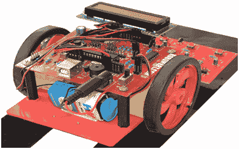
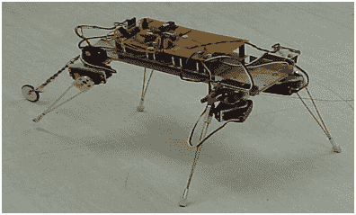
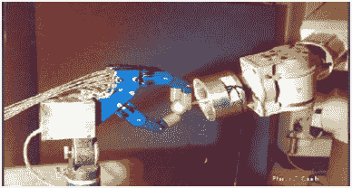
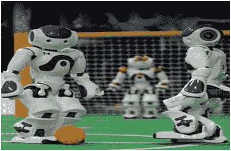
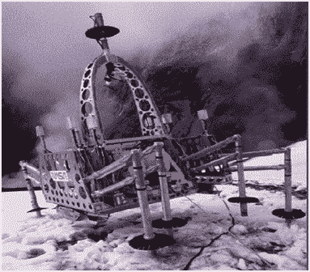

# 机器人的类型

> 原文：<https://www.javatpoint.com/types-of-robot>

* * *

## 1)移动机器人

移动机器人能够利用移动从一个位置移动到另一个位置。它是一种自动机器，能够在不受控制的环境中导航，不需要任何物理和机电制导装置。移动机器人有两种类型:

**(a)滚动机器人-** 滚动机器人需要轮子才能左右移动。他们可以轻松快速地搜索。但它们只在平坦地区有用。

**(b)步行机器人-** 有腿机器人通常用于地形多岩石的条件下。大多数行走机器人至少有 4 条腿。

## 2)工业机器人

工业机器人在不移动的情况下重复执行相同的任务。这些机器人在需要执行适合机器人的单调重复任务的行业中工作。

一个永不疲倦的工业机器人，它会日夜不停地工作，从不抱怨。

## 3)自主机器人

自主机器人是自我支持的。他们使用一个程序，该程序为他们提供了根据周围环境决定要执行的动作的机会。

使用人工智能，这些机器人经常学习新的行为。他们从一个简短的例行公事开始，并调整这个例行公事，以便在他们执行的任务中更成功。因此，最成功的程序将被重复。

## 4)遥控机器人

遥控机器人用于执行复杂和不确定的任务，这些任务是自主机器人由于操作的不确定性而无法执行的。

复杂的任务最好由真正有脑力的人来完成。因此，一个人可以通过使用遥控器来引导机器人。使用遥控操作，人可以执行危险的任务，而不在执行任务的现场。

让我们看看美国宇航局设计的机器人，通过远程控制探索火山:

