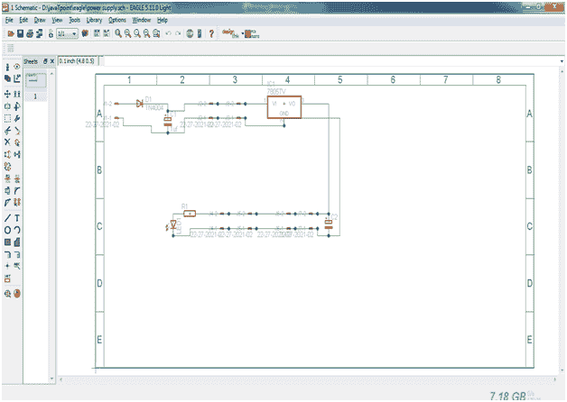
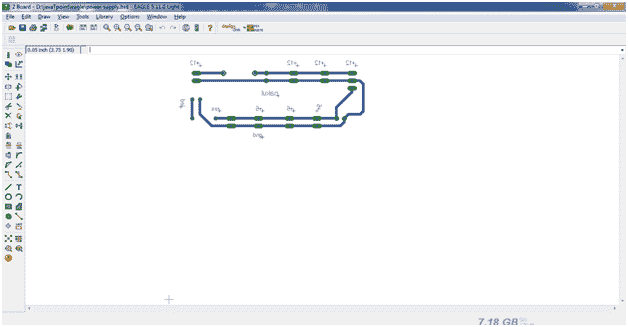

# 电源

> 原文：<https://www.javatpoint.com/robotics-power-supply>

电源是用于将 220 伏交流信号转换成机器人电子电路运行所需的 5 伏或 10 伏 DC 信号的电路。

开始在 Eagle 软件中绘制框架左上角的电源。根据下面的电路图，

然后使用添加命令**添加**组件，并使用**网**命令绘制连接。

考虑 eagle 软件上电源电路的示意图是，

使用**命名**命令重命名组件。

使用 **smash** 命令将名称和值文本从组件中分离出来，并允许它们使用 **move** 命令进行定位

使用**值**命令更改组件的值。

完成端子间的布线后，考虑 PCB 板布局，

完成电路板布局后，运行它以生成 PDF。生成的 PDF 用于将上述布局打印在头顶投影仪纸张(称为 OHP 纸张)或蜡纸上，以设计印刷电路板。