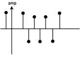

# 控制系统的分类

> 原文：<https://www.javatpoint.com/control-system-classification>

控制系统可以多种方式分类。一些流行的分类是:

1.  根据分析和设计的方法，系统可以是线性的或非线性的。
2.  根据信号的类型，系统可以是时变的、时不变的连续数据、离散数据、调制或未调制的控制系统等。
3.  根据系统组件的类型，系统可以是机电、生物、液压、热或气动控制系统等。
4.  根据主要目的，系统可以是位置控制、速度控制等。

## 线性和非线性系统

**线性系统**:当且仅当一个系统同时具有同质性和叠加性时，它才被称为线性系统。叠加意味着一个输入 r <sub>1</sub> (t)给出输出 c <sub>1</sub> (t)，另一个输入 r <sub>2</sub> (t)给出输出 c <sub>2</sub> (t)。如果两个输入一起施加，那么输出将是两个输出的总和:

```
r1(t) + r2(t) = c1(t) + c2(t)

```

如果我们的投入产出关系是一条穿过原点的直线，那么系统服从叠加性质。穿过原点的直线意味着对于零(0)输入，输出为零(0)。

如果从 r <sub>1</sub> (t)到 Kr <sub>1</sub> (t)的任何系统 K 时间内输入增加，则输出的幅度也从 c <sub>1</sub> (t)增加到 Kc <sub>1</sub> (t)，则该特性称为同质性。这个性质是系统是线性的必要条件。

**非线性系统**:非线性系统不满足叠加原理或同质性，或者是输出与其输入不成正比的系统。这里，非线性系统的稳定性取决于系统的输入和初始状态。

在线性系统中，如果输入为正弦曲线并开始增加，则输出也会增加，但形式保持不变。

然而，在非线性系统中，形式可能随着输入幅度的变化而变化。这意味着如果输入是正弦的，那么输出是非正弦的，即非线性系统。

### 时变不变控制系统

参数随时间变化的系统称为时变控制系统，参数不随时间变化的系统称为时不变控制系统。

### 连续数据和离散数据控制系统

在连续系统中，所有系统变量都是连续时间变量 t 的函数。在任何时间 t，它们都依赖于时间，因此它们被称为连续数据控制系统。

在离散数据控制系统中，如果信号不是随时间连续变化的，而是以脉冲形式出现的，则被控系统称为离散数据控制系统。

它有两种类型

1.  样品
2.  数字的

如果信号是脉冲数据的形式，该系统称为采样数据控制系统。下图显示了示例表单。



如果信号是数字代码的形式，该系统称为数字控制系统。

### 动态和静态系统

如果在任何系统中，输入不随时间变化，那么输出也不随时间变化，这样的系统称为静态系统。例如，有电阻的电路。

如果系统的输出是时间的函数，即使输入不变，这种系统也称为动态系统，就像 R、L、C 电路一样，因为电感和电容是储能器件。

* * *