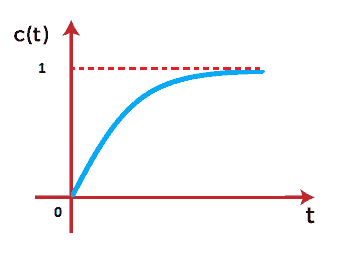
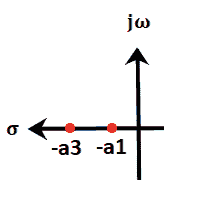
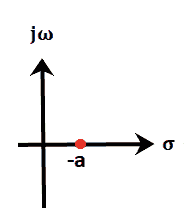
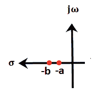
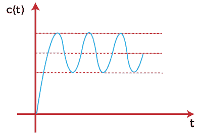

# 控制系统的要求

> 原文：<https://www.javatpoint.com/requirements-of-a-control-system>

控制系统有三个基本要求，即**稳定性、准确性、**和**响应**。

让我们讨论一下这些基本要求。

## 1.稳定性

对于系统输入信号的特定变化，输出使系统的响应处于合理的值。我们也可以说可以控制的价值。稳定系统的响应如下所示:

它是具有单位阶跃输入的一阶系统的响应。它的值介于 0 和 1 之间。

*   如果特征方程的所有根都位于 s 平面的左半部分**，则系统被称为**稳定**，如下所示:
    
    随着极点趋近于零，系统的稳定性下降。**
***   如果任一根位于 s 平面的右半部，则为**不稳定**。
    
    如果极点在本质上是**重复的**，那么这个系统就说是一个**不稳定系统**，如下图:
    *   如果极点靠近 s 面左半部原点，称为**优势极点**。如果-a 和-b 是 s 平面左半部分的两个极点，那么-a 被认为是该系统的主导极点，如下所示:
    **

 **因此，极点在 s 平面的位置决定了系统的稳定性。

基于稳定性的系统进一步分为:

*   绝对稳定系统
*   条件稳定系统
*   边缘稳定系统

### 绝对稳定系统

如果系统在所有给定的范围内都是稳定的，则称之为绝对稳定系统。

例如，

如果开环和闭环控制系统的极点位于 s 平面的左半部分，则称该系统为**绝对稳定系统**。

绝对稳定系统的阶跃响应如下所示:

### 条件稳定系统

如果系统在一定的数值范围内是稳定的，则称之为条件稳定系统。

或者

如果系统的环路增益在一定范围内，则称该系统为条件稳定系统。这意味着这种类型的系统仅在特定条件下表现出稳定性。如果违反这些条件，系统将产生无限的输出。

条件稳定系统的阶跃响应如下所示:

### 边缘稳定系统

如果一个系统产生的输出具有恒定的振幅和恒定的振荡频率，那么这个系统被认为是边缘稳定的。应用于所有这些系统的输入是有界的。

例如，

如果开环和闭环控制系统的极点位于虚轴上，则称该系统为边际稳定系统。

这些振荡被称为持续振荡。边缘稳定系统的阶跃响应如下所示:

## 2.准确

测量值与真实值的接近程度称为**精度**。测量值通常与真实值不同。这是控制系统的重要要求之一。它决定了受控过程达到期望值的精度。

准确性是系统开发过程的初始阶段。它对于预测管理决策和分析准确的数据和信息是有效的。精确度还有助于发现测量误差，其形式可能是**内部噪声**或**外部干扰**。

**精度**和**精度**都是不同的词，相互独立，虽然都与识别系统中的错误有关。精度表示系统的测量值彼此之间的接近程度，而精度则表示测量值与真实值的接近程度。一个系统可以精确但不精确，或者精确但不精确，既不精确也不精确，或者既精确又精确。理想情况下，系统应该准确无误。因此，这两个术语不应混淆。

## 3.反应

仪器响应输出信号变化的速度称为系统响应。理想的系统具有 100%精度、完美稳定性和即时响应的特点。在系统实际响应的情况下，所有这些都是不可能的。

* * ***