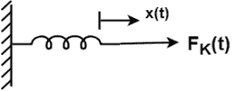
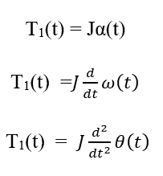
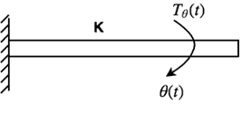
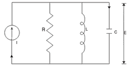

# 物理系统的数学建模和表示

> 原文：<https://www.javatpoint.com/control-system-mathematical-modelling-and-representation-of-physical-system>

物理系统是一个系统，其中物理对象被连接以执行一个目标。我们不能以真实的形式代表任何物理系统。因此，我们必须为系统的分析和综合做出假设。理想化的物理系统称为物理模型。一个物理系统可以用不同的方式建模，这取决于我们必须处理的问题和所需的精度。

## 例如

我们可以将电子放大器建模为线性集总元件的互连，如果应力在失真分析上，那么同样可以被描绘为非线性元件。

当我们获得了物理系统的物理模型后，下一步就是获得数学模型，这种数学模型被称为物理模型的数学表示。

在继续之前，让我们知道，系统建模的意义是什么？

为机械和电气系统绘制框图以找到性能和传递函数的过程称为控制系统的数学建模。

有两种类型的物理系统:

1.  机械系统。
2.  电气系统。

## 机械系统的数学建模

我们必须研究两种类型的机械系统。

1.  平移或线性系统。
2.  旋转系统。

**平移或线性系统**:沿直线发生的运动称为平移运动。我们必须研究三种不同类型的力。

**1。惯性力:**


考虑一个质量为 M，加速度为 a 的物体，根据牛顿第二运动定律:

```

F (t) = Ma (t)

```

就速度而言


根据位移，上述方程可以表示为


**2。阻尼力:**


对于粘性摩擦，我们假设阻尼力与速度成正比。


其中 B =阻尼系数单位 B = N/m/秒。

**3。弹簧力:**



弹簧有势能。弹簧的回复力与位移成正比。

```
    FK (t)∝x(t)=Kx(t)
                  Fk (t)=k∫v (t)dt

```

**其中**

```

' K '= spring constant of stiffness
Unit of K = N/m

```

旋转分量

惯性矩或扭矩

转动惯量。

**旋转系统**:当一个物体围绕一个固定的轴运动时，这种类型的运动被称为旋转运动。有三种类型的扭矩可以抵抗旋转运动。

**1。惯性力矩**:储存旋转运动动能的元素的性质叫做惯性(J)。惯性力矩 T <sub>1</sub> 是惯性矩 J 和角加速度α (t)的乘积。




**其中**

```

ω(t) =  angular veloci
θ(t)  = angular displacement

```

扭矩单位=牛米

**2。阻尼力矩**:角速度ω与阻尼系数 B 的乘积称为阻尼力矩 T <sub>D</sub> (t)。

```

TD(t) = Bω(t)

TD(t)  = B d/dt θ(t)

```

**3。弹簧扭矩:**



弹簧扭矩 Tθ(t)是扭转刚度和角位移的乘积。

```

Tθ(t) = Kθ(t)

```

K 的单位= N-m/rad。

通过比较方程，我们得到一个类似的系统:

| 没有。 | 平移的 | 轮流的 |
| one | 力，F | 扭矩 |
| Two | 加速度，a | 角加速度，α |
| three | 速度，v | 角速度，ω |
| four | 位移，x | 角位移，θ |
| five | 质量，M | 惯性矩 |
| six | 阻尼系数 | 旋转阻尼系数 |
| seven | 僵硬 | 扭转刚度 |

## 电气系统的数学建模

**模拟系统**

考虑串联 RLC 电路。


应用基尔霍夫电压定律


根据电荷方程


现在考虑一个平行的 RLC 电路



现在应用基尔霍夫电流定律


根据磁通量连接，上述等式变为“自”


## 强制电流类比

| 没有。 | 机械平移系统 | 电气系统 |
| one | 力 | 电压(东) |
| Two | 质量(米) | 电感(升) |
| three | 刚度(千) (弹性，千分之一) | 电容的倒数(1/C) |
| four | 阻尼系数 | 抵抗 |
| five | 位移(x) | 费用(q) |

* * *