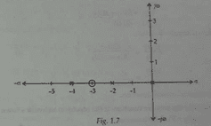
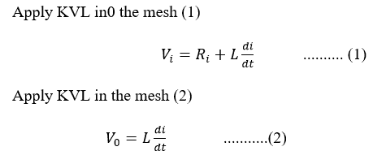
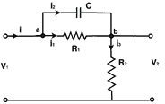
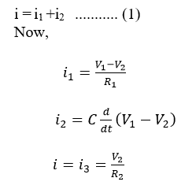
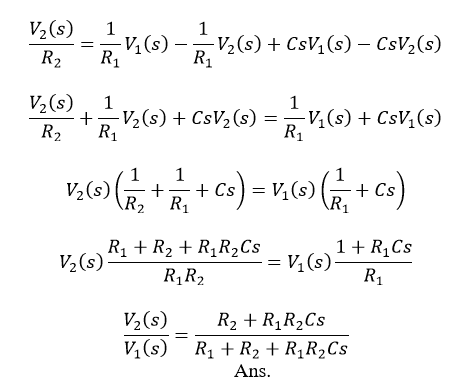

# 转移函数

> 原文：<https://www.javatpoint.com/control-system-transfer-function>

系统的传递函数定义为输出的拉普拉斯变换与输入的**拉普拉斯变换之比，其中所有初始**条件为零。


**在哪里，**

```

T(S) = Transfer function of the system.
C(S) = output.
R(S) = Reference output.
G(S) = Gain.

```

## 获取传递函数的步骤-

**第一步**写微分方程。

**步骤-2** 求出以‘零’为初始条件的方程的拉普拉斯变换。

**第三步**取输出与输入的比值。

**第 4 步**将 G(S)的方程式写如下-


这里，a 和 b 是常数，S 是复变量

## 传递函数的特征方程-

这里，线性系统的特征方程可以通过将分母等于传递函数的多项式为零来获得。因此，等式 1 的传递函数的特征方程将是:

```
an sn+a(n-1) s(n-1)+.........+a1 s+a0=0

```

## 传递函数的极点和零点-

考虑等式 1，分子和分母可以分别分解为 m 项和 n 项:


其中，为增益系数，s’为复频率。

## 柱

极点是传递函数值为零的传递函数的频率。

## 零

零点是传递函数值变为零的传递函数的频率。

我们将应用 Sridharacharya 方法来寻找极点和零点的根-


如果任何极点或零点重合，那么这种极点和零点被称为多重极点或多重零点。

如果极点和零点不重合，那么这种极点和零点被称为简单极点或简单零点。

## 例如-

求以下函数的传递函数


函数的零点为 S = -3，函数的极点为 S = 0，S = -2，S = -4 处的多个极点，即 S = -4 处的 2 阶极点。

## 当我们考虑整个“S”平面时，会出现两种情况:

1.如果零点数小于极点数，即 Z

2.如果极点数小于零点数，那么对于 S，传递函数值变为无穷大？？，这样的极点的顺序是 Z-P

用于在 S 平面上定位极点和零点的符号是？x？然后呢。o？极点表示为？x？零用“0”表示。上面例子的极点-零点图如下-



## 示例-1

**求给定网络的传递函数。**


**解决方案:**

**第一步**




**第二步**:取等式(1)和等式(2)的拉普拉斯变换，假设所有初始条件为零。


**第三步**:传递函数的计算


等式(5)是传递函数

## 示例- 2

**求下图的传递函数。**



## 解决方案-

**步骤 1** :在节点‘a’施加氯化钾



现在把所有的值放在等式(1)中


取方程(2)的拉普拉斯变换

