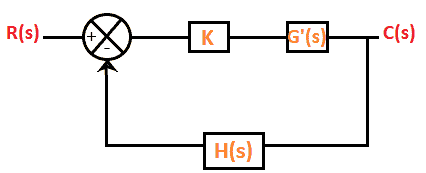

# 根轨迹的基本概念

> 原文：<https://www.javatpoint.com/basic-concepts-of-root-locus>

在前几节中，我们研究了系统的稳定性。这取决于特征方程根的**位置。我们也可以说系统的稳定性取决于**闭环极点的位置。**当参数变化时，这些关于 s 平面极点运动的知识非常重要。参数的微小变化对系统设计有很大帮助。系统瞬态响应的性质与 s 平面中极点的位置密切相关。**

我们还研究了描述代数方程稳定性的劳斯·赫维茨准则。如果罗思表第一列中的任一项有符号变化，系统就会变得不稳定。

根轨迹法是由埃文斯于 1948 年提出的。根轨迹是一种图解法，当特定参数从 0 到无穷大变化时，可以定位 s 平面中极点的运动。假设变化的参数通常是系统的**增益**。

考虑下面的闭环系统。

闭环系统的方程由下式给出:

1 + G(s)H(s) = 0

哪里，

G(s)是传递函数的增益

H(s)是反馈增益

在根轨迹的情况下，增益 K 也被假定为闭环系统的一部分。k 称为系统增益或正向路径中的增益。包含正向增益后的特性方程可表示为:

1 + KG'(s)H(s) = 0

哪里，

g(s)= KG(s)

当系统包括变量参数 K 时，闭环系统的根现在依赖于“K”的值

“K”变量的值可以在两种情况下变化，如下所示:

在第一种情况下，对于 K 的每个不同的值(整数或小数)，我们将得到根的位置的单独集合。如果所有这样的位置都被连接起来，得到的图被定义为根轨迹。我们也可以把根轨迹定义为当系统增益‘K’从**-无穷大**变化到**无穷大时得到的闭环极点的轨迹。**

当 K 从**零变化到无穷大时，**图称为直接根轨迹。如果系统增益‘K’从-无穷大变化到零，那么由此得到的曲线称为逆根轨迹。除非特别说明，增益 K 一般假设从零到无穷大。

让我们考虑一个例子。

**例:求 G(s) = K/s 的单位反馈系统的根轨迹**

如前所述，它是一个统一的反馈系统。意思是 H(s) = 1。

我们知道，

1 + G(s)H(s) = 0

1 + K/s = 0

S + K = 0

上述方程的根位于 s = -K。

根据条件，系统增益 K 从零到无穷大变化，除非状态。因此，当 K 从零到无穷大变化时，我们将通过连接所有这样的位置来获得根轨迹。

下表给出了不同 K 值下给定方程的根的值:

| K | S = -K 根位置 |
| Zero | Zero |
| one | -1 |
| five | -5 |
| 无穷 | 无限 |

上述 K 值的根轨迹图如下所示:

## 根轨迹的用途

此外，在确定系统的稳定性时，根轨迹也有助于确定:

*   **阻尼比**
    阻尼比是描述系统衰减如何影响系统振荡的无量纲单位。
*   **固有频率**
    用 w n. 表示，极点处的系统增益 K 值有助于计算系统的固有频率和阻尼比。
*   **P、PI 和 PID 控制器**借助根轨迹技术可以设计 T2 P(比例)、PI(比例积分)和 PID(比例积分微分)控制器。这里，要控制的系统的输入与系统增益 k 成比例
*   **滞后和超前补偿器**
    补偿器是系统中为补偿性能不足而增加的附加部件。相位超前补偿器有助于在复杂的 s 平面中将根轨迹向左移动，并进一步提高系统的稳定性。类似地，滞后和超前补偿器可以在根轨迹的帮助下以各种方式设计。

## 根轨迹的优势

根轨迹的优点如下:

*   我们可以借助根轨迹图来分析系统的绝对稳定性。
*   利用大小和角度条件，我们可以找到根轨迹上任意一点的系统增益 K 的极限值。
*   提高系统设计的准确性。
*   它有助于分析时滞系统的稳定性。
*   根轨迹图有助于我们确定增益裕量、相对稳定性、相位裕量和系统建立时间。
*   与控制系统中的其他技术相比，根轨迹技术易于实现。
*   它有助于分析控制系统的性能。

* * *