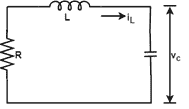
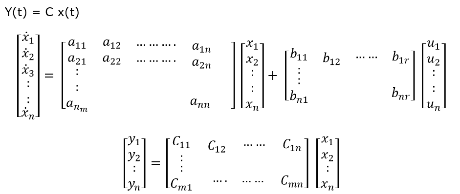
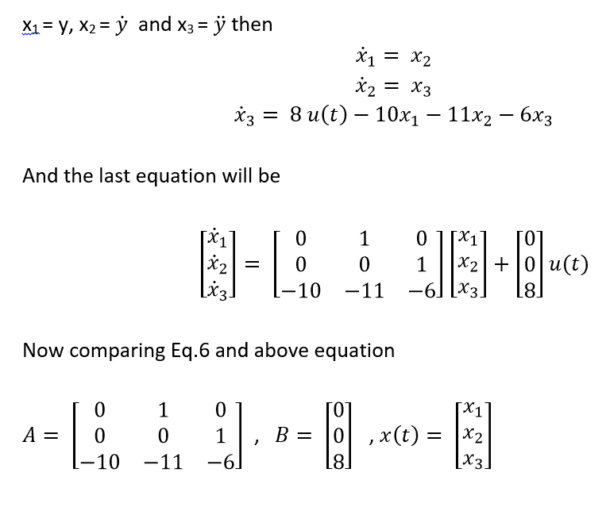

# 状态空间模型

> 原文：<https://www.javatpoint.com/control-system-state-space-model>

确定系统状态的过程称为状态变量分析。

## 状态空间技术的优势

1.  该技术可用于线性或非线性、时变或时不变系统。
2.  在拉普拉斯变换不能应用的地方更容易应用。
3.  第 n 阶微分方程可以表示为一阶‘n’方程。
4.  这是一种时域方法。
5.  由于这是时域方法，因此该方法适用于数字计算机计算。
6.  在给定性能指标的基础上，该系统可以设计为最佳状态。

## 电气系统的状态空间表示；

考虑一个 RLC 网络，

```
At time t = 0
Current = iL(0)
Capacitor Voltage = Vc(0) 

```

因此，t=0 时的网络状态由电感电流和电容电压决定。

因此 i <sub>L</sub> (0)和 V <sub>c</sub> (0)称为网络的初始状态，i <sub>L</sub> (t)、V <sub>c</sub> (t)这一对称为‘t’处的网络状态。变量 iL 和 vc 被称为网络的状态变量。



应用 KVL


还有，


从等式 1


这种类型的方程称为状态方程。这个方程中的变量叫做状态变量。

情商。3 和情商。4 可以写成矩阵形式


状态方程的一般形式是

```

x ̇(t)=Ax(t)+Bu(t)  ........Eq.6

```

```

y(t)=C x(t)+D u(t)      ........Eq.7

```

Y = n 维输出向量

U = r 维控制向量或输入向量

A = n × n 系统矩阵

B = n × r 控制矩阵

C = n × n 输出矩阵

当输入和输出之间没有直接联系时，不采用 D u(t)。



**n 阶微分方程的状态空间表示**

对于第 n 阶微分方程

### 例 1

系统由微分方程描述


其中 y 是系统的输出，u 是系统的输入。获取系统的状态空间表示。

## 解决办法

