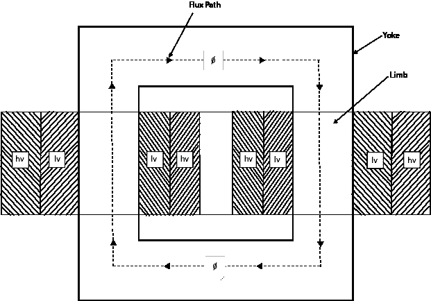
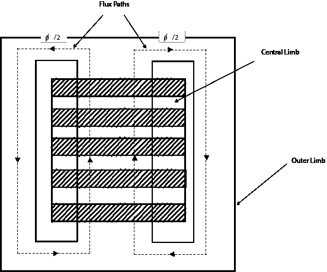
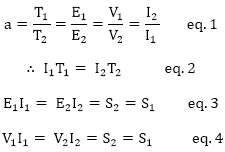

# 单相变压器的构造

> 原文：<https://www.javatpoint.com/construction-of-single-phase-transformers>

单相变压器由初级绕组和次级绕组组成。变压器的铁芯是由高级硅薄片(称为叠片)制成的。这些叠片设置在变压器中，以减少涡流损耗，硅钢减少磁滞损耗。变压器中的叠片通过耐热搪瓷涂层相互绝缘。l 型和 E 型叠片用于建筑。

变压器结构有两种基本类型:

1.  核心型结构。
2.  壳型结构。

* * *

## 核心型结构

在铁心型变压器中，磁路由两个垂直的腿或肢组成，有两个水平部分，称为磁轭。为了最大限度地减少漏磁，每个绕组的一半放在铁芯的每条腿上。低压绕组放置在铁芯旁边，高压绕组放置在低压绕组周围，以减少所需的绝缘材料。因此，两个绕组被布置成同心线圈。这种类型的绕组称为同心绕组或圆柱绕组。

* * *

## 壳型结构

在壳式变压器中，一次绕组和二次绕组都缠绕在中心臂上，低磁阻路径由外臂完成。每个绕组被细分为几个部分。低压(lv)和高压(hv)子部分交替以夹层形式放置，这就是为什么这种绕组也被称为夹层或圆盘绕组。

铁芯由两种叠片组成。铁芯类型的叠片为 U 形和 I 形。首先，将 U 形叠片堆叠在一起，达到所需的长度。预先缠绕的低压线圈的一半放置在肢体周围。低压线圈进一步提供绝缘。然后将半个预缠绕的高压线圈放在低压线圈周围。铁芯然后被顶部的工字形叠片封闭。

* * *

## 理想变压器

理想变压器是一种虚拟变压器，具有以下特性:

1.  它的初级和次级绕组电阻可以忽略不计。
2.  磁芯具有无限的磁导率()，因此只需要微不足道的 mmf 就可以建立磁芯中的通量。
3.  它的泄漏通量和泄漏电感为零。整个磁通量被限制在铁芯内，并连接两个绕组。
4.  没有电阻、磁滞和涡流造成的损失。因此，效率是 100%。

**图:理想铁芯变压器**

具有零初级和零次级阻抗的变压器称为理想变压器。初级绕组中施加的电压 V1 等于感应电压 E1。类似地，感应电压 E2 等于次级的输出电压 V2。

**图:理想变压器空载相量图。**

For an ideal transformer, if a = transformation ratio = turn ratio

然后，

等式-2 表明，理想变压器的次级绕组的消磁安匝等于初级绕组的磁化 mmf，但方向相反。

## 变压器的应用

*   电力系统中的电压和电流水平是可以改变的。
*   变压器被称为仪表变压器，用于测量电压和电流。
*   在交直流混合电力系统中，变压器用于将 hvac 转换为 hvdc。
*   将一个电路与另一个电路隔离开，因为初级和次级没有连接。