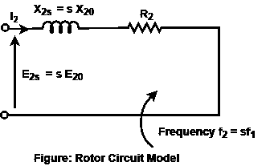
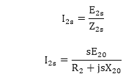

# 感应电动机的等效电路

> 原文：<https://www.javatpoint.com/equivalent-circuit-of-an-induction-motor>

## 定子等效电路:

感应电机的定子模型由定子相绕组电阻 R <sub>1</sub> 、定子相绕组漏抗 X <sub>1</sub> 组成。这两个组件出现在机器模型的右侧。空载电流 I <sub>0</sub> 由一个带磁化元件 I 的纯电感电抗器 X <sub>0</sub> 和一个带铁损电流 I <sub>ω的无感电阻 R <sub>0</sub> 模拟。</sub>

因此，

```
 I0 = Iµ +Iω

```


感应电机的磁化电流高于变压器，因为感应电机的气隙导致磁阻更高。

感应电动机中的磁化电抗 X <sub>0</sub> 将具有小得多的值。在变压器中，I <sub>0</sub> 约为额定电流的 2%至 5%，而在感应电机中，根据电机的大小，它约为额定电流的 25%至 40%。

## 转子的等效电路:

它是一种感应电动机，当 3φ电源加到定子绕组上时，电机的转子绕组中就会感应出一个电压。一般来说，转子和定子磁场的相对运动越高，产生的转子电压就越高。最大相对运动发生在转子静止时，这种情况称为静止状态。这也称为堵转或堵转状态。

如果感应转子电压为 E <sub>20</sub> ，则任何转差时的感应电压由下式给出:

```
  E2s = sE20

```

转子电阻 R <sub>2</sub> 恒定。它与滑动无关。

感应电机转子的电抗取决于转子的电感、电压频率和转子电流。

如果 L <sub>2</sub> =转子电感，转子电抗由下式给出

```
	X2=2πf2 L2
But		f2=sf1
∴		X2=2π sf1 L2=s(2π f1 L2)
Or		X2=sX20

```

在上式中，X <sub>20</sub> 是转子的静止电抗。



转子阻抗由下式给出

```
Z2s = R2 + jX2s
Or    Z2s = R2 + jsX20

```

每相转子电流如下所示



在上面画出的电路中，I <sub>2</sub> 是由作用在转子电路中的转差频率感应电压 sE20 产生的转差频率电流，转子电路的每相阻抗为(R <sub>2</sub> + jsX <sub>20</sub> )。

通过将上述方程的分子和分母除以滑移 s，我们得到


需要注意的是，通过这种操作，I2s 的幅度和相位角保持不变。

这个方程描述了一个虚拟变压器的次级电路，它有一个恒定的电压比，两侧频率相同。这个假想的静止转子携带的电流与实际旋转的转子相同，因此产生相同的 m.m.f 波。虚拟静止转子的概念使得将次级阻抗转移到初级侧成为可能。