# 逻辑门

> 原文：<https://www.javatpoint.com/logic-gates-in-digital-electronics>

逻辑门在电路设计和数字系统中起着重要的作用。它是数字系统的一个组成部分，也是一个总是只有一个输出的电子电路。这些门可以有一个或多个输入，但大多数门有两个输入。根据输入和输出之间的关系，这些门被命名为与门、或门、非门等。

有以下不同类型的门:

## 与门

该门的工作方式与逻辑运算符**和**相同。与门是对输入执行与操作的电路。该门至少有两个输入值和一个输出值。

Y=A 和 B 和 C 和 D……N
Y = A . B . C . D……N
Y = ABCD……N

### 逻辑设计

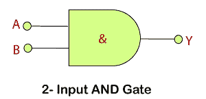

### 真值表

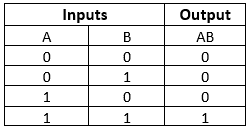

## 或门

该门的工作方式与逻辑运算符**或**相同。“或”门是执行输入“或”操作的电路。该门至少有两个输入值和一个输出值。

Y=A 或 B 或 C 或 D……N
Y=A+B+C+D……N

### 逻辑设计

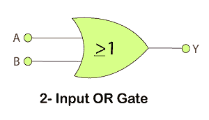

### 真值表

## 非门

“非”门也称为反相器。结果，该门给出输入值的反数值。这个门只有一个输入和一个输出值。

Y =非 A
Y = A’

### 逻辑设计

### 真值表

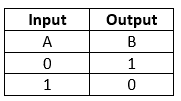

## 与非门

与非门是与门和非门的组合。该门给出与非与运算相同的结果。该门可以有两个或两个以上的输入值和一个输出值。

Y=A 非和 B 非和 C 非和 D……N
Y=A 与非 B 与非 C 与非 D……N

### 逻辑设计

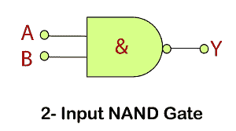

### 真值表

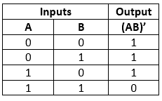

## 或非门

或非门是或门和非门的组合。该门给出与非或运算相同的结果。该门可以有两个或两个以上的输入值和一个输出值。

Y =不是或不是或不是或不是或不是或不是……N
Y =不是或不是或不是或不是……N

### 逻辑设计

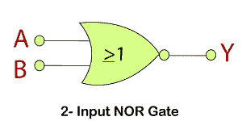

### 真值表

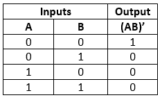

## 异域门

异或门也被称为异或门。异或门用于半加法器、全加器和减法器。“异或”门有时被称为“异或”门和“或”门。该门可以有两个或两个以上的输入值和一个输出值。

y = a xor b xor c xor d .……n
y = a a b c c d .……n
y = ab '+a ' b

### 逻辑设计

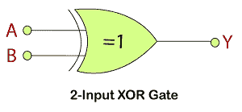

### 真值表

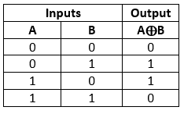

## XNOR 闸道

XNOR 门也被称为 Ex-NOR 门。XNOR 门用于半加法器、全加器和减法器。异或非门有时被称为异或非门和异或非门。该门可以有两个或两个以上的输入值和一个输出值。

y = a xnor b xnor c xnor d ... n
y = aⅲbⅲcⅲd ... n
y = a ' b '+ab

### 逻辑设计

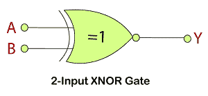

### 真值表

* * *