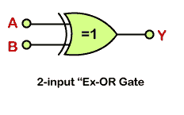
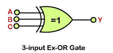
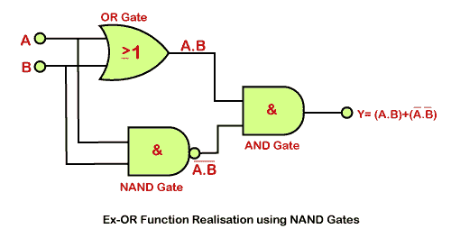
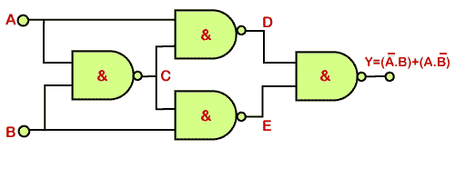

# 异域门

> 原文：<https://www.javatpoint.com/xor-gate-in-digital-electronics>

异或门代表异或门。该门是一种特殊类型的门，用于不同类型的计算电路。除了与门、或门、非门、与非门和或非门之外，还有两种特殊的门，即前或门和前或非门。这些门本身不是基本门，是通过与其他逻辑门结合而构成的。它们的布尔输出功能非常重要，足以被视为一个完整的逻辑门。异或门和 XNOR 门是混合门。

2 输入或门也称为“包含或”门，因为当输入 A 和 B 都设置为 1 时，输出为 1(高电平)。在 Ex-OR 函数中，逻辑输出“1”仅在 A =“1”或 B =“1”时获得，而不是同时同时获得。简单地说，只有当两个输入彼此不同时，异或门的输出才为高(1)。

圆圈内的加号(+)用作异或门的布尔表达式。所以异或门的符号是⨁.这个 Ex-OR 符号还定义了“子对象的直接和”表达式。这些是以下类型的异或门:

## 双输入异或门

这是混合门异或的简单形式。在这种类型的异或门中，只有两个输入值和一个输出值。有 2 2 =4 种可能的输入组合。当两个输入都设置为不同的逻辑电平时，输出电平为高电平。2 输入异或门的布尔表达式如下:

Y=(A⨁B)
Y=(A' B+AB')

真值表和逻辑设计如下:

**逻辑设计**

**真值表**

| 投入 | 输出 |
| **A** | **B** | **Y** |
| Zero | Zero | Zero |
| Zero | one | one |
| one | Zero | one |
| one | one | Zero |

### 三输入异或门

与 2 输入异或门不同，3 输入异或门有三个输入。有 2 3 =8 种可能的输入组合。逻辑异或门的布尔表达式如下:

Y=A⨁B⨁C
Y=A(BC)'+A' BC'+(AB)' C+ABC

真值表和逻辑设计如下:

**逻辑设计**

**真值表**

| 投入 | 输出 |
| **A** | **B** | **C** | **Y** |
| Zero | Zero | Zero | Zero |
| Zero | Zero | one | one |
| Zero | one | Zero | one |
| Zero | one | one | Zero |
| one | Zero | Zero | one |
| one | Zero | one | Zero |
| one | one | Zero | Zero |
| one | one | one | one |

## 异或门等效电路

我们可以使用与门、或门和通用与非门来形成异或门。这种实现的主要缺点是我们需要使用不同类型的门来形成单个异或门。通过只使用与非门，我们也可以实现异或门。这是产生异或门功能的一种更简单的方法。

## 异或门的使用

异或门在构建执行算术运算和计算的数字电路中起着重要作用。尤其是**加法器**和**半加法器**，因为它们可以提供“进位位”功能或作为受控反相器，其中一个输入传递二进制数据，另一个输入被提供控制信号。

* * *