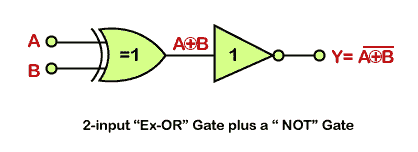
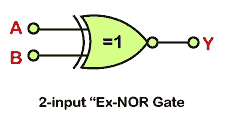
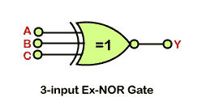
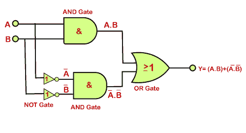
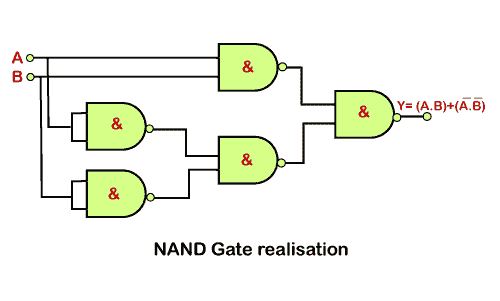

# XNOR 闸道

> 原文：<https://www.javatpoint.com/xnor-gate-in-digital-electronics>

XNOR 门是异或门的补充。这是一个混合门。简单来说，就是异或门和非门的组合。只有当 XNOR 门的两个输入相同时，XNOR 门的输出电平才为高电平，即 0 或 1。XNOR 门的符号与 XOR 相同，只加了补码符号。有时，XNOR 门也被称为**等价门**。

## 双输入异或非门

这是混合门 XNOR 的一种简单形式。在这种类型的 XNOR 门中，只有两个输入值和一个输出值。有 2 2 =4 种可能的输入组合。当两个输入都设置为高电平(1)时，输出电平为高电平。2 输入 XNOR 门的布尔表达式如下:

Y=(A⨁B)'
Y=((AB)'+AB)

真值表和逻辑设计如下:

**逻辑设计**

**真值表**

| 投入 | 输出 |
| **A** | **B** | **Y** |
| Zero | Zero | one |
| Zero | one | Zero |
| one | Zero | Zero |
| one | one | one |

### 三输入或非门

与 2 输入 XNOR 门不同，3 输入 XNOR 门有三个输入。有 2 3 =8 种可能的输入组合。逻辑异或门的布尔表达式如下:

Y=(A⨁B⨁C)'
Y=(ABC)'+ABC'+AB'C+A'BC

真值表和逻辑设计如下:

**逻辑设计**

**真值表**

| 投入 | 输出 |
| **A** | **B** | **C** | **Y** |
| Zero | Zero | Zero | one |
| Zero | Zero | one | Zero |
| Zero | one | Zero | Zero |
| Zero | one | one | one |
| one | Zero | Zero | Zero |
| one | Zero | one | one |
| one | one | Zero | one |
| one | one | one | Zero |

## 异或门等效电路

我们可以使用“与”、“或”和“非”等门来形成 XNOR 门或前“或非”门。这种实现的主要缺点是我们使用不同类型的门来形成单个 XNOR 门。只使用与非门，我们也可以实现异或门。这是产生异或非门功能的一种更简单的方法。

 

## 异或门的使用

异或门主要用于执行算术运算和数据检查的电子电路，如*加法器*、*减法器*或*奇偶校验器*等。由于异或非门给出逻辑电平“1”的输出，只要它的两个输入相等，它就可以用来比较两个二进制数字或数字的大小，因此异或非门用于数字比较器电路。

* * *