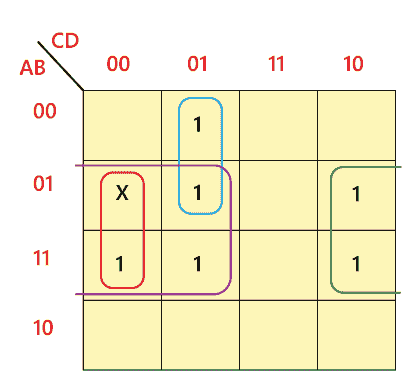
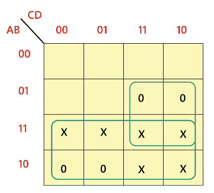
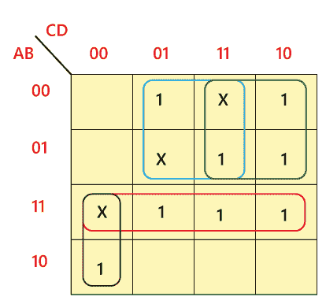

# 不在乎条件

> 原文：<https://www.javatpoint.com/dont-care-condition-in-k-map-in-digital-electronics>

“不在乎”条件表示我们可以使用 K 图的空白单元格来组成一组变量。要创建一组单元格，我们可以使用“不关心”单元格作为 0 或 1，如果需要，我们也可以忽略该单元格。我们主要用“不在乎”的细胞来制造一大群细胞。

十字(×)符号用于表示 K-map 中的“不在乎”单元格。这个十字符号代表无效的组合。超额-3 代码中的“不在乎”是 0000、0001、0010、1101、1110 和 1111，因为它们是无效组合。除此之外，4 位 BCD 到 overseas-3 代码，“不在乎”是 1010、1011、1100、1101、1110 和 1111。
我们可以把标准的 SOP 函数变成 POS 表达式，让“不在乎”的术语和它们一样。POS 表单中缺少的最小项被写成 POS 表单的最大项。同样，我们可以通过使“不在乎”术语与它们相同，将标准 POS 函数更改为 SOP 表达式。标准操作程序表格中缺少的最大术语被写成标准操作程序表格的最小术语。

**例 1:以 SOP 极小形式**最小化 f = m(1，5，6，12，13，14) + d(4)

**解决方案:**

标准操作程序中给定函数的 k 图如下:

因此，函数的最小化标准操作程序形式是:

f = BC '+BD '+a ' d

**例 2:以 SOP 极小形式最小化 F(A，B，C，D) = m(0，1，2，3，4，5) + d(10，11，12，13，14，15)**

解决方案:

给定函数的 POS 形式是:

F(A，B，C，D) = M(6，7，8，9) + d(10，11，12，13，14，15)

给定表达式的位置 K 图为:

因此，功能的最小化 POS 形式是:

F = A'(B' + C ')

**示例-3:**
**使用 K-map 以 SOP 极小形式最小化以下函数:F(A，B，C，D) = m(1，2，6，7，8，13，14，15) + d(3，5，12)**

**说明:**

给定表达式的标准操作程序 K 图为:

因此，

f = AC'D' + A'D + A'C + AB

### “不在乎”条件的意义:

无关条件对于数字电路设计具有以下意义:

**简化:**

这些条件表示给定数字电路中从未出现的一组输入。因此，为了简化布尔输出表达式，使用了“不在乎”。

**降低功耗:**

当我们用“不在乎”来分组长项时，状态的转换就减少了。这减少了所需的存储空间，从而降低了功耗。

**较少数量的门:**

为了减少用于实现给定表达式的门的数量，简化发挥了重要作用。所以‘不在乎’让逻辑设计更经济。

**危害预防:**

在数字系统中，“不在乎”在危险预防中扮演着重要角色。

**代码转换器中的状态:**

这些在代码转换中也起着重要的作用。例如，在 4 位 BCD 到 XS 3 码转换器的设计中，输入组合 1010、1011、1100、1101、1110 和 1111 是无关紧要的。

* * *