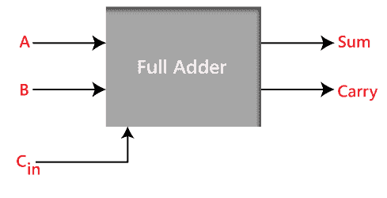
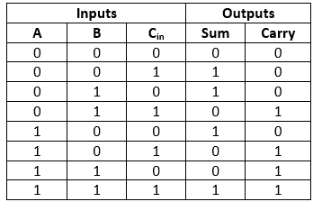

# 全加器

> 原文：<https://www.javatpoint.com/full-adder-in-digital-electronics>

半加法器只用来加两个数。为了克服这个问题，全加器被开发出来。全加器用于将三个 1 位二进制数 A、B 和进位 c 相加。全加器有三个输入状态和两个输出状态，即求和和进位。

### 框图

### 真值表

在上表中，

1.  “a”和“B”是输入变量。这些变量代表将要被添加的两个有效位
2.  中的 C 是代表进位的第三个输入。从先前的较低有效位置，提取进位位。
3.  “和”和“进位”是定义输出值的输出变量。
4.  输入变量下的八行指定了这些变量中可能出现的 0 和 1 的所有可能组合。

#### 注意:我们可以在唯一映射方法的帮助下简化每个输出‘布尔函数’。

标准操作程序表格可以借助于 K 图获得，如下所示:

Sum = x' y' z+x' yz+xy' z'+xyz
矣= xy+xz+yz

## 半加法器电路的构造；

**以上框图描述了全加器电路**的结构。在上述电路中，有两个使用或门组合的半加法器电路。第一半加法器有两个单比特二进制输入 A 和 b。正如我们所知，半加法器产生两个输出，即求和和进位。第一加法器的“和”输出将是第二半加法器的第一输入，第一加法器的“进位”输出将是第二半加法器的第二输入。第二个半加法器将再次提供“求和”和“进位”。全加器电路的最终结果是“和”位。为了找到“进位”的最终输出，我们将第一和第二加法器的“进位”输出提供给“或”门。“或”门的结果将是全加器电路的最终进位。

MSB 由最后的“进位”位表示。

全加器逻辑电路可以用**“与”**和**“**[**异或门**](https://circuitdigest.com/electronic-circuits/and-gate-circuit-working) 和 [**或门**](https://circuitdigest.com/electronic-circuits/or-gate-circuit) 构成。

全加器的实际逻辑电路如上图所示。全加器电路结构也可以用布尔表达式表示。

### 总和:

*   执行输入 A 和 b 的异或运算。
*   用进位对结果进行异或运算。所以，和在中是(A XOR B) XOR C ，在中也表示为:
    (A ⊕ B) ⊕ C

### 携带:

1.  执行输入 A 和 b 的“与”操作
2.  执行输入 A 和 b 的“异或”运算
3.  对来自前两步的两个输出执行“或”操作。所以“进位”可以表示为:
    A.B + (A ⊕ B)

* * *