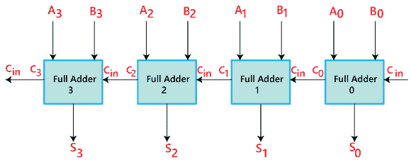

# 二进制加法器

> 原文：<https://www.javatpoint.com/binary-adder-in-digital-electronics>

寄存器在执行微操作时起着重要作用。寄存器保存数字分量和执行算术运算的数据。二进制加法器是一种逻辑电路，用于对任意长度的两个二进制数进行加法运算。

二进制加法器是在全加器电路的帮助下形成的。全加器串联，第一个加法器的输出进位将被视为下一个全加器的输入进位。

## n 位并行加法器

全加器用于对带有进位输入的两个单比特二进制数求和。在数字计算中，我们需要添加两个 n 位二进制数，而不是只添加一位二进制数。为此，我们需要使用 n 位并行加法器。为了得到 N 位并行加法器，我们级联了 N 个全加器。第一加法器的进位输出被视为第二加法器的进位输入。

### 4 位二进制加法器

*   “A”和“B”是被加数，加数位由下标数字定义。下标从右向左开始，低位由下标“0”定义。
*   C0、C1、C2 和 C3 是进位输入，它们通过全加器连接成一个链。C4 是最后一个全加器产生的进位输出。
*   第一个加法器的 C 输出作为下一个全加器的 C 输入连接。
*   S0、S1、S2 和 S3 是产生加数位和的和输出。
*   输入变量“A”和“B”的输入是从不同的源寄存器中获取的。例如，输入变量“A”的位来自寄存器“R1”，输入变量“B”的位来自寄存器“R2”。
*   将两个输入变量相加产生的结果存储在第三个寄存器或其中一个源寄存器中。

* * *