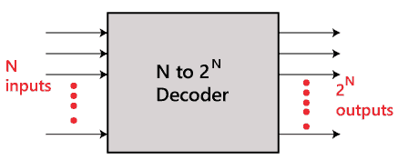
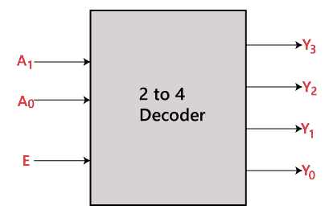
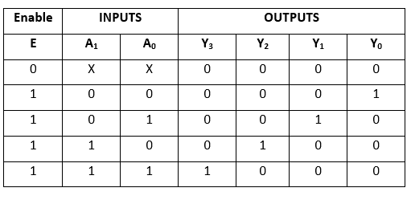
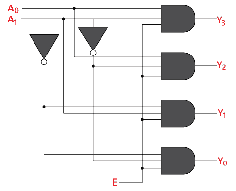
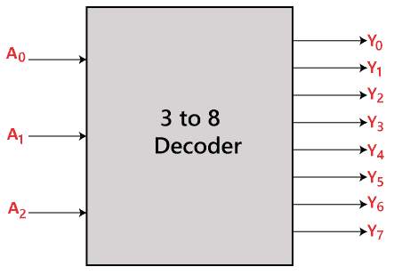
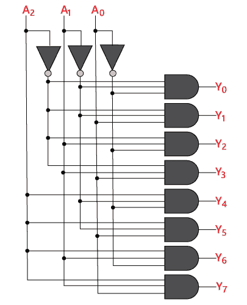
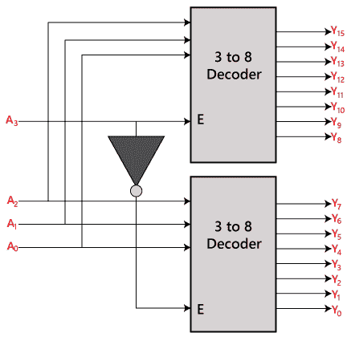
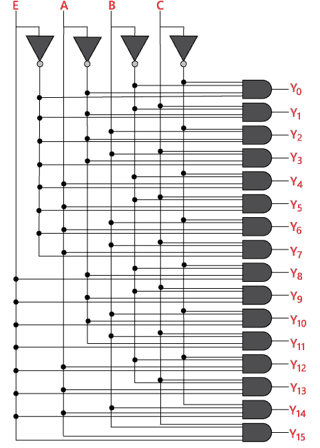

# 解码器

> 原文：<https://www.javatpoint.com/decoder-digital-electronics>

将二进制信息转换为 2 N 条输出线的组合电路称为**解码器。**二进制信息以 N 条输入线的形式传递。输出行为二进制信息定义了 2 N 位代码。简单来说**解码器**执行**编码器**的反向操作。为简单起见，每次仅激活一条输入线。产生的 2 N 位输出码相当于二进制信息。

有如下各种类型的解码器:

## 2 至 4 线解码器:

在 2 至 4 线解码器中，共有三个输入，即 A 0 ，A 1 和 E，以及四个输出，即 Y 0 ，Y 1 ，Y 2 ，Y 3 。对于每个输入组合，当使能“E”设置为 1 时，这四个输出之一将为 1。下面给出了 2 至 4 线解码器的框图和真值表。

### 框图:

### 真值表:

术语 Y0、Y0、Y2 和 Y3 的逻辑表达式如下:

Y 3 =E.A 1 。A0
Y2= E . A1。A0'
Y1= E . A1。A0
Y0 = E . A1。A 0

上述表达式的逻辑电路如下:

## 3 至 8 线解码器:

3 至 8 线解码器也称为**二进制至八进制解码器**。在一个 3 至 8 线解码器中，总共有 8 个输出，即 Y 0 、Y 1 、Y 2 、Y 3 、Y 4 、Y 5 、Y 6 、Y 7 和 3 个输出，即 A 0 、A1 和 A【A 该电路有一个使能输入“E”。就像 2 至 4 线解码器一样，当使能“E”设置为 1 时，这四个输出之一将为 1。3 至 8 线编码器的框图和真值表如下所示。

### 框图:

### 真值表:

术语 Y 0 ，Y 1 ，Y 2 ，Y 3 ，Y 4 ，Y 5 ，Y 6 ，Y 7 的逻辑表达如下:

Y 0 =A 0 。A 1 。a2
和 1 =A 0 。A 1 。a2
和 2 =A 0 。A 1 。a2
和 3 =A 0 。A 1 。a2
和 4 =A 0 。A 1 。a 和= a【0】。A 1 。A 2
和【6】= a【0】。A 1 。A 2
和【7】= a【0】。A 1 。A 2

上述表达式的逻辑电路如下:

## 4 至 16 线解码器

在 4 至 16 线解码器中，共有 16 个输出，即 Y 0 、Y 1 、Y 2 、……、Y 16 和四个输入，即 A 0 、A1、A 2 、A 3 。3 至 16 线解码器可以使用 2 至 4 解码器或 3 至 8 解码器来构建。下面的公式用于计算所需的低阶解码器数量。

所需的低阶解码器数量=m 2 /m 1

m 1 = 8
m 2 = 16

所需的 3 至 8 个解码器的数量=  =2

### 框图:

### 真值表:

术语 A0、A1、A2、…、A15 的逻辑表达式如下:

Y 0 =A 0 。A 1 。A 2 。a3
和= a【0】。A 1 。A 2 。A 3
和【2】= a【0】。A 1 。A 2 。a3
和= a0。A 1 。A 2 。A 3
和= a0。A 1 。A 2 。a3
和= a。A 1 。A 2 。A 3
和【6】= a【0】。A 1 。A 2 。a3
和 7 =A 0 。A 1 。A 2 。A 3
和 8 =A 0 。A 1 。A 2 。a3
和= a。A 1 。A 2 。A 3
和【T1111】= a【T1112】0。A 1 。a2。a3【T1119】
和 11 =A 0 。A 1 。A 2 。a3【T1131】和= a0。A 1 。a2【T1139】。a3
和= a【0】t146】。A 1 。A 2 。A 3
和【14】= a【0】。A 1 。A 2 。a3
和 15 =A 0 。A 1 。A 2 。A 3

上述表达式的逻辑电路如下:

* * *