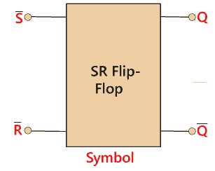
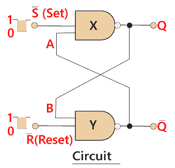
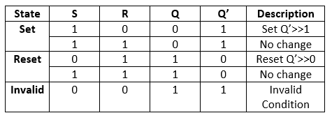

# SR 触发器

> 原文：<https://www.javatpoint.com/sr-flip-flop-in-digital-electronics>

SR 触发器是一个 1 位存储双稳态器件，具有两个输入，即置位和复位。设置输入“S”设置器件或产生输出 1，复位输入“R”复位器件或产生输出 0。设置和复位输入分别标记为 **S** 和 **R** 。

SR 触发器代表“置位-复位”触发器。复位输入用于将触发器从当前状态返回到其初始状态，并输出“Q”。该输出取决于置位和复位条件，即逻辑电平“0”或“1”。

与非门 SR 触发器是一个基本触发器，它从其两个输出端向其相反的输入端提供反馈。该电路用于在存储电路中存储单个数据位。因此，SR 触发器总共有三个输入，即“S”和“R”，以及电流输出“Q”。该输出“Q”与当前历史或状态相关。术语“触发器”涉及设备的实际操作，因为它可以“翻转”到逻辑设置状态或“翻转”回相反的逻辑复位状态。

## 与非门 SR 触发器

我们可以通过将两个交叉耦合的 2 输入与非门连接在一起来实现置位复位触发器。在 SR 触发器电路中，从每个输出到其他与非门输入之一，连接反馈。因此，该器件有两个输入，即置位和复位，分别有两个输出。下面是 S-R 触发器的框图和电路图。

### 框图:

### 电路图:

## 设定状态

在上图中，当输入 R 设置为假或 0，输入 S 设置为真或 1 时，与非门 Y 具有输入 0，这将产生输出 Q’1。“Q”的值作为输入“A”淡入与非门“X”，现在与非门“X”的两个输入都是 1(S=A=1)，这将产生输出“Q”0。

现在，如果输入 R 变为 1，而“S”保持为 1，则与非门“Y”的输入为 R=1，B=0。这里，输入之一也是 0，所以 Q’的输出是 1。因此，触发器电路被设置或锁存为 Q=0 和 Q′= 1。

### 重置状态

在第二稳定状态下，输出 Q’为 0，输出 Q 为 1。它由 R =1 和 S = 0 给出。与非门“X”的输入之一为 0，其输出 Q 为 1。输出 Q 作为输入 b 淡入与非门 Y。因此，与非门 *Y* 的两个输入都设置为 1，因此，Q' = 0。

现在，如果输入 S 变为 0，而‘R’保持为 1，则输出 Q’将为 0，状态没有变化。因此，触发器电路的复位状态已被锁存，并且设置/复位动作在下面的真值表中定义:

从上面的真值表中，我们可以看到，当设置‘S’和复位‘R’输入设置为 1 时，输出 Q 和 Q’将是 1 或 0。这些输出取决于输入条件存在之前的输入状态 S 或 R。因此，当输入为 1 时，输出的状态保持不变。

两个输入状态都设置为 0 的情况被视为无效，必须避免。

* * *