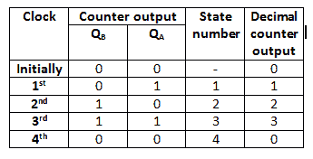
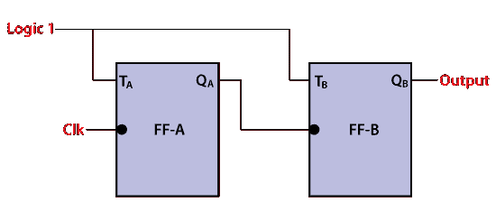
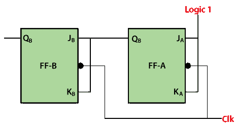
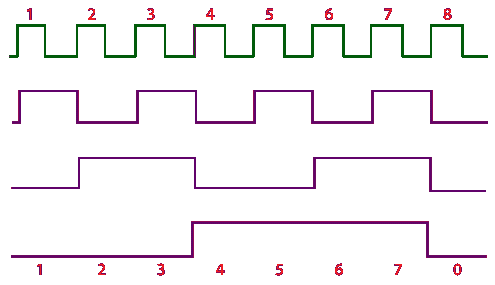

# 计数器

> 原文：<https://www.javatpoint.com/counters-in-digital-electronics>

用于计数脉冲的特殊类型的时序电路称为计数器，或者施加时钟信号的触发器的集合称为计数器。

计数器是触发器最广泛的应用之一。基于时钟脉冲，计数器的输出包含预定义的状态。可以使用计数器的输出来计数脉冲的数量。

### 真值表

有以下类型的计数器:

*   异步计数器
*   同步计数器

## 异步或波纹计数器

**异步计数器**也称为**波纹计数器**。下面是 2 位**异步计数器**的示意图，其中我们使用了两个 T 触发器。除了 T 触发器，我们还可以通过将两个输入永久设置为 1 来使用 [JK 触发器](https://www.javatpoint.com/jk-flip-flop-in-digital-electronics)。外部时钟传递到第一触发器即 FF-A 的时钟输入端，其输出端即传递到下一触发器即 FF-B 的时钟输入端

### 框图

### 信号图

### 操作

1.  **条件 1:** 当两个触发器都处于复位状态时。
    **操作:**两个触发器的输出，即 Q A Q B 将为 0。
2.  **条件 2:** 当第一个负时钟沿过去时。
    **操作:**第一个触发器会触发，这个触发器的输出会从 0 变为 1。这个触发器的输出将被下一个触发器的时钟输入接收。第二个触发器将此输出作为正边沿时钟。该输入不会改变第二个触发器的输出状态，因为它是负沿触发触发器。
    所以，Q A = 1，Q B = 0
3.  **条件 3:** 施加第二个负时钟沿时。
    **操作:**第一个触发器将再次触发，这个触发器的输出将从 1 变为 0。第二个触发器将此输出作为负沿时钟。该输入将改变第二个触发器的输出状态，因为它是负沿触发触发器。
    所以，Q A = 0，Q B = 1。
4.  **条件 4:** 施加第三个负时钟沿时。
    **操作:**第一个触发器将再次触发，这个触发器的输出将从 0 变为 1。第二个触发器将此输出作为正边沿时钟。该输入不会改变第二个触发器的输出状态，因为它是负沿触发触发器。
    所以，Q A = 1，Q B = 1
5.  **条件 5:** 施加第四个负时钟沿时。
    **操作:**第一个触发器将再次触发，这个触发器的输出将从 1 变为 0。第二个触发器将此输出作为负沿时钟。该输入将改变第二触发器的输出状态。
    所以，Q A = 0，Q B = 0

## 同步计数器

在**异步计数器**中，当前计数器的输出传递到下一个计数器的输入。所以，计数器像链条一样连接在一起。这种系统的缺点是会产生计数延迟，传播延迟也会在计数阶段出现。**同步计数器**旨在消除这一缺点。

在**同步计数器**中，相同的时钟脉冲被传递到所有触发器的时钟输入端。所有触发器产生的时钟信号彼此相同。下面是一个 2 位同步计数器的示意图，其中第一个触发器(即 FF-A)的输入设置为 1。因此，第一个触发器将作为触发触发器工作。第一个触发器的输出传递给下一个 JK 触发器的两个输入。

### 逻辑图

### 信号图

### 操作

1.  **条件 1:** 当两个触发器都处于复位状态时。
    **操作:**两个触发器的输出，即 Q A Q B 将为 0。
    所以，**QA= 0****QB= 0**
2.  **条件 2:** 当第一个负时钟沿过去时。
    **操作:**第一个触发器将被切换，该触发器的输出将从 0 变为 1。当第一个负时钟沿过去时，第一个触发器的输出将为 0。第一个触发器的时钟输入及其两个输入都将设置为 0。这样，第二触发器的状态将保持不变。
    所以，**QA= 1****QB= 0**
3.  **条件 2:** 当第二个负时钟沿过去时。
    **操作:**第一个触发器将再次切换，该触发器的输出将从 1 变为 0。当第二个负时钟沿过去时，第一个触发器的输出将为 1。第一个触发器的时钟输入及其两个输入都将设置为 1。这样，第二触发器的状态将从 0 变为 1。
    所以，**QA= 0****QB= 1**
4.  **条件 2:** 当第三个负时钟沿过去时。
    **操作:**第一个触发器将从 0 切换到 1，但在这种情况下，输入和时钟输入都设置为 0。因此，输出将保持不变。
    所以，**QA= 1****QB= 1**
5.  **条件 2:** 当第四个负时钟沿过去时。
    **操作:**第一个触发器将从 1 切换到 0。在这种情况下，第二个触发器的输入和时钟输入设置为 1。因此，输出将从 1 变为 0。
    所以，**QA= 0****QB= 0**

* * *